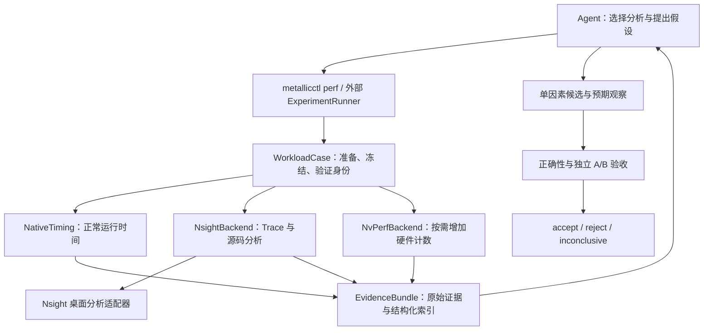

# Metallic Agentic Shader 优化路线图

2026-09-24。设计依据：用户提供的 Pro 讨论、当前工作树与历史实验报告、已安装 Nsight Graphics 2026.3.1 的能力发现，以及 NVIDIA 官方文档。本轮只做设计和只读核对，没有采集新的 GPU 数据，也没有执行优化实验。

M0 实施进度见 [能力与证据基线](AgenticShaderOptimizationM0.md)，M1 实施进度见 [Nsight 源码分析](AgenticShaderOptimizationM1.md)。[M0 收尾](AgenticShaderOptimizationM0Closeout.md)已完成真实 Source/IL 格式验证；原生桌面运行时恢复后，[三次实际 UI 导出](NsightUIExportValidation.md) 3/3 通过。验收范围是同一固定报告的重复保存，M1 的可复用 adapter、重新打开/选择及回放异常恢复仍为 partial；cua-child 不再是前置条件。

**建议将 Nsight 源码分析放到第一个可交付里程碑，将已有计时与正确性能力收敛为实验执行器；NvPerf 随后按实际计数器缺口接入。** 用户当前需要突破的是从 marker 到 shader、源码和依赖关系的分析过程。单纯扩大范围计数器采集，不能完成这个目标。

**1. 当前起点：哪些已有，哪些仍缺**

| 能力 | 核对到的现状 | 路线图中的增量 |
| --- | --- | --- |
| Graphics Capture / GPU Trace CLI | SDK capture 与 CLI 编排已有；本机 doctor 检出 2026.3.1、unified+split 及 GPU Trace 参数 | 分别记录启动、采集、导出、解析状态；doctor 成功不能代替实际采集成功 |
| GPU marker 层级 | `profileScope()` 已导出配对的 debug labels，覆盖 software/hardware、early/late、实际队列 | 用当前构建重新验证 Nsight 的实际导出层级；不能沿用旧版本“只能合并 HW/SW”的结论 |
| Shader 符号 | `CaptureSymbols` 已为优化编译加 `-g2`、嵌入源码与 NonSemantic 调试信息，已有编译测试 | 验证 Nsight 中的源码关联、函数/调用点及采样覆盖；无需重做 `-g1 → -g2` |
| Shader 身份 | `softwareRasterIdentity()` 已有 module、entry、SPIR-V FNV1a64、mode、部分运行状态 | 补依赖/配置摘要、实际绑定与 dispatch、queue/submit、输入与输出状态，建立 Nsight 标识映射 |
| 固定状态实验 | `EditorRasterComparison` 已冻结 camera/cut/驻留、分离读回与计时，并做换序对照 | 抽象通用 case/runner；当前 `ProfileReady` hold 仅在首轮 legacy mode 10 触发，须改为按显式目标选择 |
| Shader Profiler 数据 | 9 月 24 日报告已解析手工导出的分类 shader 源码/IL CSV | 建立专用解析器和自动导出流程；不能把它送给仅支持 GPU Trace 表格的 summarize |
| 生产 SW 算法 | 协作装载、共享屏幕顶点、整数边步进已经存在；当前默认选择 WorkControl，不分桶 | 重新测当前实现的瓶颈；不再把“首次实现协作装载”作为新任务 |
| 工作量诊断 | 已有独立 coverage replay、atomic attempts、HZB 与 shader 身份记录 | 该诊断 shader 不写生产 visibility/depth，不是生产内核的隔离重放器 |
| 引擎控制面 | `metallicctl`、有类型的 debug provider、job/artifact 协议已有 | 增加有限的 perf 操作，复用传输和证据身份；构建、进程和 Nsight 编排留在引擎外 |

事实来源：[标记层级修正](NsightGpuScopeLabels20260924.md)、[标记复测](ZorahFullMarkerRecheck20260924.md)、[Slang 编译策略](../Source/Runtime/Render/SlangCompiler.cpp)、[SW 身份和实际绑定](../Source/Runtime/Render/RenderPass/BuiltinPass/VisibilityBufferPass.cpp)、[固定状态实验](../Source/Editor/EditorRasterComparison.cpp)、[控制面](DebugControlPlane.md)、[协作装载](ZorahFullCooperativeRaster.md)、[共享顶点与局部分桶](ZorahFullLocalWorkBins.md)。

还应立即处理两项可复现性缺口：

- [源码级分析报告](StreamClusterBinProfile20260924.md)及 [JSON](StreamClusterBinProfile20260924.json)保留了目标模块、原始 SHA256、10,310 个 IL self samples 等信息，但本机未找到它们引用的 `Captures/NsightGraphics/streamClusterBinMain.csv` 和 `build/nsight-visibility-20260924/AnalyzeBinProfile.py`。先找回原件或重新导出，再作为解析夹具；现有 JSON 只能提供历史预期，不能证明解析器现在可复现。
- 当前机器查询到 RTX 5070 Ti、driver 616.92；[另一份 9 月 24 日 Capture 报告](VisibilityBufferNsight20260924.md)来自 RTX 5060，且 CLI 出现 `No single-pass metric set selected`。将它保留为独立环境的失败案例，不能推断本机也失败或套用另一张卡的性能。最初路线设计时尚未发现 cua-child；后续 M0 找到它但 worker 未就绪。最新 M1 已取消 child 前置要求，原生桌面运行时的启动故障与 Nsight 自身能力分开记录。

**2. 专用分析器应成为可查询的工具层**

目标交互链是：

```text
选中工作负载 → 对齐 Nsight 事件/时间范围 → 确认 shader 变体
→ 查看 Shader Summary → 定位 Hot Spots → 读取源码上下文
→ 必要时追踪依赖生产者 → 形成假设 → 发起受控实验
```

NVIDIA 文档确认 Shader Pipelines 可保存当前表为 CSV，Source 支持复制选中行；但官方 `--auto-export` 的承诺是 metrics 导出，不能据此承诺所有源码与依赖视图都有无头接口。完整低层反汇编还存在发行版能力差异。[Shader Profiler](https://docs.nvidia.com/nsight-graphics/UserGuide/shader-profiler.html)、[GPU Trace CLI](https://docs.nvidia.com/nsight-graphics/UserGuide/gpu-trace-overview.html)。

因此，对外提供的是稳定的分析动作，内部按能力使用官方导出、经过验证的表格/剪贴板、窗口级桌面 UI；无法可靠读取则返回明确原因。截图可用于定位和人工复核，不能作为唯一的数值评分依据。首版不逆向 `.ngfx-gputrace` 私有格式，也不假设 UI 内部存在未公开 API。

| 拟议动作 | 必需输入 | 返回和检查 |
| --- | --- | --- |
| `open_artifact` | artifact hash、工具版本 | session、实际打开的 artifact、能力状态 |
| `list_workloads` / `select_workload` | case、phase、queue、事件或时间范围 | 实际选择范围、重叠工作、能否进一步过滤 |
| `list_shaders` / `select_shader` | selection、模块/entry/SPIR-V 身份 | shader handle、工具内 hash、匹配证据；匹配不唯一则停止归因 |
| `export_shader_summary` | shader selection | 原始表、列/单位/分母、导出范围与内容 hash |
| `read_hotspots` / `read_source_context` | shader、排序字段、top-k | source/IL 位置、self/inclusive 样本、采集时源码及证据定位 |
| `read_dependencies` | 热点或指令位置 | 可用的 producer/consumer 证据；不可用时不推断完整寄存器依赖图 |

这些名字是设计接口，尚不是现有命令。UI adapter 必须保存当前 artifact、选中时间范围、queue、shader 和筛选条件；每次读取前核对实际状态。界面升级、列名变化、失焦、空表、超时和多模块混入都应返回可诊断状态，不能沿用上一轮结果。

原生 Nsight 界面可通过 computer-use 提供的窗口级接口直接操作，cua-child 是可选隔离方式。按实际观察到的窗口和控件逐步操作，每步核验选择与导出结果。桌面运行时不可用时保留文件导入与 CLI 分析路径，并明确 source automation 未完成。离线分析 worker 可以与采集 worker 分离，但共享同一 GPU 时仍需纳入测量互斥与干扰检查。

Nsight 2026.3 的 Graphics Capture Live Replay 支持在 UI 内采集 GPU Trace；官方说明该集成结果不生成独立 trace 文件。因此先以可归档的独立 GPU Trace/导出物作为流水线输入，再评估集成 UI 路径。[2026.3 发布说明](https://developer.nvidia.com/nsight-graphics/get-started)。

**3. 架构与三个数据契约**



`WorkloadCase` 定义“执行什么”，包含语义 workload ID、frame/view/phase、实际 queue/submit/dispatch、indirect arguments、绑定资源代际、输入指纹和质量设置。先注册 `GPUDriven.Raster.Early.Software` 与 Late 对应项，Nsight 解析试点另注册精确分类入口。

不能仅用 camera/cut/page mapping 代表完整输入。还需覆盖 HZB 内容与 `paramsHzbValid`、jitter/history、push constants、工作列表及可写 depth/visibility 的初态。完整资源快照可分阶段实现：首版提供进程内冻结 case，明确其不能跨进程精确恢复；独立构建 A/B 若无法取得相同输入，应另列为动态路线实验，不能冒充固定状态 A/B。

`ShaderVariantManifest` 定义“到底编译和绑定了什么”，记录源码及依赖内容摘要、entry、宏/specialization、Slang 版本/profile/优化/符号选项、workgroup/subgroup、SPIR-V 内容 hash、驱动/GPU、pipeline 配置。保留已有 FNV 字段，同时提供内容寻址摘要。Nsight 的 app/module hash 与自算 hash 可能采用不同算法，必须通过字节码或可核验绑定关系建立映射，不能直接比较字符串。

当前 SW compute 确实创建 `VkPipeline`，可复用已接入的 executable statistics；graphics shader object 路径单独记录 stage 组合和 dynamic state。不能把额外构造 pipeline 的统计默认为生产 `VkShaderEXT` 的统计。[Vulkan 实现](../Source/Runtime/Render/GAPI/Vulkan/VulkanRhi.cpp)。

`EvidenceBundle` 定义“测到了什么”，每条记录至少有以下字段：

| 字段组 | 内容 |
| --- | --- |
| 身份 | case/variant/run/artifact/selection IDs；源码、二进制和工作树快照摘要 |
| 归因 | `requested_scope`、`achieved_scope`、concurrent work、scope 匹配理由 |
| 方法 | timing / range counter / periodic sample / PC sample / compiler statistic / diagnostic replay |
| 指标 | 原始名称、值、单位、分母、归一化方式、完整性/下界标记 |
| 源码 | 采集时 source hash、文件/行、IL/PC、调用点；与当前工作树是否一致 |
| 证据 | 原始文件 hash、表/行/列或选区、工具版本、采集/导出日志 |
| 有效性 | complete / partial / invalid，原因码及受影响的后续能力 |

`achieved_scope` 应区分 dispatch、shader-in-window、marker-range 和 whole-device。即使选中了一个 SW marker，也不能自动把相同 shader 在其他 dispatch 的样本排除；周期采样和同名 early/late 复用尤其需要检查实际过滤范围。

证据包按 run 归档：manifest、输入/输出指纹、原始 trace/capture/CSV、shader/SPIR-V/依赖快照、结构化分析、validation、timing、decision。大文件放本地或对象存储，以 manifest 引用；解析代码、schema 和小型夹具进入版本管理，不再把唯一解析器放在 `build/`。

**4. 分阶段实施与退出条件**

下列为单一开发主线的工程估算，按工作日计算，尚未包含工具兼容故障的不可预估时间。阶段按验收推进；前期不用等待完整 NvPerf 或通用离线资源重放系统。

| 阶段 | 估计 | 核心交付 | 退出条件 |
| --- | --- | --- | --- |
| M0 能力与证据基线 | 1–2 天 | 固定本机版本，能力清单，原始 CSV 恢复/新导出，小型样本集，最小 case manifest | 能区分“官方支持、此环境已验证、未验证、不可用”；原始证据可定位且 hash 正确 |
| M1 Nsight 源码分析纵向切片 | 3–5 天 | 专用 CSV importer、窗口级 UI adapter、shader/hotspot/source 查询；最小目标选择与符号核对 | 从固定 artifact 自动选中唯一 shader，重复 3 次导出一致的结构化结果；混模块/缺符号/选错范围能被检出 |
| M2 可信 WorkloadCase 与采集 | 3–5 天 | 将现有冻结 harness 通用化，选择当前生产入口，SDK 边界，输入/输出验证，A/A | 新构建的 early/late、队列和 shader 身份可对齐；同 case 重复稳定；计时、诊断分离 |
| M3 一个候选的自动实验闭环 | 4–6 天 | 外部 runner、候选 patch/build、正确性、交错 A/B、机器判定和证据归档 | 独立完成 accept/reject/inconclusive；无正确性结果、零工作量和身份变化无法被评为加速 |
| M4 NvPerf 与深层分析扩展 | 3–5 天起 | 按需要接入计数器，恢复可写状态的生产内核隔离执行，依赖视图按能力开放 | 至少一个实际硬件指标集合可稳定复现；isolated 与 in-frame 分开验收 |
| M5 多 case 持续优化 | 3–5 天起 | 静态视角/漫游/异步场景矩阵，预算、历史候选去重、保留验证集 | 新候选在未参与选择的 case/独立复测中仍有效；失败能干净结束并保留证据 |

预期 4–7 个工作日取得“Agent 可以深入 Nsight 源码分析”的首个演示，约 2–4 周完成一次完整优化闭环。若 M0/M1 发现桌面运行时或 UI 导出不可行，明确记录 source automation 阻塞，继续用人工导出的文件验证 importer 与 M2/M3；不能把这个降级路径宣布为全自动 Nsight 已完成。

**M0/M1 的具体工作顺序**

1. 为 Shader Profiler CSV 单独实现 importer。解析多段表头、多个模块、嵌入源码、多行字段和 self/inclusive/dependency-attributed 样本。按模块和表示层去重；原件恢复后，历史夹具应重现目标 10,310、非目标 28 个 IL self samples。若重新导出产生新内容，就建立新的预期，不能硬套旧数值。
2. 将 `Live Registers`、驱动分配寄存器数和 occupancy 分开。CSV 每行只列前三种 stall 时，将累计原因标为下界，不能补零。旧截图分母和 CSV 分母不一致时，保留为两条证据。
3. 使用一个小型已知 shader/capture 验证窗口级 UI 流程：打开、选择、导出、读取、重新打开再重复。再在当前 Metallic shader 上验证函数/源码映射。完整 SASS、寄存器依赖图暂不作为 M1 门槛。
4. 源码采集模板明确开启所需 shader profiling/符号收集；不能继承 top-level triage 模板中禁用 shader-pipeline collection 的选项。记录实际支持的 metric set，不硬编码跨 GPU 的数字 ID。
5. 对新 label 构建做一个有界 Trace 验证，分别检查 UI 与 CLI 导出效果。若仍合并，记录真实范围，改用 shader 选择或后续隔离；不再反复尝试仅靠 `time-every-action` 解决所有归因问题。

**M2 的输入恢复边界**

先支持真实帧上下文和现有进程内冻结测量；只有归因确实需要时再做 isolated 生产内核执行。后者必须使用同一 shader、真实工作列表/资源/参数，恢复每轮会被读取或修改的 depth/visibility、counter、indirect 与相关 history 初态。恢复操作放在目标计时区间外，记录其缓存影响。现有 coverage replay 只能提供诊断工作量。

GPU Trace 使用准备完成后触发的 SDK 边界，避免仅靠固定等待时间。GPU Trace 仍需 host，且同一进程不能同时注入 Graphics Capture 和 GPU Trace；runner 按采集模式启动相应 worker。具体函数与版本结构以安装的 SDK header 为准。[Nsight Graphics SDK](https://docs.nvidia.com/nsight-graphics/UserGuide/sdk.html)。

NvPerf 支持 Vulkan 应用内指标采集与自定义触发/输出，适合后续减少对 GUI 的依赖。[Nsight Perf SDK](https://developer.nvidia.com/nsight-perf-sdk)。是否接入由三项结果决定：现有导出是否缺关键指标、需要多少自动采集、维护成本是否合理。首先验证本机 SDK/驱动支持与 counter availability，使用最小 triage 集；再增加 memory/warp/atomic 集合。多轮采集必须恢复相同输入，计数会话串行管理，不把 periodic device 数据当成 dispatch 专属数据。

**5. 自动实验的判定规则**

状态机：`Prepare → ValidateIdentity → A/A → Collect → Diagnose → Propose → Build → Correctness → PairedTiming → Confirm → Decision`。采集失败、编译失败、设备丢失有独立终态，不能用缺失数据继续评分。source 不可用可以降低诊断深度；正确性缺失则不能接受候选。

| 门槛 | 实施要求 |
| --- | --- |
| 同一问题 | 分辨率、LOD、材质、阴影、HZB/jitter、cut/驻留、输入量与算法质量约束均写入 case；改画质另建实验类别 |
| A/A | 最小预热后检查时间与工作量稳定，按独立运行/块估计噪声；对照版自身不稳定则暂停自动接受 |
| 正确性 | SW 优先逐位比较 depth、visibility、stable bins/ID；覆盖 early/late、空工作、overflow、异常页、裁面、双面、反射与 jitter；浮点容差须在实验前定义 |
| 正常计时 | validation、读回、诊断 replay、Nsight 注入与细粒度计数不混入性能验收；记录 VSync/Reflex、可见/隐藏窗口、clocks、温度与竞争进程 |
| A/B | ABBA 或随机配对，切换后同样预热；统计单位为独立运行或合理帧块，不能把连续帧全部视作独立样本 |
| 收益 | 预先声明目标收益阈值和允许回退；收益区间超过 A/A 噪声及工程阈值，且 VBuffer/Graph/相关正常帧指标满足预算 |
| 确认 | 候选搜索后的最佳结果须独立复测或在保留 case 验证，控制多次尝试挑中偶然快值的问题 |

首版可从至少 3 组独立 A/A、5 组配对 A/B 起步，设上限后根据区间宽度增加样本；这些只是启动预算，不保证统计充分。阈值从本机 A/A 校准，不能预先宣布固定 1% 就可接受。动态漫游允许驻留演化，但必须作为单独验收层记录工作量/质量变化，不与严格固定输入结果混算。

候选必须写明 evidence IDs、假设、单因素修改、预期时间/机制变化和证伪条件。计数器改善只用于解释；最终由时间与正确性判定。长期等待可能出现在消费者 PC，barrier 样本也不等于可回收时间，adapter 不应把这些比例转换成“这一行耗时多少毫秒”。

`accept` 表示该候选满足已声明的 case 和约束，生成 patch 与可复核报告；不表示自动改变全局默认或自动合并。`reject` 保留失败原因和证据，`inconclusive` 指向最小的补测。自动化预算包含候选/构建/采集次数、GPU 时间、磁盘与超时；共享 GPU 上的采集和推理避免重叠。遇到 device lost 保存日志并结束候选，不自动放宽 TDR。

**6. 两个试点和第一批可提交改动**

采用两个用途明确的试点，避免把历史分类数据当作当前 SW 内核数据：

- **分析器试点：精确分类 shader。** 利用已知源码/IL CSV 格式验证 importer、热点与源码关联。当前 cull/classify 已存在 P0/P1 producer-consumer 成对选择，重新采集时记录实际 entry 与变体；旧报告的源码行不能直接套到新代码。
- **完整闭环试点：当前 Full Zorah 的生产 SW WorkControl。** 先做新基线和源码热点，再选择一个局部候选。若仍是加载依赖，研究更紧凑输入或局部生命周期；若是扫描长尾，再研究小 bbox/scanline。协作装载和共享顶点已完成，不能作为新成果重复实施。历史“分桶更慢”可用于验证拒绝路径，但当前机器仍须实测。

| 提交建议 | 主要落点 | 完成标准 |
| --- | --- | --- |
| PR1：证据 schema 与 Nsight CSV importer | 新增 `Tools/Perf/`、小型夹具/解析测试、文档；找回或重采原件 | 能导入多模块 source/IL 并保留 provenance；缺列、下界和重复归因有明确处理 |
| PR2：Nsight 分析 adapter | `Tools/Perf/` 内的工具编排与窗口级 UI 接口 | 指定 artifact/shader 可重复导出 summary/hotspots/source；失败不返回旧数据 |
| PR3：工作负载身份与精确采集目标 | `EditorRasterComparison.cpp`、`VisibilityBufferPass.cpp`、`Profiling/`、debug provider | 任意已注册变体可进入 hold/SDK 采集窗口，actual queue/dispatch 与输入可核验 |
| PR4：实验 runner 与判定 | 复用 `RunZorahFullRoam.ps1` 和现有分析/正确性工具，扩展 CLI | 一个有限候选能完成构建、验证、A/B、独立确认和归档 |
| PR5：可选 NvPerf backend | `Profiling/`、`cmake/`、backend contract tests | 无 SDK 构建仍正常；支持/缺失指标和多轮采集有明确语义 |

复用 [MetallicCtl.cpp](../Source/Tools/MetallicCtl.cpp)、[DebugCore.cpp](../Source/Runtime/Debug/DebugCore.cpp) 的协议；复用 [GpuProfilingTests.cpp](../tests/rhi/GpuProfilingTests.cpp)、[EditorProfilerTests.cpp](../tests/rhi/EditorProfilerTests.cpp)、[StreamClusterClassificationTests.cpp](../tests/rhi/StreamClusterClassificationTests.cpp) 和现有光栅正确性测试。新增测试聚焦解析语义、错配检测、可写状态恢复与接受门槛，避免只是照抄实现。

**7. 建议的 Agent 命令面与完成定义**

以下均为拟新增 Metallic 命令，不是现有 CLI 或 Nsight 原生参数。外部 runner 负责耗时编排；引擎只接收有界且有类型的 case/采集操作。

```powershell
metallicctl perf capabilities --json
metallicctl perf import --format nsight-shader-csv --input <csv> --manifest <manifest>
metallicctl perf case create --workload GPUDriven.Raster.Early.Software --state frozen
metallicctl perf collect --case <case> --backend nsight --level source
metallicctl perf analyze --run <run> --shader <variant> --view hotspots --top 10
metallicctl perf analyze --run <run> --hotspot <id> --view dependencies
metallicctl perf experiment --case <case> --baseline <snapshot> --candidate <patch>
```

能力状态采用 `verified / supported-unverified / unsupported / blocked`，每项带工具版本、环境、验证 artifact 和原因。至少分别暴露 capture、metrics export、shader summary、source hotspots、dependencies、完整低层反汇编；任何一项成功都不能自动推导其他项成功。

本路线的首个完成点是：**Agent 能选择准确的生产 shader，通过 Nsight 取得可复核的源码热点，并说明数据的范围和限制。** 完整闭环的完成点是：在同质量约束下，据此提出一个有限候选，自动获得正确性与正常执行时间证据，可靠给出接受、拒绝或证据不足，且整条证据链可重新检查。
