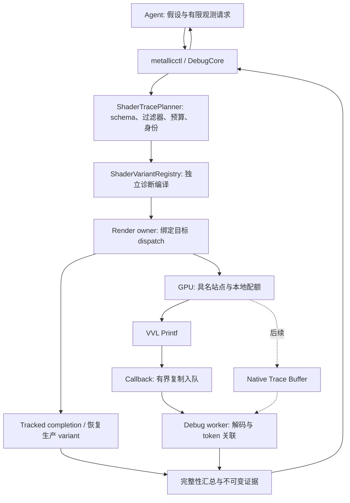

# Shader Printf Agentic Debugger 设计

状态：P0 与 P1 已实现并完成本机验证；生产站点与 variant lease 属于 P2。日期：2026-09-26。
输入为用户提供的 Shader Debug Printf 讨论。本文保留完整路线设计；当前可运行接口与验证范围见
[P0 验收](AgenticShaderPrintfP0.md)和 [P1 验收](AgenticShaderPrintfP1.md)，其余设计不代表已交付。
本文结合当前 Metallic 源码、Debug Control Plane v2 和官方 Vulkan/Slang 文档制定。

## 1. 决策与首个交付

对 Agent 暴露 **Shader Watch / Logpoint**，内部先实现 VVL Printf backend，未来接入
Native Trace Buffer。统一产物为有类型、执行身份、覆盖范围和完整性状态的 ShaderEvent。
Printf 回答局部值与控制流问题；硬件计数与未插桩 A/B 继续负责性能判定。

首个可交付：给定 MiniZorah history case，选择 VBuffer 的 early 或 late WorkControl
生产 dispatch，在 `stream.after-triangle-prepare` 观察一个 workgroup/local invocation，
执行一个目标帧，返回最多 16 条协议记录，并恢复生产 pipeline。首批字段为实际已经
计算的 recordIndex、triangleId、三点 screen position/depth、instanceFlags；不额外读取
shader 原本没有读取的资源，不为了输出而重新计算一次生产表达式。

不将任意源码行、任意表达式、所有 shader stage、全场景快照恢复或 GPU 单步暂停纳入首版。
“cluster 为什么被 HZB 拒绝”属于下一组具名站点，必须放在真正执行拒绝判断的 shader，
不能从后面的 WorkControl 没收到 cluster 就推断剔除原因。

## 2. 当前代码给出的接入约束

| 已核实的现状 | 设计影响 |
|---|---|
| `VulkanRhi.cpp::createDebugMessenger` 只订阅 Warning/Error | Printf 模式必须订阅 INFO，同时检查 VVL 自身的 severity/filter 设置 |
| `RenderDebugRuntime::validationSink` 在 callback 构造 JSON，文本截到 4096 字符；`DebugCore::pushEvent` 每 provider 保留 256 项 | 新建独立有界 raw-message 通道，逐类记录丢弃/截断；不把通用 validation ring 当 trace 存储 |
| `ValidationSink` 从任意 validation 线程调用，参数只在调用期间有效 | callback 必须复制消息与对象名；不借用指针，不在回调里操作渲染器 |
| DebugCore 已有 session、jobs、schema、capture/export、typed eval、限制和 stale generation 语义 | 扩展现有控制面和证据类型；不再建立另一套 IPC 或任意代码执行接口 |
| `DebugEvidenceStamp` 包含 graph/generation/execution/pass/frameSlot/provenance | 扩展 dispatch 实例映射；复用已有执行与资源生命周期 |
| Slang cache key 已覆盖 root module/entry、宏、profile、debug mode、descriptor mode 等 | 复用编译器，增加显式 instrumentation 身份；诊断产物与生产缓存隔离 |
| `SlangShaderDebugMode` 是进程全局策略 | 不能为单个 watch 临时切换全局 -O0；插桩是独立维度 |
| `VisibilityBufferPass` 已在实际 WorkControl bind/dispatch 旁记录 module/entry/SPIR-V/phase/queue | 在这里选择诊断 pipeline 并注册 dispatchToken；不靠 ProfileMark 名称猜执行 |
| WorkControl 使用 128 threads/group；小 wave 分支会走 fallback | 记录实际路径；未注册的 fallback 站点返回 UnsupportedPath，而非输出空集成功 |
| `WorkloadCase.analyze_run` 无条件拒绝 validationRequested | 抽出共享 workload 身份检查，再分别实现 timing 与 shader-trace 校验；不能全局放宽原门槛 |

关键源码：[Vulkan RHI](../Source/Runtime/Render/GAPI/Vulkan/VulkanRhi.cpp)、
[RenderDebug](../Source/Runtime/Render/Debug/RenderDebug.cpp)、
[DebugCore](../Source/Runtime/Debug/DebugCore.cpp)、
[SlangCompiler](../Source/Runtime/Render/SlangCompiler.cpp)、
[生产调度](../Source/Runtime/Render/RenderPass/BuiltinPass/VisibilityBufferPass.cpp)、
[WorkControl](../Shaders/Features/GPUDriven/GPUDrivenStreamWorkRaster.slang)。
现有协议见 [DebugControlPlane.md](DebugControlPlane.md)。

本机发现 `C:/VulkanSDK/1.4.350.0/Bin/VkLayer_khronos_validation.json`，声明 API 1.4.350。
这只证明文件存在，不证明运行进程实际加载了它，更不证明当前 Slang/heap/driver 路径可用。

## 3. 架构与职责



- `ShaderTraceCore` 放在 `Source/Runtime/Debug/`：请求、site schema、预算、typed event、
  completeness、离线解码，不依赖 Vulkan/Slang。
- `ShaderTraceRuntime` 放在 `Source/Runtime/Render/Debug/`：编译计划、绑定 lease、
  dispatch-token 表、GPU completion、恢复和 owner-thread 生命周期。
- `VulkanShaderPrintf` 放在 `Source/Runtime/Render/GAPI/Vulkan/`：layer settings、INFO
  messenger、能力检查、raw callback 队列。backend 状态对上层显式暴露。
- `ShaderTrace.slang` 建议作为 `Shaders/Modules/` 下独立调试模块，配合生产 root module
  的具名站点。CPU/Slang ABI 与站点 manifest 同版本，不修改 vendor shader。
- `metallicctl` 延续本地 named pipe、session pinning、jobs、分页和 CLI 本地导出。
  UI 只展示同一证据，不能成为调试系统成立的前提。

第一版不建立任意 shader/pipeline 的完整反射数据库。先注册 WorkControl 的 production
和 diagnostic variant、少量站点，后续需要时再扩展到其他 pass/Shader Object。

## 4. 能力发现、启用与格式

Slang `printf()` 可映射到 SPIR-V DebugPrintf，但是否产生输出取决于消费者。
使用 VVL 消费这些指令；`-g2` 产生的 NonSemantic debug info 与 DebugPrintf 是两件事，
不要用包含 `NonSemantic` 字样作为插桩判定。
来源：[Slang printf](https://docs.shader-slang.org/en/latest/external/core-module-reference/global-decls/printf.html)、
[SPIR-V DebugPrintf](https://github.khronos.org/SPIRV-Registry/nonsemantic/NonSemantic.DebugPrintf.html)。

Vulkan 1.3 已把 shader non-semantic info 功能纳入核心。Metallic 当前 Vulkan 1.4 路径
不应强制要求设备仍单独枚举该扩展名；需要的是可工作的消费者。
来源：[Vulkan 扩展规范](https://docs.vulkan.org/refpages/latest/refpages/source/VK_KHR_shader_non_semantic_info.html)。

提出启动选项 `--shader-trace`，隐含启用 debug control；这是待实现选项。配置必须发生在
VkInstance 创建前。对没有启用 backend 的既有进程，`shader.watch` 返回 RestartRequired，
不假装可以事后把 VVL 装到既有 instance。普通启动保持现状。

优先按已安装 VVL 支持的 `VK_EXT_layer_settings` 显式设置 printf_enable、
printf_to_stdout=false、消息 INFO/Warning/Error、verbose、容量和重复消息策略。
保存实际 layer DLL 路径/hash/version、Slang 版本、driver、GPU、Vulkan 版本与设置快照。
若采用旧版兼容配置，记录明确的 adapter；不要同时设置多组相互覆盖的环境变量。
应用 messenger 接收 INFO 仍不足以证明 layer 没过滤消息，必须用 echo probe 验证全链路。
VVL 配置与格式约束参考 [官方 Debug Printf 说明](https://vulkan.lunarg.com/doc/view/latest/windows/debug_printf.html)。

`shader.capabilities` 分别报告 discovered / configured / smokeVerified，维度包括：
普通 compute fixture、生产 descriptor heap compute、Slang mapped/native、shader object、
mesh/fragment/ray-query。支持性按具体组合记录，Skipped 不是通过。
上游已有 descriptor heap/Shader Object Printf 测试，但测试源码不等于本机支持。
来源：[VVL 上游测试](https://github.com/KhronosGroup/Vulkan-ValidationLayers/blob/main/tests/unit/debug_printf.cpp)。

MVP 只承诺验证通过的生产 compute 路径。若需要的 layer feature/heap 保留空间不可用，
返回 Unsupported；不能暗中把生产资源绑定切换到另一条路径来宣布验收成功。

协议只使用经过测试的 `%u` / `%x` 等固定 32-bit 字段，不接受 Agent 提供 format string。
向量拆为标量，f32 用 raw bits，u64 拆为两个 u32；人类可读值由 CPU 解码产生。
保留 f32 原始位型以区分 NaN payload、-0 和逐位差异。wire 数值复用现有 lossless tag，
另带 `{type: f32, bits: ...}`；不经普通 JSON 浮点往返丢失位型。

## 5. Shader Watch 请求与 variant 计划

### 5.1 对外方法（P1 已接通控制面；生产请求结构属于 P2）

| Method | 语义 |
|---|---|
| `shader.capabilities` | 当前 instance/backend 实际能力、限制、验证状态 |
| `shader.sites` | 当前 variant 可用站点、字段类型、source/schema hash、有效路径 |
| `shader.watch` | 有界一次性请求，返回普通 job ID；MVP 只接受一个目标帧 |
| `jobs.get/cancel` | 复用 job 轮询/取消；取消不释放尚在 GPU 使用的资源 |
| `capture export` / offline load | 扩展 artifact kind 为 shader-trace-v1，同一解码器在线/离线使用 |

CLI 外观建议：

```powershell
# P1 已支持这些命令；当前只在独立 fixture 服务启用。PID/session/job 由控制面查询获得。
metallicctl --pid 1234 --session SESSION --json shader capabilities
metallicctl --pid 1234 --session SESSION --json shader sites
metallicctl --pid 1234 --session SESSION --json shader watch --spec watch.json --wait
metallicctl --pid 1234 capture export JOB --out .tmp/shader-watch-new
metallicctl --capture .tmp/shader-watch-new --json eval 'shaderTrace.records[0].fields'
```

以下是 **P2 生产请求设计**，不能直接提交给 P1；P1 的最小请求见验收文档。
hash/graph 标识必须从当前 `shader.sites` / `hello` 获取：

```json
{
  "version": 1,
  "workloadCase": "minizorah-work-control-history-v1",
  "target": {
    "pass": "VBuffer",
    "phase": "early",
    "module": "Features/GPUDriven/GPUDrivenStreamWorkRaster",
    "entry": "streamClusterRasterWorkControlMain",
    "site": "stream.after-triangle-prepare",
    "expectedSiteSchemaHash": "<from shader.sites>"
  },
  "invocation": {"group": [0, 0, 0], "localIndex": 0},
  "predicate": {"field": "triangleId", "op": "eq", "value": 0},
  "fields": ["recordIndex", "triangleId", "a.position", "a.depth"],
  "limits": {"targetFrames": 1, "maxRecords": 16, "timeoutMs": 30000},
  "completionPolicy": "require-selected-scope-complete"
}
```

group 0 / local 0 是示例，不是预先知道故障 cluster 的位置。通过已验证的软件列表/
resource capture 找逻辑 entity 到物理 group 的映射；映射必须绑定同一 execution 或
明确验证过的相同输入，不能把跨帧索引当稳定身份。记录物理坐标与 logical ID 两者。

MVP 只允许站点白名单字段、类型化标量比较，以及有限的 and/or；不接受任意 Slang 字符串。
后续可以复用 DebugEval 的受限 AST 思路，但 CPU eval 的 count/findFirst/数组访问能力
不能直接照搬到 GPU：禁止新资源加载、赋值、函数调用、循环和指针求值。
范围、类型、可定义路径与最坏记录数必须在编译前确定。

### 5.2 插桩策略

首版采用源码中预定义且受编译开关隔离的站点。生产宏为 0；诊断 variant 使用受信任的
站点/字段模板，Agent 只提交数据参数。不要让 Agent 在工作区随机插 printf 后再依赖
Git 回滚；不要靠行号作为稳定站点身份。

每个 site 的 manifest 保存：siteId、稳定名、source/dependency hash、root module/entry、
字段 schema、局部变量在什么分支已定义、是否循环、何种 return 需要记录 finish。
首个 after-triangle-prepare 只读 `a/b/c` 与已有 ID；bbox/area/reject reason 位于更深 helper
时必须新注册对应站点，不能重算一套值冒充生产判断。

MVP 可把 token、group/local filter、字段选择和配额作为诊断专用宏常量编译，避免改变
生产 push ABI。预先分配 token、异步编译，然后在录制目标 dispatch 前建立身份映射。
只为目标 phase 选择该 pipeline；每次请求产生独立计划，不复用带旧 token 的 variant。
代价是逐请求编译；它只计入诊断准备耗时。后续频繁 watch 再增加 pass-owned 的只读
TraceParams，逐 recording 保持不可变，并显式验证 CPU/Slang 布局。

`ShaderVariantId` 至少包含 root/dependency hashes、Slang/compiler options、descriptor mode、
site schema、instrumentation plan、input/device SPIR-V 指纹。
新增独立 `instrumentation=None|Printf|NativeTrace`，不要复用全局 ShaderDebug 模式。
诊断缓存写入单独 namespace 并设容量/回收规则，不污染默认 shader warmup。
保留生产优化级别作为起点；如需 -O0，记录为另一种诊断条件，不能泛称生产行为。

准备好后，render owner 在现有 WorkControl bind 点选择诊断 pipeline 并完成该次 dispatch。
提交后的资源由 completion lease 持有。一个 observation 使用一个目标执行，不把不同时刻
capture/probe 的字段补进同一份证据。默认新诊断进程运行可信 WorkloadCase；在线附着
可观测 next eligible execution，但不能声称它重放了过去的故障状态。

## 6. 身份、预算与完整性

### 6.1 执行关联

CPU 使用 `(session, runToken, dispatchToken)` 查不可变 registry：
`graph/generation/execution/pass/phase/dispatchOrdinal/commandBufferRecording/queue/submit/
variant/inputFingerprint`。recording 时创建，submit 后补齐提交身份；未提交的工作不能
产生 completed 结论。真实 queue/submit 目前缺哪项就记录 null，不能从 pass 名称杜撰。

Token 用固定宽整数并在协议中拆成 u32；session 内不复用，溢出拒绝新计划。
GPU 记录 token、siteId、group/localIndex、逻辑 ID、invocation 内 seq 和 payload。
seq 只表示这个 invocation 的观测顺序；callback 到达顺序和时间都不表示 GPU 全序。
不按 `engine.currentFrame` 归属。未知/过期 token 保留为 orphan 并使相关 job 不可判完整。

### 6.2 有界采集

MVP 限制：一个 active job、一个 dispatch phase、一个 group+local invocation、一个站点、
一个目标帧、16 条总记录（含 BEGIN/END，最多 14 条 DATA）。参数均为初始策略上限，
通过 schema 宣告，不能把 UI 显示前 16 条当 GPU 限流。

筛选必须在 GPU 内、调用 printf 之前执行。只选 localIndex==0 会让每个 group 打印，禁止。
每个 invocation 的本地配额限制输出；继续记录局部 attempted/emitted/budgetExceeded，
不能因达到日志上限提前结束生产算法或绕过 barrier。跨多个 invocation 的严格全局配额
需要额外 GPU allocator/atomics，不在 MVP 中偷偷引入。

当前 P0/P1 使用 VVL buffer 64 KiB/command buffer、raw host pool 256 个 4096 字节文本 slot，
每条另有 160 字节 idName 与元数据，总容量约 1.1 MiB。
这些是容量策略，不是假定每条固定 50 bytes；预检按实际 payload words 和 backend overhead
保守计算，并验证过量打印告警。BEGIN/END 为控制记录保留配额，DATA 不能把它们挤掉。

callback 用预分配、有界并发队列复制必要元数据；无可用 slot 或文本过长时增加独立计数，
不阻塞、不分配大型 JSON、不在里面调用 Vulkan、等待 GPU、重编译或执行用户表达式。
返回 VK_FALSE；解析、token lookup 和落盘在 worker 进行。
来源：[Vulkan callback 约束](https://docs.vulkan.org/refpages/latest/refpages/source/PFN_vkDebugUtilsMessengerCallbackEXT.html)。
丢弃控制计数不走可能已经满的消息队列。无法归属的 overflow/host drop 保守污染当前 job。

### 6.3 无消息的可解释性

为受控入口定义 BEGIN、DATA、END 三种记录。选定 invocation 在进入生产逻辑时发 BEGIN，
其受控调用返回时发 END，包括 siteEvaluationCount、matchedCount、emittedCount、seq 尾号、
exitReason、budgetExceeded。首版优先利用 WorkControl entry 调用 helper 后统一收尾的结构，
不在 barrier 前添加仅部分 lane 执行的 return。不能收尾的路径不能声明支持完整性证明。

| 证据 | 结果 |
|---|---|
| layer/INFO/echo probe 未通过 | BackendUnavailable / Unsupported，不是条件未命中 |
| pass 未执行、dispatch 未提交或间接 group 数为零 | TargetNotExecuted |
| dispatch 完成，但没有 BEGIN/END 或序号缺口 | Incomplete / Unknown；不能推断谓词为 false |
| BEGIN/END 完整、siteEvaluationCount=0 | SiteNotReached，保留 exitReason |
| 站点被求值，matchedCount=0，完整性条件成立 | NoMatch，仅限选定 invocation 与窗口 |
| matchedCount>0、DATA/summary 数量和 seq 对齐 | Matched，附 selected-scope completeness |
| GPU 日志容量警告、host drop、重复/截断/解析失败或 quota 截断 | Incomplete/Truncated，保留有效的部分记录 |
| device lost/hang/超时 | Failed 或 Incomplete；最后一条 Printf 不是可靠 crash 定位 |

结果分开保存 instrumentationStatus、targetExecutionStatus、readbackStatus、outcome、
receivedRecordCount、hostDroppedRecordCount、hostTruncatedCount、decodeErrorCount、
orphanCount、gpuOverflowDetected(true/false/null)、gpuDroppedRecordCount(可为 null)、
selectedScopeComplete。没有 VVL 丢失数量 API 时填 null，绝不能默认 0。

GPU completion 与 backend 消息回收完成是两件事。固定 sleep/安静窗口不能证明完整；
只有 BEGIN/END、seq/count、tracked completion、队列 drain 与 backend 健康证据齐备才封存。
如果本机 adapter 无法证明所需回收边界，返回 Unknown completeness；先缩小/修复 backend，
必要时进入 Native Trace Buffer 阶段，而不是把空日志当 NoMatch。
跨 invocation/stage 的排序、未选中 invocation、未覆盖路径不在完整性声明范围内。

## 7. Job 生命周期与恢复

`Queued → Planning → Compiling → Armed → Recording → Submitted → Collecting → Sealed`。
失败分支：Unsupported、StaleHandle、CompileFailed、ExecutionFailed、Timeout、Cancelled。
完成状态与 outcome/completeness 分开，例如 Sealed + NoMatch + selectedScopeComplete。

- compile/arm 前后复核 generation、source/site hashes、case 配置；图重编译、resize、
  hot reload 或场景变更使计划 StaleHandle，不自动换绑到下一张图。
- shader 编译可以在 worker 完成；Vulkan 对象创建/绑定遵守现有 RHI 线程所有权，
  不把 Vulkan handle 放进 DebugCore 或 IPC。
- 提交前取消不安装 variant；提交后取消只停止新录制和交付，相关 pipeline/token/
  参数/消息存储保持到 GPU 与消息生命周期结束。不能复用仍在飞行的 token 或 frame slot。
- 正常完成或失败都取消 diagnostic binding lease，后续执行重新绑定 production variant。
  记录 restoration.status、productionVariantId、SPIR-V 与下一次绑定确认，不能只检查
  `dbg.enabled=0`。若需继续性能实验，使用新的未启用 VVL Printf 的进程。
- 并发源码编辑不得被回滚覆盖。本方案运行时不改工作区 shader；临时产物均由 job 持有。
  崩溃证据继续由 breadcrumbs/Aftermath 独立处理。

## 8. 证据包与 Agent 工作方式

新 artifact kind 复用现有 export 分块与 manifest-last 原子完成流程，包内包含：

- Request.json / InstrumentationPlan.json / Sites.json / Variants.json；
- Dispatches.json：执行、提交、variant 与已有 WorkloadCase 身份关联；
- 原始 callback 记录、解码后的 ShaderEvents、Completion.json、Limits.json；
- shader dependency hashes、编译参数与诊断 SPIR-V；输入 SPIR-V 与实际提交设备的
  SPIR-V 若有后端改写需分别记录；不能声称取得了 VVL 内部最终插桩二进制；
- 必要的同一 execution 资源 capture/probe 与 production/diagnostic 输出对比；
- runtime/layer/driver/hash、日志与逐文件 hash manifest。

原始文本只是 backend 输入；Agent 消费 schema 解码结果。离线验收用当前受信任
parser 重解析 raw messages、核 token/site/schema/seq、重算完整性，不执行包中代码。
离线复核不重跑 GPU。记录 parser version，保留原始 evidence，不用新规则改写旧包。

Agent 闭环：明确症状与单一假设 → 选择已有资源检查/固定 probe 或具名 shader site →
按预算提出定向观测 → 执行并先检查完整性 → 判断假设受到支持、被否定或仍未知 →
恢复生产 variant → 仅在需要时提出修复候选与回归测试。

若记录无法判定，下一次观测必须有理由，例如收窄 invocation、移动站点或换字段。
在一个诊断计划中预先声明最大 probe 次数与总时限；不能重复相同不完整请求直到出现
期望数据。需要全局分布时扩展固定 reduction/histogram，不打印全部三角形。
“加了 printf 后问题消失”标注 instrumentation-sensitive，不能视为修复成功。

## 9. 与 NvPerf / M3 的关系

提出统一诊断标志：capture 中记录 `instrumentation` 及 `performanceEligible=false`。
性能 runner 要同时核 engine 证据、variant instrumentation、是否启用 VVL Printf，
以及输入 SPIR-V 是否含真正的 NonSemantic.DebugPrintf；不能只信一个环境变量。
NativeTrace 同样属于插桩；没有 DebugPrintf 指令也不自动合格。

分离 `validate_workload_identity`、`validate_timing_run`、`validate_shader_trace_run`：
复用真实 WorkloadCase 的 scene/history/dispatch/readback 契约，不复制另一套弱化检查。
后者允许已声明的 Printf validation backend，前者不讨论性能，timing 继续拒绝诊断。
现有 NvPerf 会拒绝 validation，保留该隔离；不要为了组合采集取消冲突检查。

典型顺序：未插桩 counters 提假设 → 单独 Printf 验数据/路径 → 恢复 → 未插桩候选做
正确性与 A/B。Printf 运行的毫秒、寄存器和 occupancy 不能代表生产 baseline。
诊断版输出不一致时报告观察扰动，不能把该批次的行为泛化到原版。

## 10. 分阶段实施与验收

2026-09-26 更新：P0 已完成七项真实 GPU 正负验收；P1 已完成有界协议、job/CLI/export/offline，
以及 mapped/native 各五项真实 GPU fixture 验收。详见 [P0 验收](AgenticShaderPrintfP0.md)、
[P1 验收](AgenticShaderPrintfP1.md)。P2–P4 仍为设计，不能据此宣称生产调试闭环已交付。

下表保留阶段规划；当前完成状态以上述更新和各阶段验收记录为准。工期按单一开发主线粗估，驱动/SDK 兼容故障另计。

| 阶段 | 交付和代码落点 | 验收门槛 | 粗估 |
|---|---|---|---|
| P0 能力与链路 | VulkanShaderPrintf 配置、INFO 通道；tests/rhi/shaders 的 Slang echo fixture；capabilities | 实际 layer/Slang/driver 留证；普通与生产 heap compute 分开验证；缺 layer、缺 INFO、stdout 重定向、GPU buffer overflow 均不能空成功 | 1–2 天 |
| P1 有界事件协议 | Debug/ShaderTraceCore、raw queue、decoder、token map、job/export/offline；MetallicCtl 扩展 | 跨帧延迟/乱序回调正确归属；host overflow、文本截断、NaN/-0、大整数、缺 END、unknown token、取消/超时均有确定结果 | 2–3 天 |
| P2 首个生产 logpoint | WorkControl after-triangle-prepare、variant lease、一个目标 invocation 与 case adapter | 三次独立目标帧复现同样位型与语义；early/late 不混淆；NoMatch 与 SiteNotReached 可区分；恢复后生产绑定/输出相同 | 2–3 天 |
| P3 Agent 调试闭环 | 添加真实 triangle reject 或 HZB decision 站点；声明式计划、结果比较、回归/性能门禁 | 用可控故障定位最早有证据的分歧并在无插桩版本确认修复；Printf-only 插桩不能进入 M3；日志消失不被当修复 | 2–3 天 |
| P4 按需扩展 | Native Trace Buffer、多 invocation 摘要、运行时 TraceParams、其他 stage 与受限表达式 | 每种 stage/descriptor/object 路径单独验收；原子配额、同步与生命周期不丢证据；旧 artifact 仍可离线解码 | 按具体需求 |

建议先验收 P0–P2，约 5–8 个开发日形成首个可用闭环，再根据真实问题决定 P3/P4。
P0 若生产 heap 路径不支持，记录准确的组合与错误；不能用传统 descriptor fixture
通过代替生产链路验收，也不先承诺完整系统工期。

新增 CPU 测试放 `tests/debug/`，GPU/RenderGraph 集成放 `tests/rhi/`，Slang fixture 放
`tests/rhi/shaders/`，按当前 GoogleTest 约定注册进 `tests/CMakeLists.txt`。
原 DebugCore/RHI capture、固定 probe/watch 与 normal timing gates 都需相关回归。
构建选兼容现有配置；不得为此切换无关 build tree 的编译器、生成器或 SDK 组合。
文档提案本身只检查源码事实、链接与 diff，不构建或启动 renderer。

## 11. 明确不做的推断

- 不把 printf 看成 breakpoint、memory barrier、动态读取寄存器或 GPU 全序 trace。
- 不把 callback 时间标成该 shader 行的 GPU 时间。
- 不把 GPU buffer 无告警标成确知零丢失；用 protocol coverage 判断有限范围完整性。
- 不把上游测试覆盖、安装目录存在、编译成功或 Skipped GPU 测试当本机生产路径通过。
- 不把 M0/M1 历史 Source/IL 导出、M2/M3 合格 case 或已有 NvPerf 成功当 Printf 已验证。
