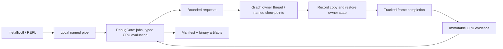

# Engine debug control plane and typed evaluation (v1)

The debug control plane lets a local agent query an executing Metallic instance,
capture GPU data at a named boundary, and repeat the same CPU analysis offline.
It is opt-in and independent of ImGui. It does not pause passes or execute user
code in the engine.

## Build and start

Build from the normal configured MSVC environment:

```powershell
cmake --build build --target Metallic MetallicGPUDrivenSample MetallicCtl MetallicDebugTests MetallicRhiTests --config Debug
```

`MetallicDebugCore` depends on C++ and the existing JSON library; its Windows
transport also links `advapi32`. `MetallicCtl` produces `metallicctl.exe` and does
not link Vulkan, Slang, or Editor. The root project configuration still discovers
the engine's usual dependencies. Paths below use the Ninja build layout; for a
multi-config build, add the appropriate configuration directory.

```powershell
.\build\Source\MetallicGPUDrivenSample.exe --debug-control --streamasset
.\build\Source\metallicctl.exe --json list
.\build\Source\metallicctl.exe --pid 1234 --json hello
.\build\Source\metallicctl.exe --pid 1234 --json schema gpuScene
.\build\Source\metallicctl.exe --pid 1234 --json schema layouts
.\build\Source\metallicctl.exe --pid 1234 --json eval 'streaming.instances[0].stats.pendingPageCount'
```

Use a current StreamAsset. For a small reproducible fixture:

```powershell
.\build\Source\Metallic.exe --build-meshstream Asset\StandfordBunny\scene.gltf --output .tmp\debug-bunny.meshstream.bin
.\build\Source\MetallicGPUDrivenSample.exe --debug-control --streamasset --scene Asset\StandfordBunny\scene.gltf --streamasset-path .tmp\debug-bunny.meshstream.bin
```

`METALLIC_DEBUG_CONTROL=1` enables the service for other editor entry points.
`METALLIC_DEBUG_VALIDATION=1` additionally enables Vulkan validation when the
service is enabled. The existing Vulkan log remains active. `metallicctl repl`
accepts read-only commands, including `eval <expression>`, `schema`, `hello`, and
`quit`. JSON responses go to stdout; prompts and diagnostics go to stderr.

## Discover, capture, analyze, export

`rg graph` describes active and culled passes, execution order, graph edges,
resource allocations and runtime-setting schemas. `rg trace RESOURCE` follows
pass dependencies. `object.get resources` describes the resources observed in the
latest completed execution, including private provider resources and whether the
producer supports capture. Array results support `--offset` and `--count` paging.

```powershell
.\build\Source\metallicctl.exe --pid 1234 --json rg graph
.\build\Source\metallicctl.exe --pid 1234 --json object.get resources
.\build\Source\metallicctl.exe --pid 1234 --json capture batch --spec Documentation\DebugCapture.example.json --wait
.\build\Source\metallicctl.exe --pid 1234 --json eval 'buffers["streaming.GPUDriven.activeHeader"][0]' --job 1
.\build\Source\metallicctl.exe --pid 1234 --json eval 'links["streaming.GPUDriven.activeGroups"].items[0]' --job 1
.\build\Source\metallicctl.exe --pid 1234 --json jobs get 1 --stats
.\build\Source\metallicctl.exe --pid 1234 capture export 1 --out .tmp\evidence-1
.\build\Source\metallicctl.exe --capture .tmp\evidence-1 --json eval 'buffers["streaming.GPUDriven.activeHeader"][0]'
.\build\Source\metallicctl.exe --capture .tmp\evidence-1 --json stats
```

Job IDs in these examples are placeholders. Export creates a new directory with
`manifest.json` and numbered binary files; it writes the manifest last. The
manifest contains copied CPU values, the evidence stamp, each layout and layout
hash, and every captured range. The manifest and binary data are transferred in
chunks, so large metadata does not prevent job polling or export. Offline loading
checks sizes and layouts and uses the same decoder, evaluator, relation resolver,
statistics code, and array pagination as online queries.

The example intentionally captures small ranges. Increase counts using discovered
capacities and the relevant counter/header contracts. Include dependent tables
in the same batch when a complete relationship is needed. A later capture is a
different observation and must not complete a missing dependency in old evidence.

`inspect buffer ID --count N --offset N` and
`inspect texture ID --roi X,Y,W,H` / `--pixel X,Y` are capture conveniences.
Add `--wait --stats` to obtain CPU range statistics. Without an explicit range,
one element or the pixel at (0, 0) is captured. Statistics report this scope; they
do not silently expand a pixel query into a full-image scan.

### Comparing checkpoints in one execution

A normal batch fixes one pass/checkpoint and binds to the next eligible graph
execution when the owner thread drains it. For an Early/Late comparison, send a
single `capture.batch` request containing `batches`, as in
`DebugCapture.Compare.example.json`. Enqueue is atomic; the group cannot be split
by the per-frame command limit. Each child gets its own job and evidence stamp,
with the same execution ID and different checkpoints. `--wait` waits for all
children. Export child jobs separately. A group must fit `commandsPerFrame`; the
shared per-execution copy budget still applies. Resource validation failures are
reported on the affected child, with no automatic retry at another boundary.

## Data and expression contracts

Expressions have scalar literals, object fields, array indices, arithmetic,
comparisons, short-circuit boolean operators, and these bounded functions:

```text
count(records)
count(records, r => r.instanceIndex >= gpuScene.stats.instanceCount)
findFirst(records, r => isnan(r.position[0]))
min(records, r => r.depth)
max(records, r => r.depth)
mean(records, r => r.depth)
length(vector)
isnan(number)
isinf(number)
```

Use `buffers["resource ID"]` for captured arrays, `coverage["resource ID"]` for
their ranges, `links["resource ID"].items` for domain references, and `diagnostics`
for counter/capacity inconsistencies. Indices in a decoded array are relative to
the captured range; link indices are absolute. `findFirst` returns a relative
index or null. `length` is vector magnitude (or string byte length); `count` is
array cardinality. Empty min/max/mean return null. Min/max propagate NaN; range
statistics separately count finite values, NaNs and infinities and report a
finite-only approximate f64 mean. Integer extrema and comparisons remain exact.

The parser builds a restricted expression tree. Evaluation checks operand types,
indices and integer overflow. Assignments, general function calls, user loops,
recursion, and pointers are rejected. Mixed floating arithmetic/comparisons cannot
silently round an integer above 2^53. Decoding is bounded to one million scalar
fields per artifact, with a total of 262,144 captured elements per evaluation or
statistics request. Expression limits are 16 KiB, 2,048 tokens, and one million
operations including value-copy work. Expensive CPU analysis runs on the service
thread, outside the renderer and outside the core lock. `eval` never records GPU
commands; GPU descriptors themselves are not iterable.

All integer JSON values on the wire are tagged, for example
`{"$type":"u64","value":"18446744073709551615"}`. Signed integers use `i64`;
non-finite floating values use `{"$type":"f64","value":"NaN"}` (also `+Inf`,
`-Inf`). Requests may use ordinary integer JSON values where exact, or these tags.
GPU schemas use explicit `sizeof` / `offsetof` layouts and layout hashes. A raw
structured buffer needs an explicitly supported layout; stride alone does not
define its fields. RGBA8/BGRA8 statistics use storage values 0..255, not linearized
color. Texture capture covers mip 0, layer 0 of single-sample 2D textures:
RGBA8/BGRA8, RGBA16F, RGBA32F, R32Uint, R32Float and D32Float. ROI is row-major and
tightly packed. Depth capture requires a graphics-capable queue; arbitrary ROI on
a transfer-only queue is currently Unsupported.

## Provider boundaries

| Provider | Published data |
| --- | --- |
| engine | Service state, device capabilities, graph/submission/history frame identities |
| rg / resources | Compiled graph, pass settings, aliases/edges, resource descriptions and allocations |
| gpuScene | CPU instances/geometries, draw-set revision, global GPU tables, view/slot and instance-cull descriptors |
| streaming | Residency/page metadata, runtime generation, original request source frame, GPU request/page/active tables |
| tasks | Bounded `ITaskEventSink` graph/node/edge snapshots and state events, with truncation/drop counts |
| validation | Severity/type, message ID, objects and timestamp; no invented pass/execution association |

CPU instance, geometry and page arrays retain at most 4,096 records with explicit
truncation flags. Task/validation queues hold 256 events per provider; task graph
events contain up to 64 nodes and 256 edges. Shader/pipeline registries are outside
v1. GPUScene global tables include instances, geometries, meshlets, meshlet draws
(`VisibleClusterRecord`) and draw-instance IDs.

GPUDrivenPreviewPass and GPUDrivenStreamAssetPass publish AfterTraversal when
streaming is active, AfterEarlyCull, AfterLateCull, and AfterPass. RTAS-only
visualization publishes Traversal/AfterPass. They sample without pausing or
splitting the pass. Copies occur outside dynamic rendering scopes.

Two existing producer contracts matter when interpreting evidence:

* These GPUDriven paths use `recordInstanceCull`. The allocated view meshlet
  worklists/bucket indirect arguments are not populated by that path. They are
  described as unsupported for capture, rather than decoded as live records.
  Instance counter/list data describes the last instance-cull dispatch at that
  boundary; it is not an aggregate over all dispatches in the pass.
* Streaming `VisibleClusterRecord` entries are sparse and written during mesh
  drawing. Capture them at AfterPass. A captured visibility pixel can establish
  that a particular slot was referenced in this execution. An unreferenced slot
  remains Unverified, even when its bytes resemble a valid old record.

Packed decoding preserves Resident / StreamPage, draw bucket and page-table state
and offset. Resident records link to CPU geometry/instance metadata and captured
GPU geometry/meshlet ranges. Stream records link to active groups, the active
header and page table. Missing captures or missing subranges produce
MissingDependency; indices beyond known capacity produce OutOfRange. Active-group
and visible-instance links explicitly distinguish Live from OutsideLiveRange when
their headers/counters are captured. An unmapped active group's GPUScene instance
sentinel is reported as Unmapped. CPU residency and GPU page-table stages are
reported independently and are not automatically treated as contradictory.

## Consistency, lifetime, and limits



Execution ID counts debug-observed graph executions. It is distinct from the
renderer frame number, editor submission frame, history frame, streaming frame,
and reusable frame slot. Evidence includes the session, graph instance and compile
generation, pass, checkpoint, sample/content version, allocation generation, and
available GPUScene/streaming provenance. Delayed GPU request statistics retain
their source frame; unknown attribution is null. Recording timestamps are UTC
epoch nanoseconds; validation timestamps use the steady clock.

The default query selects one completed metadata snapshot. Use `--frame N`
(and `--graph ID` if needed) to choose a historical observation explicitly. GPU
completion alone does not retain old resource contents. Only captured bytes are
available for old GPU data; absent evidence returns NotCaptured. Recompile,
resize, successful shader reload and scene-generation changes invalidate queued
handles with StaleHandle. Nothing is silently retargeted.

Jobs advance Queued → Recording → Recorded → Submitted → Ready. Recording is an
internal owner-thread preparation state. Cancellation and timeout stop delivery;
accepted GPU work and staging resources remain alive until completion. A submitted
prefix of a failed execution may produce valid checkpoint bytes, with
`executionComplete=false`; it does not become a completed-frame snapshot.

Both executor submission routes use the same observer. Asynchronous capture
requires a tracked RenderFrameContext. Legacy untracked calls expose only recorded
metadata through `--recorded`, labeled recorded-untracked, and reject GPU capture.
The editor polls the service before its minimized-window early exit. Existing
snapshots remain queryable while rendering is stopped; new captures expire if no
eligible execution occurs. Startup/shutdown follow the ownership rules in
[RenderFrameLifetime.md](RenderFrameLifetime.md).

| Limit | Default |
| --- | ---: |
| Metadata ring | 120 executions, 16 MiB serialized values |
| Capture pool | 128 MiB retained payload/manifest budget |
| Per job | 16 MiB payload plus serialized manifest estimate |
| Copies recorded per graph execution | 16 MiB |
| Job/command queue | 256 |
| Requests drained per execution | 8, or 1 ms for queue dispatch; atomic groups stay together |
| Protocol message | 1 MiB; binary/manifest chunks at most 256 KiB raw |
| Capture timeout | 30 seconds; configurable 1..300,000 ms |

`METALLIC_DEBUG_LIMITS` accepts a startup JSON object with snapshotCount,
snapshotBytes, capturePoolBytes, jobBytes, frameBytes, queueCount and
commandsPerFrame. Byte limits count serialized metadata/raw evidence, excluding
C++ allocator and temporary CPU decode overhead. Capture preflight, recording and
mapping are owner-thread work; the 1 ms dispatch limit does not promise a 1 ms
GPU-copy or readback CPU cost. Completed jobs can be evicted under pool/queue
pressure, so export evidence that must persist. Oversized batches fail rather
than being split across frames. The frame's debugControl values report copy bytes
and CPU recording time; GPU copy duration is currently unknown (null), and no
continuous GPU probe is enabled.

## Protocol and extension points

The Windows endpoint is `\\.\pipe\Metallic.Debug.<pid>`. A random session ID and
process start time are returned by hello; subsequent CLI requests carry that
session. Stateless agent invocations can pass `--pid PID --session SESSION` to
pin the identity across CLI processes and reject PID reuse. The explicit pipe
DACL uses the current logon SID and remote clients are
rejected, following [Microsoft's named-pipe access-control guidance](https://learn.microsoft.com/en-us/windows/win32/ipc/named-pipe-security-and-access-rights).
One request is exchanged per connection: four-byte little-endian length, UTF-8
JSON request, then the same response framing. The client sends one acknowledgment
byte after receiving the response so disconnect does not discard unread bytes.
Reads, writes and shutdown cancellation are bounded; malformed frames and deeply
nested JSON are rejected.

```json
{"version":1,"id":"agent-1","session":"from-hello","method":"eval","params":{"expression":"streaming.instances[0].stats.pendingPageCount"}}
```

| Method | Parameters / result |
| --- | --- |
| hello | Version, session/start information, provider names, methods, graph, limits |
| schema | Optional name; provider schema or layouts |
| frame.latest | Optional frame/graph/recorded; values and evidence |
| rg.describe / rg.trace | Graph / resource and direction dependency closure |
| object.get / eval | path / expression, optional job or frame, array pagination |
| capture.batch | pass, checkpoint, resources; or atomic batches array; returns job(s) |
| jobs.get / jobs.cancel | job; get supports stats and optional includeCapture for small manifests |
| artifact.read | job, index, offset/count; or manifest:true to read the manifest |

Errors include ProtocolError, TypeError, ParseError, PrecisionLoss, Overflow,
OutOfRange, LayoutMismatch, Unsupported, StaleSession, StaleHandle, NotCaptured,
NotReady, QueueFull, BudgetExceeded and Timeout. The engine accepts no arbitrary
output paths; exports are local CLI file operations.

Render providers borrow resource bindings only during debugCheckpoint. They must
publish explicit layout and state contracts and keep copies outside rendering
scopes. Readback uses HostReadback destinations, TransferSource source usage and
barriers restoring the exact owner state. Sources keep their original memory
location. Unsupported format/queue/range/state combinations are rejected before
recording, consistent with [Vulkan image-to-buffer copy requirements](https://docs.vulkan.org/refpages/latest/refpages/source/vkCmdCopyImageToBuffer.html).
No per-query waitIdle or extra submission is introduced; without an observer,
checkpoint calls skip all debug work.

## Validation and follow-up scope

```powershell
ctest --test-dir build -C Debug -L debug --output-on-failure
.\build\tests\MetallicRhiTests.exe --gtest_filter='*DebugControl*:*frame_*:*gpu_scene_*:*render_graph_multi_queue_submit*'
.\build\tests\MetallicRhiTests.exe --filter render_graph_gpu_driven_mixed_producer_render
pwsh -File tests\debug\DebugControlE2E.ps1 -EnginePid 1234 -CaptureDirectory .tmp\new-e2e-evidence
```

The PowerShell 7 end-to-end test uses an already running, stable GPUDriven streaming
instance. It compares three checkpoints in one execution, exports evidence, and
checks four expressions plus range statistics against offline results.

The dedicated tests cover protocol/session/disconnect behavior, integer and NaN
encoding, layout/packed-field validation, expression limits, pagination, queue
groups/timeouts, missing dependencies and statistics. Vulkan tests write different
values at two checkpoints and verify independent results, both executor paths,
ROI coverage, resize/reload invalidation, abandoned recording, and submitted
prefix survival. Device-loss handling follows completion errors but is not
hardware fault-injected by these tests.

The mixed-producer raster regression also captures all four Preview checkpoints,
checks Resident typed decoding and the stream visibility-record base, and retains
its existing image checks for both resident and streamed geometry.

Follow-up phases remain: fixed Slang GPU probes/watch; pre-recorded submission
stepping; restricted IR-to-Slang GPU evaluation; and revision-checked runtime
setting transactions. V1 exposes no pause, GPU eval or mutation method.
