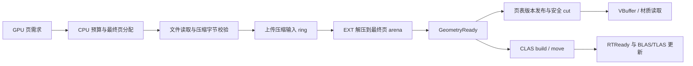

# GPUDriven 流送：GPU 解压与间接复制调研

后续实施进度见 [第一阶段实现与验证](GpuStreamingDecompressionImplementation.md)。以下保留调研时的结论与阶段划分。

2026-09-18。代码基线 `5b5a3c3ccb81b58d2912cf9074a27b9d7920ec48`，分支 `modernization_/fast-streaming`。依据用户提供的讨论、当前 Streamer 实现、Khronos 规范和本机只读探测。本文是接入设计；没有实施 GPU 解压，也没有测得吞吐或帧时间收益。

**建议先接入 GDeflate 解压到最终驻留页，再按实际需要接入 GPU 参数驱动的复制。** 本机两个扩展均可用；Metallic 已具备页分配、完整回退和完成后发布机制，适合增量改造。关键工作是离线生成 GPU 可直接消费的页、消除 CLAS 对 CPU 完整解码的依赖，以及把发布条件从“复制完成”延长到“解压及相关消费链已就绪”。

**本机与资产核查**

2026-09-18 使用系统 `vulkaninfo --text` 查询，结果如下。结构化记录在 [GpuStreamingDecompressionEvidence.json](E:/metallic/Documentation/GpuStreamingDecompressionEvidence.json)，原始输出在 [vulkaninfo.txt](E:/metallic/.cache/fast-streaming/vulkaninfo.txt)。这是物理设备能力查询，尚未进行引擎内 feature 启用和命令执行验证。

| 项目 | 实测结果 | 接入含义 |
| --- | --- | --- |
| GPU / 驱动 / Vulkan API | RTX 5060 / 610.47 / 1.4.341 | 可以在当前开发机验证 |
| `VK_EXT_memory_decompression` | revision 1，`memoryDecompression=true` | 可启用 EXT 路径 |
| 解压方法 | `GDEFLATE_1_0` | 不能直接解压现有 ByteRle |
| `maxDecompressionIndirectCount` | 2,147,483,647 | 只是 API 上限，不能当作每帧工作预算 |
| `VK_KHR_copy_memory_indirect` | revision 1，两个 feature 均为 true | buffer 和 image 两条路径分别启用 |
| 间接复制 `supportedQueues` | GRAPHICS、COMPUTE | 本机纯 transfer 队列不能执行间接复制 |
| image 格式能力 | 本次未查询 | 接纹理前逐格式、tiling 检查能力 |

本机 SDK `1.4.341.1` 与仓库 `External/volk/volk.h` 已有两个扩展声明。运行时仍需枚举扩展、查询/启用 feature、保存 properties 并确认函数指针；不能根据显卡型号或头文件宏直接假定支持。保留 Raw 与 CPU GDeflate 路径，EXT 解压和 KHR 间接复制不应互为硬依赖。

另直接扫描了本地 [MiniZorah 缓存](E:/metallic/Asset/MeshletCache/MiniZorahCook/MiniZorah.meshstream.bin) 的全部页目录；未读取全部 payload。该文件是 v9，60,916,791,801 字节，包含 1,356,959 页和 33,020,491 个 cluster。

| 页目录统计 | 当前磁盘 payload | 按现有转换计算的 GPU payload |
| --- | ---: | ---: |
| 总字节，不含目录和分配对齐 | 60,494,871,392 | 48,681,578,880 |
| P50 页大小 | 45,536 B | 36,608 B |
| P95 页大小 | 59,568 B | 47,952 B |
| P99 页大小 | 63,632 B | 51,312 B |
| 最大页大小 | 74,688 B | 59,840 B |

所有页的 `compressionMode=0`、`payloadFlags=0`、`attributeFlags=9`：这份缓存未压缩，使用旧 float4 位置布局，只声明 position/material 属性。现有运行时已压紧为 float3。将同一转换提前到离线阶段，可使 payload 减少约 **19.53%**；这是布局变化，不是 GDeflate 压缩率，也不是相对当前运行时的额外 VRAM 节省。

按当前设备布局，所有页都能放进一个不超过 64 KiB 的解压块，因此第一版不需要重新分组或改变 page/group ID。以后包含 normal/UV/tangent 等更多属性的缓存可能超过此限，格式仍应支持一页多个 tile。目录扫描脚本与结果留在 [本地调研目录](E:/metallic/.cache/fast-streaming/InspectAsset.py)；JSON 保存了页目录 SHA-256 和范围，方便核对输入。

**现有链路与需要拆开的依赖**

| 环节 | 当前实现 | 对 GPU 解压的影响 |
| --- | --- | --- |
| 读盘 | [MeshletStreamAsset::open/pagePayload](E:/metallic/Source/Runtime/Scene/MeshletStreamAsset.cpp:4232) 使用 Windows 文件映射并返回 span | 工作线程首次触碰可能触发磁盘缺页；当前不是显式 overlapped I/O 队列 |
| 页加载 | [MeshletStreamPageLoader](E:/metallic/Source/Runtime/Render/Streamer/MeshletStreamPageLoader.cpp:18) 每页提交 TaskSystem 工作，最多 32 个并发 load | 返回的是 CPU 解码后的 vector，Raw 路径也可能复制/转换 |
| 解码/布局 | [decodeMeshletStreamPayloadForDevice](E:/metallic/Source/Runtime/Scene/MeshletStreamAsset.cpp:4801) 支持 None/ByteRle，校验后 float4→float3 | GPU 解压输出必须预先达到最终布局；不能留下运行时 CPU 重排 |
| 上传 | [processUploads](E:/metallic/Source/Runtime/Render/Streamer/MeshletStreamResidency.cpp:951) 向最终页 offset 上传 decoded bytes | 可以复用现有最终分配；增加压缩输入 ring 和解压 batch |
| CLAS 计划 | [buildMeshletStreamClasPagePlan](E:/metallic/Source/Runtime/Render/Streamer/MeshletStreamClas.cpp:46) 读取 header/cluster，并逐 triangle index 校验 | GPU 解压后不能仍要求 CPU 完整 payload，否则收益链路被截断 |
| 发布 | [completeUploadPages](E:/metallic/Source/Runtime/Render/Streamer/MeshletStreamResidency.cpp:510) 在 completion 后设 Resident | GPU 路径必须等待最终安装完成，不能沿用压缩输入 copy 的 completion |
| Vulkan 复制 | [CommandBuffer::copyBuffer](E:/metallic/Source/Runtime/Render/GAPI/Vulkan/VulkanRhi.cpp:5509) 已使用 `vkCmdCopyMemoryKHR` | 目前已是 BDA 复制；KHR indirect 的新增价值是 GPU 读取参数，不是引入 BDA |

最近的 [wave 工作分配报告](E:/metallic/Documentation/StreamWaveWorkDistribution.md) 中 `Stream traversal` 包含 demand/frontier 等 GPU 工作；解压扩展不会消除这些工作，也不会直接降低 Stream early/late 的光栅成本。既有 [Stream Begin 细分](E:/metallic/Documentation/MiniZorahStreamBegin.md) 没有覆盖后台加载线程全部执行时间，不能用其小的上传 CPU scope 推断磁盘和解码没有瓶颈。

**两个扩展的边界**

`VK_EXT_memory_decompression` 提供设备内存之间的解压。CPU 仍负责文件读取、任务优先级和预算；它与间接复制一起也不等于 DirectStorage 的文件 I/O 系统。扩展不承诺独立解压硬件或不占用渲染资源，异步收益需要实测。[EXT 规范](https://docs.vulkan.org/refpages/latest/refpages/source/VK_EXT_memory_decompression.html)

第一版使用 `vkCmdDecompressMemoryEXT`，CPU 一次提交多个 `VkDecompressMemoryRegionEXT`。同一调用只选一个 method，Raw tile 单独复制。GDeflate 每个 region 的输出最多 65,536 字节；src/dst 地址按 4 字节对齐，大小非零，地址范围有效且不得重叠；源和目标 buffer 都需要 `VK_BUFFER_USAGE_2_MEMORY_DECOMPRESSION_BIT_EXT`。继续保持 Metallic 页/段自己的 16/256 字节对齐约束。[Region 约束](https://docs.vulkan.org/refpages/latest/refpages/source/VkDecompressMemoryRegionEXT.html)、[批次约束](https://docs.vulkan.org/refpages/latest/refpages/source/VkDecompressMemoryInfoEXT.html)

后续若 GPU 开始生成有效 tile 集合，再使用 `vkCmdDecompressMemoryIndirectCountEXT`。它新增的 `maxDecompressionCount` 可以限制执行数量，但 GPU count 本身仍必须符合 property 和参数 buffer 范围约束，不能靠 clamp 掩盖越界。参数和 count buffer 需要 INDIRECT_BUFFER usage。解压只允许 graphics/compute 队列，不能放入 transfer-only command pool。[间接解压规范](https://docs.vulkan.org/refpages/latest/refpages/source/vkCmdDecompressMemoryIndirectCountEXT.html)

`VK_KHR_copy_memory_indirect` 在执行时从 GPU buffer 读取 src/dst/size 等参数，**`copyCount` 仍由 CPU 提交**。它不会减少 payload 字节数；CPU 已知最终页地址时，应先与现有直接复制批处理比较，而不是给每个解压页额外加一次复制。[KHR 设计](https://docs.vulkan.org/features/latest/features/proposals/VK_KHR_copy_memory_indirect.html)

buffer 复制的 src/dst/size 都要求 4 字节对齐，参数使用 INDIRECT_BUFFER，payload 使用 TRANSFER_SRC/TRANSFER_DST；整个批次不允许读写区域重叠或多个目的区域重叠。适合非重叠的新旧 arena 搬迁、GPU 分配结果驱动的 Raw scatter；不能作为任意原地 memmove。[复制参数](https://docs.vulkan.org/refpages/latest/refpages/source/VkCopyMemoryIndirectInfoKHR.html)、[复制区域](https://docs.vulkan.org/refpages/latest/refpages/source/VkCopyMemoryIndirectCommandKHR.html)

image 路径可考虑“GDeflate → 线性纹理块 → indirect image copy”。目标 image、layout 和逐项 subresource 仍在 CPU 命令中指定，GPU 参数的 subresource 必须一致；还要查询 `COPY_IMAGE_INDIRECT_DST_BIT_KHR` 和 TRANSFER_DST 格式能力并满足 texel/block 对齐。本次没有核验任何具体 BC 格式。当前 refpage 对 image copyCount 的说明与隐式 VUID 存在零值表述不一致，第一版空批次直接跳过命令。[Image info](https://docs.vulkan.org/refpages/latest/refpages/source/VkCopyMemoryToImageIndirectInfoKHR.html)、[Image command](https://docs.vulkan.org/refpages/latest/refpages/source/VkCopyMemoryToImageIndirectCommandKHR.html)

**推荐的页格式与 CLAS 接口**

新增版本化的 GPU-ready 容器，保留现有 v8/v9 读取兼容；通过离线转码器从现有缓存转换，不重新生成 LOD。离线调用等价的验证和紧凑布局转换，再把最终 payload 切成独立 tile 压缩。CPU/GPU decoder 输出必须逐字节一致，包括最终 header、offset、position stride、属性和 padding。

| 记录 | 建议内容 |
| --- | --- |
| 文件头 | format/layout version、来源 fingerprint、页/组/层级目录、tile 表位置 |
| 页目录 | stable page ID、最终 payloadBytes、tileOffset/count、依赖关系、可选 CLAS 元数据位置 |
| tile | fileOffset、storedBytes、decodedBytes、页内 dstOffset、codec、checksum |
| 编码 | Raw 或 GDeflate1_0；压缩后不划算的 tile 使用 Raw，比较时计入 padding/目录成本 |

GPU BDA、ring offset、generation 和 timeline 不写入磁盘。逻辑页、≤64 KiB 解压 tile、合并 I/O 区间是三个不同单位。第一版沿用页大小，按文件邻近性合并读取；128 KiB/512 KiB/2 MiB 等只是实验档位，不能为凑大包拖延首屏关键页。记录 read amplification，避免少量需求读入大量无用数据。

使用现成 GDeflate 编码器并保留其合法结尾 padding，不将普通 deflate/zlib、meshopt 或整个 DirectStorage/sample 容器直接传给解压命令。每个 region 应指向独立 GDeflate tile bitstream。NVIDIA 示例提供 CPU 编码/解码对照，但仍使用 NV API；迁移到 EXT 时需按新方法参数、结构和同步规则适配。[NVIDIA 示例](https://github.com/nvpro-samples/vk_memory_decompression)、[GDeflate 位流说明](https://github.com/microsoft/DirectStorage/blob/main/GDeflate/GDeflate/README.md)

CLAS 建议分两步解耦：

1. 第一版离线生成每页精简 CLAS build sideband，保存局部 offset/count/stride/material 等，由 CPU 与压缩页一起按需读取、校验并拼计划。triangle index 全量语义校验放在 cook/转码验证；运行时验证目录、长度、范围及压缩字节 checksum。旧文件继续走现有完整 CPU 验证路径。sideband 必须和 payload 绑定同一版本/校验标识。
2. 后续在解压后由 GPU 读取页内 header/cluster，生成 CLAS 输入参数；再减少 sideband。沿用现有 CLAS allocator、build/move、地址发布和 BLAS 复用。

不要把所有 cluster 元数据复制进永久 CPU 目录：当前有 3302 万 cluster，即使每个额外 24 字节也约 756 MiB。sideband 应随页按需加载并及时释放；这是权衡，不是无成本捷径。CLAS/BLAS 的移动必须继续使用对应 AS API，不能用通用间接内存复制替代结构感知的 relocation。[CLAS build/move 命令](https://docs.vulkan.org/refpages/latest/refpages/source/vkCmdBuildClusterAccelerationStructureIndirectNV.html)

**安装、发布与帧间流水**

建议的几何数据路径如下；所有新模块归 Streamer 管理，文件 I/O 在 RenderGraph 外完成，图只调度已准备的 GPU batch：

初版允许同一 graphics/compute 队列顺序执行，用于建立正确性基线；第二步拆成 copy 上传、compute 解压/建 CLAS、graphics 消费。当前页 arena 的 queueAccess 是 Graphics|Compute；压缩输入 ring 若跨 copy queue，必须加入对应共享访问或所有权转移，不能只改提交队列。

复用现有 completion 基础设施，但为安装 batch 区分 upload、decode、publish/consumer 完成点：

- 上传完成只释放 host staging；device compressed ring 必须保留到解压读完。
- 一页所有 tile 写完后才 GeometryReady。发布到下一可用页表版本，仍由安全 frontier 选择完整覆盖；不得把“有一部分 tile”视作可绘制页。
- RTReady 额外要求 CLAS 地址及依赖有效。光栅与 RT 的就绪位分开，但当前要求共同安全 cut 的消费者仍需满足其完整条件。
- graphics 消费一个确定的 resident snapshot；只有消费新页的提交等待对应 timeline。未就绪则使用现有 fallback，不能每帧 CPU 等所有 I/O/解压完成。
- 取消、相机转向、卸载和重载使用 generation 防止过期发布；已提交 GPU 写入所占的物理页/ring slice 仍必须等 GPU 完成后回收。generation 不会阻止旧命令覆盖复用的内存。
- 旧页地址及 CLAS 必须等所有使用该版本的 graphics/compute/RT 读者退出才能复用。保留首屏完整 terminal/fallback 集合，细节加载不延迟安全首屏。

这与 vk_lod_clusters 的 storage/update 分离方向一致：传输完成后 patch，再在使用结束后释放。其 RT 路径可在 CLAS 建完后丢弃部分位置数据，而 Metallic 的 VBuffer、材质和细分仍消费几何，因此不能直接照搬释放位置的策略。[参考 streaming 生命周期](https://github.com/nvpro-samples/vk_lod_clusters/blob/main/docs/streaming.md)

**RHI 与同步改动范围**

建议增加独立 capability、direct/indirect decompression 和 indirect copy 的 typed desc；为输入 ring/目标 arena 设置 usage，并把 Vulkan 通用 buffer 创建改为 `VkBufferUsageFlags2CreateInfo`。现有通用 [buffer 创建](E:/metallic/Source/Runtime/Render/GAPI/Vulkan/VulkanRhi.cpp:8682) 使用 32 位 native usage；heap/DGC 部分已有 usage2 可复用。RHI 自己的 `BufferUsageBits` 可以新增抽象 bit 后映射，不必仅因 Vulkan bit 超过 32 位就强制全项目枚举扩宽。

下面列出直接解压路径的必要依赖。跨队列用 semaphore/timeline 建立依赖，exclusive resource 另做 queue-family ownership transfer；host 非 coherent 写入要先 flush。

| 生产者 → 消费者 | 同步范围 |
| --- | --- |
| compressed copy → 解压读 | COPY / TRANSFER_WRITE → MEMORY_DECOMPRESSION_EXT / MEMORY_DECOMPRESSION_READ_EXT |
| 解压写 → shader 页数据读 | MEMORY_DECOMPRESSION_EXT / MEMORY_DECOMPRESSION_WRITE_EXT → 实际 mesh/compute/fragment 等 shader stages / SHADER_STORAGE_READ |
| 解压写 → 常规 BLAS 几何输入读 | MEMORY_DECOMPRESSION_EXT / MEMORY_DECOMPRESSION_WRITE_EXT → ACCELERATION_STRUCTURE_BUILD / SHADER_READ |
| shader 生成间接复制参数 → 参数读取 | COMPUTE_SHADER / SHADER_STORAGE_WRITE → COPY_INDIRECT_KHR / INDIRECT_COMMAND_READ |
| 解压写 → 复制 payload | MEMORY_DECOMPRESSION_EXT / MEMORY_DECOMPRESSION_WRITE_EXT → COPY / TRANSFER_READ |
| 页表 patch → 遍历 | 实际 patch 的 transfer/compute 写 → 遍历 compute/storage 读 |

参数读取与 payload 复制是不同阶段，不能用 DRAW_INDIRECT 或单个 compute barrier 代替所有依赖。具体 CLAS 输入/输出继续按其 API 的 AS_BUILD、INDIRECT_COMMAND_READ、AS_READ/WRITE 访问角色同步。尽量用页范围 barrier，避免整个大 arena 转为写状态而串行化旧页绘制。[同步规范](https://docs.vulkan.org/spec/latest/chapters/synchronization.html)、[解压访问类型](https://docs.vulkan.org/refpages/latest/refpages/source/VkAccessFlagBits2.html)、[AS 输入同步](https://docs.vulkan.org/spec/latest/chapters/accelstructures.html)

**预算和验证路线**

GPU 压缩减少磁盘/上传字节，不减少解压后几何、CLAS 或 BLAS 的驻留占用；新增 compressed ring 还会占用 VRAM。将当前 `maxUploadBytesPerFrame` 分解为压缩上传字节、解压输出字节/region 数、CLAS 工作量和发布页数等预算，同时限制在途字节与保留最终页分配。单用压缩输入预算会让高压缩率批次突然产生很大的解压/CLAS负载。

入队仍用现有可见收益/依赖优先级。新增后台批次应有短批上限和年龄提升，避免一个大解压提交阻塞当前绘制；async compute 与 DLSS、软光栅等可能争用 GPU，必须允许按负载降额。对已 Ready 但未发布的页单独计时，避免解压更快却被发布额度或 CPU 轮询卡住。

推荐实施顺序：

| 阶段 | 交付及退出条件 |
| --- | --- |
| 0：测量与格式样本 | 分离 mapped-file 缺页、CPU 转换、上传、安装/发布耗时；对固定页请求样本转码并测真实压缩率 |
| 1：正确性闭环 | Raw/GDeflate GPU-ready 容器、CPU fallback、CLAS sideband、EXT direct batch、最终 arena 写入和完成后发布；不改变 LOD/cut |
| 2：重叠与 I/O | 有限容量多批 ring、timeline、async compute；若缺页/读盘成为瓶颈，再引入 overlapped ReadFile/IOCP、合并读取和预取 |
| 3：间接化 | 对 GPU 生成地址的 Raw scatter/arena 搬迁验证 KHR indirect；对 GPU 生成有效 tile 队列验证 EXT indirect count；通过 A/B 后接入 |
| 4：拓展 | GPU 生成 CLAS 计划；再考虑纹理分块/BC 数据和 image indirect，不阻塞几何主链 |

I/O backend 可先保留当前文件映射，以便单独测出 GPU 解压效果。IOCP 改造时任务等待应由完成通知推进，避免把大量 TaskSystem worker 阻塞在 ReadFile。将 DirectStorage 系统内存目标作为未来 Windows I/O backend 是另一项独立实验，不需要引入 D3D12/Vulkan 资源互操作来验证这两个扩展。

比较至少包含以下四组，使用完全相同的 GPU-ready 字节、校验、页请求及驻留预算：

| 组别 | 存储/解码/上传 | 隔离的变化 |
| --- | --- | --- |
| A | Raw compact + 普通上传 | 去除旧 float4 转换的控制组 |
| B | GDeflate + CPU 解码 + 普通上传 | 磁盘压缩收益与 CPU 代价 |
| C | GDeflate + 压缩上传 + 同队列 EXT 解压 | GPU 解码、PCIe 字节差异 |
| D | C + 异步队列和安装流水 | 真正的 overlap 与渲染争用 |

先用固定页序列隔离传输；再用现有 [RunMetallicCfgReplay.ps1](E:/metallic/tools/RunMetallicCfgReplay.ps1) 的 MiniZorah 3000 帧漫游验证端到端行为。固定相机并不保证固定页请求，因为及时可见性会改变后续流送，两层基准都需要。沿用 [Replay.json](E:/metallic/.cache/gpudriven-four/Replay.json) 及其 SHA-256；固定输出/内部分辨率、LOD、workers、细分、CLAS/BLAS 和全部预算，性能与 validation/质量回放分开，保存全部重复和 GPU 竞争记录。旧报告不作为当前分支的性能测量。

记录 request→GeometryReady、request→实际可绘制/RTReady 的 P50/P95/P99、首屏完整覆盖和细节收敛时间；细分 I/O 等待、CPU decode/repack、staging、upload、GPU decode、CLAS build、publish 等阶段。当前 [MeshletStreamLatency](E:/metallic/Source/Runtime/Render/Streamer/MeshletStreamLatency.h) 的 Decode 覆盖加载任务中的多种工作，complete 在 CPU 驻留完成时调用，其 Drawable 命名不应直接充当“实际 draw 已消费”的证据。扩展端点时保留旧指标并明确新含义。

同时记录实际磁盘字节/缺页、请求有用字节、上传字节、解压输出字节、重复加载、fallback 误差、CPU 主线程与后台开销，以及 GPU 解压时长和整帧 P95/P99。完整内存口径包含 metadata、CPU staging、device compressed ring、最终页、CLAS/BLAS 和 scratch。冷缓存与暖缓存分组；重新启动进程不等于清空系统文件缓存，不把暖缓存结果称为 SSD 吞吐。

正确性验收覆盖 CPU/GPU 逐字节解码、尾块、跨 tile 页、Raw/GDeflate 混合、非对齐输入拒绝、损坏/截断包、ring wrap、取消重载与 generation、内存紧张、队列延迟、旧版本仍在绘制时卸载，以及 CLAS/光栅就绪不同步。必须保持无缺失 meshlet、完整安全 cut、首屏 fallback 和既有 budget oracle。只有压缩率、request→usable 和整帧分布共同改善，才默认启用 GPU 路径；本次调研不预设收益倍数。
