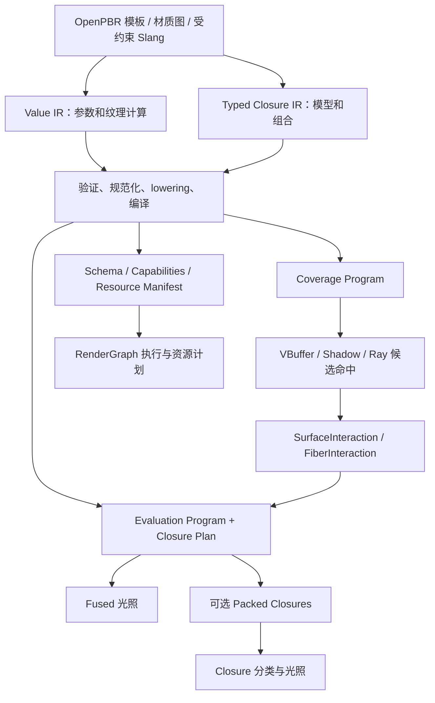

# Metallic 材质系统推进路线图

本文将用户提供的 Pro 模型讨论转化为可逐步合入、验证和调整的工程路线。目标是建立支持 OpenPBR 模板、自定义参数程序、可组合表面散射与 Fiber 扩展的材质系统。建议先交付统一运行时，再完成自定义程序和有界的 Mix / Layer，随后根据实测选择存储与调度后端，并独立扩展 strand 可见性。

本路线基于 2026-10-01 对 Metallic `287bad681` 的静态核对。M0 的场景与采样基线已按用户决定固定为现有 LookDev，运行采样和阶段验收尚未执行；其余阶段仍为规划。已有测试和历史记录仅用于确定可复用基础。文中的新类型、目录和预算均为建议，不表示当前仓库已经提供。

2026-10-04 基线进展：已将三个 LookDev 参考固定为独立图，完成三进程 HDR/GPU timestamp 采集、独立 validation 和管线寄存器诊断。实际结果、当前 ABI、A/B 命令及仍缺失的硬件/分箱指标见 [MaterialSystemPhase0](MaterialSystemPhase0.md)。这不将原始规划文字视为所有阶段的当前实现状态。

2026-10-04 资产模型进展：已实现外部路线图的 **Phase 1 — Material Definition / Instance / Program**，包括 `.material` 稀疏继承、语义 schema、版本迁移入口和 SceneDocument 绑定；复用已有共享程序与 GPU 上传。接口、示例、验收证据和阶段边界见 [MaterialSystemPhase1](MaterialSystemPhase1.md)。外部 Phase 编号与本文原有 M 编号分别记录。

## 1 目标和首个架构验收点

最终统一的是材质定义、编译、实例、资源生命周期和散射接口。Surface、Fiber 及特殊输运仍保留各自的交互数据、能力边界和执行策略。

首个架构验收点包含三个可实际运行的案例：

1. 现有 OpenPBR 表面通过新运行时渲染，保留原有外观和估计器。
2. 一个程序化双层表面材质通过同一套 Program / Instance / Closure 契约，在 VBuffer 与光追命中上求值。
3. 现有 RTXCR Chiang groom 通过 Fiber adapter 接入同一运行时，继续使用现有 DOTS 光追几何。

第三项从早期迁移阶段开始，用于验证抽象；它不要求先完成 strand 光栅、多样本覆盖或动画。第二项必须使用真正的组合契约，不能仅用 OpenPBR 内置 coat 参数证明通用 Layer 已完成。

## 2 当前基础和相对原讨论的调整

| 已核对的基础 | 工程含义 |
| --- | --- |
| [MaterialBinning.h](../Source/Runtime/Render/MaterialBinning.h) 与 [分类模块](../Shaders/Modules/GPUDriven/MaterialBinningCommon.slang) 已提供 8×4 tile、lane mask 和 5 类特征分箱 | 保留为固定模板的优化路径；新增 Program 分类，不把 5 个满屏队列直接扩成任意数量 |
| [VBuffer Deferred](VisibilityBufferDeferred.md) 已支持 resident 与 StreamAsset realtime 路径；补充路径追踪默认关闭、按变体显式启用 | 迁移必须分别覆盖两类场景来源和开关状态；固定采样数、估计器和 guides 设置进行对照 |
| [SceneMaterial.slang](../Shaders/Modules/Material/SceneMaterial.slang) 的 `PathTraceMaterial` 同时保存表面、透射、RTXCR hair 和纹理字段 | 用 legacy adapter 接入，逐步分离类型化 payload；保留旧资产和上传入口的兼容性 |
| [Slang 模块组织](../Shaders/README.md) 已建立 Modules / Interop / Features 边界和传递依赖缓存 | 新材质编译器复用现有 Slang 后端；无需重新进行全仓库 shader 模块化 |
| [RTXCR groom](RtxcrSample.md) 已有 Chiang BSDF 和 groom → DOTS → triangle BLAS 路径 | 早期即可验证 Fiber adapter；LSS、动画和 strand 光栅覆盖仍是后续项目 |
| [DGC](DeviceGeneratedCommands.md) 已有可选能力、execution set、preprocess 和读回测试 | 后续任务是接入材质 active-program 调度及测量收益，不是从零实现扩展 |
| [场景绑定](VisibilityBufferDeferred.md#场景绑定与帧前准备) 已保证 visibility / depth / rasterInfo 同源，并处理场景版本交接 | 扩展现有契约以纳入 program、layout、参数和 descriptor generation |

本次也核对了本机 VividRP 的 `MaterialValueIR.cs`、`ClosureExpressionGraph.cs` 及 lowerer：表达层已有 Slab / HorizontalMix / VerticalLayer，lowerer 仍要求单 Slab 或一个操作符连接两个直接 Slab。可继承双 IR、验证器和规范化思路；Metallic 的拓扑限制应归属 backend / quality profile，不能固化为作者图的类型规则。

## 3 先确定的架构决策

### 3.1 身份和编译产物

| 概念 | 职责及稳定性 |
| --- | --- |
| MaterialDefinition | 模板、图或受约束 Slang 模块；包含参数、资源、domain 和模型版本 |
| MaterialProgram | 不可变编译产物：coverage / evaluation 入口、schema、closure plan、资源声明、能力和诊断 |
| MaterialInstance | Program 引用及动态参数、纹理绑定；通过参数更新产生新快照 |
| MaterialProgramGeneration | 一次可发布的代码、布局与依赖资源集合；按 GPU completion 退休 |
| MaterialBin | 帧内临时调度分类；不进入资产文件，不充当持久材质身份 |

ProgramKey 包含规范化定义及传递代码依赖、closure lowering、显式静态参数、domain、quality profile、ABI、编译器与目标配置。实例颜色、纹理句柄和普通动画参数不进入代码键；可能改变执行分支的动态值也不自动变成静态特化。

区分语义 ProgramKey 与最终 kernel / pipeline key。后者还需要执行后端、入口、光照配置和资源布局等信息。多个 Program 共用一个 BSDF 不代表 fused 后端天然只有一个 kernel；需要统计实际编译组合数，避免只在命名上“消除排列”。

### 3.2 双 IR 和运行边界

Value IR 表达计算；Closure IR 表达散射和组合。几何变形、位移和 strand 展开保留独立 Geometry / Visibility Provider 契约。SSS、体积和群体毛发多次散射由 Transport Requirements 请求专门路径。

初期采用 fused evaluation + lighting。先统一语义接口，再决定是否把 closure 写到屏幕缓冲。保持 canonical evaluated closure 与依赖当前出射方向的 prepared BSDF 分离。

### 3.3 散射接口和数学约定

模型提供 Schema、Prepare、Eval、Sample、Pdf、Capabilities 和受限 Summary；Pack / Unpack 在需要物化时再实现。模型通过集中注册或生成的分发接入，业务 lighting pass 不再各自增加模型分支。

建议 Surface 约定方向指向交互点外侧，Eval 返回未乘投影项的散射值，Sample 显式携带事件类型、PDF 测度、eta 和适用于当前输运模式的权重。最终形式在 M1 由 OpenPBR / RTXCR 双适配实验确定，并写成可测试契约；vendor 返回量必须在 adapter 内明确转换。Fiber 的投影因子和测度单独约定，不能套用 Surface 的 `max(dot(N, wi), 0)`。

继续保持 authored/world-space normal 与 geometryNormal 稳定；构建 TBN、求值法线贴图之后才处理最终 shading normal 的朝向。单位、工作颜色空间、normal/tangent 约定进入 schema 和导入元数据。

## 4 分阶段交付

主线为 M0 → M1 → M2 → M3 → M4。M4 关闭后，达到首个架构验收点。M5 与 M6 根据内容需求和性能证据分别推进；它们不互为前提。阶段以验收门槛结束，不以完成某个类或某张截图结束。

| 阶段 | 可用成果 | 依赖 | 结束条件 |
| --- | --- | --- | --- |
| M0 LookDev 基线与契约清单 | 固定现有 LookDev 材质球、采样条件及现有能力矩阵 | 无 | LookDev 配置、捕获和差异解释可重复；基线定义已固定，实测待执行 |
| M1 统一运行时 | OpenPBR + RTXCR 两个现有模型接入 | M0 | 外观迁移、实例共享、版本与资源生命周期正确 |
| M2 自定义程序闭环 | 多个 Value Program，共用现有模型，支持可声明的覆盖与 footprint | M1 | 自定义材质同时覆盖 VBuffer、阴影和 RT 所声明的目标 |
| M3 双 IR 与创作入口 | 有类型的图、编译报告、模板实例与持久化 | M2 | 图能保存、重载、诊断并产生稳定编译产物 |
| M4 有界 Mix 和 Layer | 可比较的双 closure 混合与双层表面 | M3 | 组合数学、采样、法线及误差预算通过 |
| M5 存储与调度决策 | 有证据的 packed / fused、indirect / DGC 选择 | M2；多 closure 评估还需 M4 | 相同工作负载下收益超过测量噪声且正确性不退化 |
| M6 strand 与高级输运 | 明确样本容量和覆盖策略的 Fiber 可见性 | M1 的 Fiber 契约；产品接入需 M3 | 轮廓、遮挡、运动、LOD、容量与消费者行为正确 |

### M0 固定现有 LookDev 材质基线

**已确定：M0 使用现有 LookDev 的 OpenPBR Default 材质球作为唯一主场景。** 主入口为 `LookDev.exe --sample lookdev-vbuffer`，复用同一场景上的 PT / VBuffer 双路径和 Slider；独立参考入口为 `LookDev.exe --sample openpbr-lookdev`。两个入口使用同一份几何、材质、相机和场景光照。后续新增材质优先在此 playground 内构造测试变体，并保留默认材质基线。

#### 固定配置

| 项目 | M0 固定值 |
| --- | --- |
| 场景 | [OpenPbrDefault.gltf](../Asset/LookDev/OpenPBRDefault/OpenPbrDefault.gltf)，连同其材质、纹理和 [scene sidecar](../Asset/LookDev/OpenPBRDefault/OpenPbrDefault.metallic_scene.json) |
| 主对照图 | [lookdev_vbuffer.metallic_graph.json](../Pipelines/Samples/lookdev_vbuffer.metallic_graph.json)；`Reference → Slider.sourceA`，`Deferred → Slider.sourceB` |
| 独立 PT 参考图 | [openpbr_lookdev.metallic_graph.json](../Pipelines/Samples/openpbr_lookdev.metallic_graph.json) |
| 输出 | 768×768；数值检查使用未曝光线性 HDR，显示截图经过现有曝光和 None/sRGB 链路 |
| 几何 | resident 原始 shader ball；VBuffer `autoLod: false`、`lodLevel: 0`，与原始三角形 BLAS 对齐 |
| 相机 | 使用图中保存的透视相机原值，FOV 60°、near 0.05、far 100；双路径保持 `LookDevComparison` 相机同步 |
| 环境与光源 | 使用 sidecar 的 `san_giuseppe_bridge_split.hdr`，强度 1、旋转 0°，以及配套 split sun；不叠加另一份 world 方向光 |
| 曝光 | 自动曝光关闭，EV100 0、补偿 0；`toneCurve: "none"` |
| PT | OpenPBR，4 spp/帧、最大深度 12、累积开启；独立参考从清空历史开始运行 256 帧，合计 1024 spp |
| VBuffer Deferred | OpenPBR，64 次环境采样/像素/帧、累积开启；主对照从清空历史开始运行 256 帧 |
| 分箱与透射续追 | 基准 `materialBinning: true`、`supplementaryPathTracing: false`；分箱关闭另存为同估计器对照，不覆盖基准 |
| 后处理与随机状态 | 降噪、超分和 upscaler guides 关闭；保持现有 RNG 算法及相同的初始帧序列，记录实际种子/帧输入，不沿用交互编辑残留历史 |

图中省略的运行时默认值也须写入捕获配置快照，避免以后默认值变化使 M0 悄然漂移。首次采集记录代码提交、图、scene sidecar、模型、纹理和 HDRI 的内容哈希；之后资产或采样设置变更产生新的基线版本。新启动或显式恢复场景环境，排除编辑器保留的全局覆盖。

#### 比较方法与现有验证入口

1. **迁移前后同路径比较。** PT 对 PT、Deferred 对 Deferred，固定输入和帧数，用于判断材质系统迁移是否改变外观。主基线保留当前默认材质；Inspector 中的金属度、粗糙度、颜色和法线强度修改作为命名参数变体保存，不覆盖原值。
2. **分箱正确性比较。** 同一 Deferred 估计器下分别开启/关闭分箱，每次清空历史并执行相同帧序列，检查任务重排是否改变结果。无 native wave32 的设备单列整屏路径结果和分箱 skip。
3. **跨路径诊断。** Slider 用于观察完整 PT 与 Deferred 的外观差异；多次反弹、环境积分和主表面抗锯齿差异不要求逐像素相等。表面重建与参数一致性沿用相同直接光估计器的探针，再逐步补充 identity、UV、geometryNormal、shadingNormal 等诊断输出。

复用 [OpenPBRLookDevTests.cpp](../tests/rhi/OpenPBRLookDevTests.cpp) 中的 `openpbr_lookdev_reference_capture` 生成 768² / 1024 spp 独立参考；复用 [VisibilityBufferDeferredTests.cpp](../tests/rhi/VisibilityBufferDeferredTests.cpp) 中的 `visibility_buffer_deferred_openpbr` 验证同场景重建及双路径捕获。该测试另有 193×157 的边缘/直接光探针，保留其分辨率和现有阈值，不与 768² 外观捕获混为同一测量。

现有双路径测试在 256 帧时保存 Slider 图，再各渲染一帧保存 Deferred 和 Reference 全图。因此这些全图对应后续帧，不能都标成 256 帧 / 1024 spp。捕获记录须写明实际累计数；做严格同帧 A/B 时应从同一完成帧读取两路输出，或分别重置后执行相同帧数。

初始证据至少包含配置快照、独立 PT 参考、双路径显示图、可用的 HDR/属性输出、测试日志和 skip 清单。现有 PNG 捕获不等于已具备线性 HDR 数值回归；缺少的输出和误差阈值列入 M0 待办，完成首次采集后再锁定。独立散射数学测试仍用于检验模型语义，不能由两条共用 BSDF 的渲染路径互相代替。

#### 测量范围和后续扩展

M0 性能记录沿用同一 LookDev 配置，区分完整双路径图、PT、VBuffer/Deferred 节点和已有细分 GPU 范围；完整图的时间包含参考 PT，不能称为单独材质着色成本。记录 CPU/GPU 时间、峰值显存、shader 冷编译/热缓存、PSO 状态、预热和采样窗口；当前尚不存在或无法独立测量的 Value / Prepare / pack 范围标为不可用，不填零。64 次环境采样保持为外观基线，低采样数的架构实验在 M2/M5 另建命名配置。

ABeautifulGame、StreamAsset、程序数量压力与 Claire groom 分别在后续透射、场景集成、调度和 Fiber 工作包中使用，不作为 M0 完成的前置条件。LookDev 基线也不代表这些路径已经得到验证。

**门槛：**完成现有 LookDev 固定配置的可重复捕获，明确迁移前后与跨路径比较的差别，保存原始证据并列出现有能力和缺口。当前完成的是基线定义冻结；首次运行采样、HDR 回归补齐和 M0 验收仍待执行。

### M1 统一运行时并保留现有外观

**状态：已完成（2026-10-01）。** 已交付内置模型注册、带稳定 ID/类型的参数布局迁移、编译产物与资源 manifest、失败保留与首次错误材质、CPU/GPU 发布对象和完成点退休。23 项回归通过，LookDev PT / Deferred 与 Claire 256 帧原始 HDR 迁移前后逐字节一致；详见 [M1 实现与验收记录](MaterialRuntimeM1.md)。当前内置 GPU 布局保留兼容 ABI，自定义 Value Program 与新模型编译扩展进入 M2。

交付 Definition / Program / Instance / Schema / Capabilities，生成式或集中式模型注册，以及 legacy 数据适配。保留现有 OpenPBR composite 和 RTXCR Chiang 实现；旧 `PathTraceMaterial` 作为输入兼容层，不继续承担所有新模型的通用字段集合。

接入两条现有路径：VBuffer / OpenPBR PT 的 Surface，以及 RTXCR DOTS PT 的 Fiber。先复用各自已有几何与积分器，通过共同材质 API 求值，不强制合并全部 transport 代码。定义 FiberInteraction 的最小真实需求，并显式标注 DOTS 可提供的信息及近似。Fiber adapter 修改前补采现有 Claire DOTS / RTXCR 基线，作为 M1 的专用证据；Surface 继续使用 M0 冻结的 LookDev。

编译成功后发布完整新 generation；失败时继续使用上一份成功版本和诊断。首次编译失败则使用明确的错误材质。参数布局变化按稳定参数 ID 和类型迁移；无法迁移的值给出诊断与默认值。代码、参数、descriptor、实例索引和 scene material version 在同一帧边界发布，旧资源按完成点退休，并按变更使历史失效。

**门槛：**相同估计器下新旧结果在预先定义的数值容差内；实例数量增长不使 Program 数量等量增长；覆盖 CPU/Slang offset、类型与对齐、热重载失败恢复、旧提交仍在运行时的资源退休。既有 resident / StreamAsset 两条 Surface 路径均通过后，才扩大默认使用范围。

### M2 跑通真正的自定义程序

**当前状态：进行中。** 首批受控 Value 前端、静态程序集和 OpenPBR PT / reference VBuffer 接入见 [M2 实施记录](MaterialValueProgramsM2.md)。完整阶段门槛仍以下列四项为准。

先做小型代码前端和足够支持示例的 Value 表达，暂不等待完整节点编辑器。用默认 OpenPBR、程序化锈蚀、三平面贴图、带动画 mask 的材质证明：参数计算不同，散射模型可以相同。

这一阶段包含四个不可拆开的子任务：

1. **Coverage 提取与后端路由。** 从受控图提取 opacity/mask 依赖；手写 Slang 则要求独立 coverage 入口和明确依赖，不能承诺从任意代码自动切片。覆盖 VBuffer 的硬件/软件光栅、阴影与 RayQuery 候选命中；现有透明路径和 transmission 语义分别保留。某个 producer 暂不支持的程序应在编译或场景准备时拒绝，或显式路由到已支持的路径。Coverage 修改若影响烘焙的 opacity 数据，也须失效或绕过对应缓存。
2. **TextureFootprint。** 三角形路径提供透视正确梯度和显式 SampleGrad；RT 先适配已有 cone/LOD 策略；程序化坐标节点传播梯度或声明近似 LOD。掠射角、UV seam、跨 primitive、三平面混合和 tile 边缘进入测试。计算导数扩展只可作为具备有效 invocation 邻接关系时的优化。[Khronos 对导数组的定义](https://docs.vulkan.org/features/latest/features/proposals/VK_KHR_compute_shader_derivatives.html)要求固定的调用分组，不会自动恢复任意分箱后的屏幕邻接。
3. **稀疏 Program tile 任务。** 单次 tile 内分类只枚举实际出现的 program，生成逻辑上的 `{programBin, tileIndex, laneMask}`，再计数、前缀和、分配区间和生成 indirect args。沿用固定 5 类路径做对照。单采样时任务总数最多为有效像素数；该上界仍可能很大，必须报告峰值容量。资源预算不足时选择有界分批或明确失败，不能静默漏像素。保留非 wave32 的正确路径，不能把当前 wave32 优化假设提升为材质语义。
4. **RT 程序选择。** MVP 使用有明确预算的场景 Program 集合，生成静态分发并记录编译时间、代码体积及寄存器成本；Program 集变化触发相应 kernel generation，普通实例参数变化不触发。coverage 分发在候选命中处执行，Surface 求值在确认命中后执行。超预算时明确诊断；wavefront 是后续可选后端，不能通过屏幕 closure 缓存替代屏幕外或二次命中求值。

Resources 默认通过受控只读接口提供。编译器产出 manifest，注册的 Slang 节点声明资源、导数、阶段和副作用能力，并结合反射检查。声明不是对任意 Slang 代码的自动安全证明：无法分析的任意资源访问不进入通用材质入口。VT feedback 等受控写入要有专门接口和 RenderGraph 声明。

在这一阶段增加程序压力配置，分别扫描实例数量、实际 Program 数量及同一 tile 混合度，例如 1/16/64/256 个程序与 1/100/1000 个实例；几何和光照保持一致，结果独立于 M0 默认材质外观基线归档。

**门槛：**每个有效 shade sample 恰好被处理一次；背景、无效 ID、边缘 tile、最大混合度和容量不足有确定行为；动态 dissolve 的主可见性、阴影与 RT 遵守同一代参数及已定义采样策略；不同 footprint 引起的可解释边缘差异与逻辑不一致分开统计。屏幕外反射中的自定义材质也必须正确。

### M3 建立双 IR 和可用的创作入口

将 M2 最小前端收敛为稳定的 Value IR 与有类型 Closure IR。实现参数/纹理/数学/坐标变换节点、常量折叠、无效分支删除、共享子表达式和确定性哈希。外部 Slang 节点作为带 schema 和能力声明的叶子；不能默认其内部代码也可参与自动导数传播或 coverage 提取。

Closure IR 从此允许 DAG，先支持 OpenPBRComposite 与 Fiber 叶子，随后承接 M4 的操作符。分别报告 ClosureRecordCount、ScatteringLobeCount、NormalBasisCount、LayerDepth、PayloadBytes；逻辑记录数不等于 lobe 数，payload 预算也不表示必须立刻物化。

OpenPBR 模板提供 ModelVersion、ImplementationRevision、QualityProfile、SupportedFeatures 和 AppliedApproximations。第一版明确列出现有 glTF 映射支持的参数；之后单独补齐 coat、fuzz、thin-film 等目标字段与导入映射，不能把完整规范支持混入架构迁移。[OpenPBR 规范](https://academysoftwarefoundation.github.io/OpenPBR/)是模型语义依据，模板的具体保真度仍需逐项验证。

资产使用带版本的稳定 definition/parameter/resource ID；保存、重新加载和实例覆盖必须可往返。先提供 schema 驱动 Inspector、编译诊断、参数编辑和样例资产，再做轻量图编辑器。后者是同一 IR 的前端，不另建一套材质语义或 GPU evaluator。

**门槛：**等价图得到稳定编译键，参数编辑无需代码重编译，非法 domain/operator 组合能定位到节点，序列化及旧资产适配正确；材质在编辑器之外也能编译和验证。

### M4 实现有界 Mix 和 Layer

分两个可独立验收的增量，先完成 Mix，再做 Layer：

- **M4a MixClosures。** 初始执行 profile 支持至多两个 closure record 和各自 normal basis。Eval 按权重组合；Sample 的分支选择概率与最终混合 PDF 一致，处理连续与离散事件、零权重和两端退化。BlendParameters 是显式近似模式，编译报告必须说明它与 closure mix 的区别。
- **M4b Layer。** 先限定为一个 dielectric coating 加一个满足约束的 Surface substrate，定义介质 IOR、厚度、吸收、底层透射及内部多次反射的处理范围。先建立这个有限模型的物理参考，再实现声明近似的 realtime lowering；不可用 BSDF lerp 冒充 Layer。独立双法线、掠射角和高吸收条件必须验证。OpenPBRComposite 只有提供了所需界面/介质信息且能力匹配时才可参与外部 Layer。

采用作者 DAG + 有界 lowering。超过某个 profile 的层数、法线基或 payload 预算时，给出编译错误或作者明确选择的近似；拓扑合法性与执行能力不足分别诊断。`Layer(Surface, Fiber)` 初期拒绝。[Epic 的 Substrate 文档](https://dev.epicgames.com/documentation/en-us/unreal-engine/overview-of-substrate-materials-in-unreal-engine)也将 Slab 的组合与特殊 BSDF 的独立用途区分开，不能将所有模型默认视为可层叠。

**门槛：**在适用假设下进行白炉、能量和互易性测试；吸收材质不要求输出纯白，非互易实时近似按声明的误差指标验证。检查 Sample / Eval / Pdf 一致性、混合端点、双法线、透射 eta 及数值稳定。新混合/层叠材质在 PT 和 VBuffer 使用相同语义；到此关闭三个案例的架构验收点。

### M5 按证据选择存储和调度后端

这是可选择的实验集合，不是要求依次启用所有技术：

| 实验 | 触发条件 | 决策依据 |
| --- | --- | --- |
| Fused 对比 packed closure + lighting 分类 | 大量不同 Value Program，或多个消费者重复求值，或复杂 closure 使 fused 成本突出 | 相同样本与输出下测额外带宽/显存、寄存器、分类开销、代码规模与完整帧时间 |
| 普通 indirect 对比 DGC active-program | CPU 录制、空 dispatch 或程序切换成本在 Program 扫描中变得显著 | 复用现有 DGC；测 CPU 提交、GPU preprocess、帧时间和尾延迟，保留普通 indirect |
| 静态 RT 分发对比 wavefront | RT 程序集合变大导致编译、分支、寄存器或指令体积成本突出 | 比较队列流量、路径状态容量和调度成本；coverage 候选命中仍需独立解决 |
| Payload 压缩及专用 kernel | 未压缩布局和正确性基线稳定 | 数值/图像误差预算、pack/unpack 成本和真实消费者收益 |

如果物化，采用小 header + 类型化 payload + 独立 summary，prepared BSDF 仍为消费端临时状态。NRD、DLSS-RR、RTXDI、时域和调试各自声明能理解哪些 summary；多层/Fiber 的退化策略必须显式，不能默认一个 normal/roughness 就完整描述材质。

作为容量提醒，2560×1440 下每像素 64 字节数据约占 235.9 MB；一次写入再一次读取约 471.9 MB/帧，60 fps 对应约 28.3 GB/s 理论流量。它未包含 header、padding、分类及其他消费者，也未建模缓存效果，不是性能测量。

**门槛：**只将具有可重复收益的策略纳入默认选择。DGC 选择已编译的执行对象；Slang 泛型/特化负责代码组合，两者分别解决调度和编译问题。[Slang 泛型文档](https://shader-slang.org/slang/user-guide/interfaces-generics.html)、[Khronos DGC 说明](https://docs.vulkan.org/features/latest/features/proposals/VK_EXT_device_generated_commands.html)提供机制依据，具体收益由 Metallic 工作负载决定。

### M6 扩展 strand 可见性和高级输运

M1 已得到可用的 Fiber 散射适配器；本阶段解决几何、覆盖和多次输运。先用内容目标选择 cards、shell 或真实 strands，分别制定可见性策略，不要求四种表示全部完成才能发布。

真正 strand 路径定义独立可见性样本，提供 strand/segment ID、沿线参数、切线、半径、横向命中参数或明确近似、footprint 与运动重投影所需的稳定信息。在可见性之后转换为共用的 ShadeSample / Task，复用材质身份、求值和光照调度。

通过小型 groom 实验选择有限层、多样本或随机覆盖；公布每像素/每 tile 容量、样本归并方式与 overflow 行为。再逐步增加深度合成、阴影透射、LOD、动画和时域。LSS 是后续可选几何后端，不作为 Fiber 材质系统的硬依赖。

SSS、体积、多层透明和毛发群体多次散射另建 Transport Feature 任务：声明所需空间数据、history 和 RenderGraph pass，由 renderer 选择实现。OpenPBR fuzz 仍是 Surface 外观近似；单根 Chiang BSDF 成功不能代表完整 groom 输运成功。

**门槛：**静态与运动下分别检查轮廓、排序/覆盖、阴影、透射、LOD 切换、重投影和超容量场景。DOTS 光追结果只能作为对应路径的证据，不能替代 strand 光栅验证。

## 5 源码落点和依赖方向

| 领域 | 建议落点与复用入口 |
| --- | --- |
| CPU 材质定义与资产 schema | 新增 `Source/Runtime/Scene/Material/`；复用 [scene.h](../Source/Runtime/Scene/scene.h) 中 RenderMaterial 的导入与旧数据映射，避免 Scene 依赖 Render/RHI |
| GPU 运行时、Program 编译、generation | 新增 `Source/Runtime/Render/Material/`；复用 [SlangCompiler](../Source/Runtime/Render/Core/SlangCompiler.h) 与现有资源 registry / completion 契约 |
| Shader 数据和求值契约 | 扩展 [Modules/Material](../Shaders/Modules/Material.slang)；新增模型 adapter 于 `Shaders/Interop/`；入口继续放 `Shaders/Features/` |
| VBuffer / PT 集成 | [ScenePathTracePass.cpp](../Source/Runtime/Render/RenderPass/BuiltinPass/ScenePathTracePass.cpp)、[VisibilityBufferDeferred.slang](../Shaders/Features/VisibilityBuffer/VisibilityBufferDeferred.slang)、[OpenPBRRayQueryPathTrace.slang](../Shaders/Features/PathTracing/OpenPBRRayQueryPathTrace.slang) 与 [ScenePathTrace.slang](../Shaders/Features/PathTracing/ScenePathTrace.slang) |
| Program 分类 | 在 [MaterialBinning](../Source/Runtime/Render/MaterialBinning.cpp) 旁新增独立职责的 program classifier，复用 tile 编码、任务容量与间接调度工具 |
| 资产上传与流送 | [ScenePathTraceResources](../Source/Runtime/Render/Streamer/ScenePathTraceResources.h) 及 StreamAsset 材质映射；geometry cook identity 与材质实例更新分开 |
| 创作工具 | [EditorMaterialInspector.cpp](../Source/Editor/EditorMaterialInspector.cpp) 先接 schema，图编辑前端后续追加 |
| 验证 | CPU 资产/IR 验证放 `tests/scene/` 或对应 CPU 目标；GPU contract/probe 放 `tests/rhi/` 与 `tests/rhi/shaders/`，按 [tests/CMakeLists.txt](../tests/CMakeLists.txt) 注册 |

不复制第三方 BSDF 到新系统中重写，不通过 `Modules/` 反向引用 `Features/`。SDK 纹理回调、宏与包含边界继续遵循现有 shader interop 规则。新增编译排列进入相同缓存和手动预热清单；[MetallicShaderWarmup](ShaderWarmup.md)仍是可选工具，运行时缓存未命中继续正常编译。

Material ResourceAccessManifest 必须实际转化为图输入、访问声明或已导入资源的生命周期依赖；仅把 manifest 存入 metadata 不足以建立同步。实例的 bindless 资源访问也要有可证明的保留和状态契约。新增 graph resource / history 需求时重新准备或重建相应执行计划，不能只替换 shader 字节码。

## 6 验收体系与发布策略

| 验证层 | 复用基础和新增重点 |
| --- | --- |
| CPU 与编译 | 参数 schema/布局、稳定键、图类型和预算、序列化迁移、失败诊断；复用 `slang_shader_modules_and_vendor_interop` 的缓存与模块边界测试 |
| GPU 调度 | 扩展 `material_binning_indirect_coverage` / typed 变体；覆盖稀疏 Program 分类、每样本唯一处理、capacity、无效 ID、非对齐尺寸、跨帧变更 |
| 数学与外观 | `visibility_buffer_deferred_openpbr`、OpenPBR 参考捕获、RTXCR preview；新增独立散射探针、程序化 footprint、Mix 和 Layer 测试 |
| 生命周期与集成 | `render_graph_scene_binding_contract`、`frame_descriptor_snapshots`、`visibility_buffer_async_scene_handoff`；覆盖 reload、布局切换、descriptor 退休、guides 与历史失效 |
| 真实场景 | `stream_material_shading` / `stream_material_shadow` / `stream_material_transmission`，再运行固定完整场景与 groom；检查输出和时间稳定性、显存、流送错误及溢出 |

数值容差和性能预算在 M0 根据输出格式、随机估计器及噪声水平确定，随后锁定。确定性 identity / coverage / bin 测试要求精确；浮点外观使用线性 HDR 与统计误差标准。能力缺失导致的 skip 应单列，不能作为相应路径通过。

每阶段先在显式选择的新路径中验证，再迁移已有内容。保留 legacy adapter 和相同估计器的对照入口，直到所有声明支持的后端及资产格式完成迁移。模型改进、参数导入改动与运行时架构迁移分别合入，便于归因和回退。

首个默认发布版以 M1 的兼容性为门槛；自定义程序预览版以 M2 为门槛；可组合材质预览版以 M4 的三案例验收为门槛。产品可用还要求 M3 的持久化、编辑、诊断及明确的能力矩阵，不能仅以硬编码 demo 代替。

## 7 建议立即启动的五个工作包

1. **LookDev 基线与设计契约。** 按已冻结的 M0 场景和配置完成首次采集与 manifest，列出现有 Coverage、纹理 footprint、Surface 数学约定和消费者矩阵；补齐 HDR 输出、误差与性能记录。Fiber 基线在第三项接入前采集。
2. **Program / Instance 最小运行时。** 完成 schema、legacy adapter、实例共享和布局验证，只接一个现有 OpenPBR 程序。
3. **RTXCR 双模型验证。** 用同一 Program / Instance API 接入 DOTS groom，确认 FiberInteraction 和投影/PDF 适配；此时即可发现 Surface 专用假设。
4. **代际发布与场景集成。** 同时覆盖 resident、StreamAsset、参数修改、reload 成败和 GPU completion；把资源声明接到现有 RenderGraph 生命周期。
5. **两个自定义 Value Program 的完整切片。** 先实现程序化颜色/粗糙度，再加入可动画 mask 和显式 footprint；跑通 VBuffer、阴影、RT 后扩大为 M2 的稀疏调度与程序压力测试。

前四项形成第一批可评审改动。它们不依赖全屏 closure buffer、完整节点编辑器、无限层 slab 或 DGC 材质调度。进入第五项前，应已有可用的旧/新路径对照和错误诊断。
