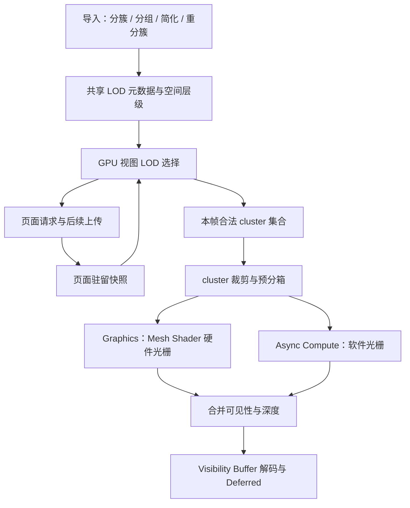

# Nanite Meshlet LOD 分析与 Metallic 接入方案

实施状态：常驻自适应 LOD 已接入，数据契约、设置和验证见 [ResidentMeshletLod.md](ResidentMeshletLod.md)。下文保留实施前的分析基线。

日期：2026-09-12。依据本机 Unreal Engine 5.7.4 源码和 Metallic 当前工作区进行静态分析，公开资料用于交叉核对。本轮未修改渲染实现，未进行运行时性能测量。

## 1. 结论

Metallic 已具备 Nanite 类 cluster LOD 的构建基础：meshoptimizer `clod` 的分组、合并、边界锁定、简化、重新分簇，以及 group 误差和 `refinedGroupIndex`。StreamAsset 也已实现 GPU 层级遍历和按 group 的细化选择。

下一步优先把这些能力接入普通常驻 GPUScene：上传完整 LOD 关系，按视角生成合法的 cluster 集合，再交给现有 cluster 预分箱与异步软硬光栅。保留现有构建器，先完成常驻场景正确性，再统一流式选择、驻留依赖和容量回退。

当前最明显的差距是：常驻路径仍按整档 meshlet range 选择，且选择与 `visualization="lod"` 耦合。正常 deferred 渲染尚未使用逐区域自适应 LOD。

## 2. Nanite 的三个不同层级

| 结构 | 解决的问题 | 关键约束 |
| --- | --- | --- |
| Cluster/group LOD DAG | 哪些粗细几何可以相互替换 | 一个细组可被多个粗 cluster 共同表示；切换关系需一致 |
| 空间裁剪层级 BVH | 如何快速找到视图可能需要的 cluster/group | 范围与误差估计保守；不能当成几何替换关系 |
| 流式页面依赖 | 哪些替换在当前驻留状态下可以生效 | 依赖满足后细化；缺页仍有完整可绘制表示 |

DAG 是有向无环图。这里的父子表示粗细替换，不要求一个父 cluster 恰好覆盖几个完整子 cluster。重新分簇会改变内部边界，因此会产生多对多关系。

运行时通过空间层级寻找候选，再用误差与驻留状态确定合法 cut。cut 指覆盖物体的一组粗细 cluster：同一替换区域具有一个有效表示，允许物体不同区域处于不同细节等级。

## 3. 离线构建：group → simplify → recluster

1. 按空间与邻接关系，将原始三角形分为叶 cluster。
2. 将相邻 cluster 组成 group，尽量减少 group 外部边界。
3. 合并该 group，锁定 group 外边界，简化内部几何。
4. 将简化结果重新划分为多个粗 cluster。
5. 记录粗 cluster 对应的细 group、简化误差和 LOD 范围。
6. 在粗 cluster 上重复，直到根表示或无法继续简化的终止组。

Unreal 5.7.4 的普通三角形路径以 128 个三角形为 cluster 上限，`GroupTriangleClusters` 使用 8–32 个 cluster 的分组目标。这些数值不是算法的必要条件；现代源码中其他构建路径及编码上限不同。Metallic 当前的 128 三角形、128 顶点和 group 格式上限 32，可以继续作为起点。

源码：[ClusterDAG.cpp / ReduceGroup](E:/UnrealEngine/Engine/Source/Developer/NaniteBuilder/Private/ClusterDAG.cpp:894)、[ClusterSize](E:/UnrealEngine/Engine/Source/Developer/NaniteBuilder/Private/Cluster.h:243)。

### 边界如何保持一致

简化时固定当前 group 的外边界。原先 cluster 之间的内部边界在合并后可以消失，简化和重新分簇得以持续推进。若永久锁定最初每个 meshlet 的全部边界，层级很快会因锁定边过多而停止简化。

同一次 group 简化产生的粗 cluster 共用 LOD 误差和 LOD 范围，从而对该替换作出一致判断。邻接 group 保留共同边界；合法替换保持连接关系。位置编码也必须让共享边界解码到一致坐标。

Unreal 明确锁定 `ExternalEdges` 端点，并把同一个 group 的 `ParentLODError` 和 `LODBounds` 写入其所有父 cluster。几何裁剪 sphere 与 LOD 决策 sphere 应分别理解，不能为追求更紧的裁剪而随意替换共享 LOD 范围。

源码：[外边界锁定](E:/UnrealEngine/Engine/Source/Developer/NaniteBuilder/Private/Cluster.cpp:658)、[共享误差与范围](E:/UnrealEngine/Engine/Source/Developer/NaniteBuilder/Private/ClusterDAG.cpp:1070)。

### 属性与简化质量

Unreal 简化考虑法线、切线、颜色、UV 等属性及属性修正。几何误差小，不等于 UV 插值、法线贴图或 alpha-tested 轮廓误差小。

Metallic 当前 `clodMesh` 仅传入法线属性，未传入 UV 属性及显式 attribute protection；配置继承了 permissive 简化和 sloppy fallback。应验证 UV 接缝、细栏杆、叶片、硬法线和 alpha mask，并增加对应的构建质量设置。这是源码提示的质量风险，尚未用特定模型复现。

当前简化复用原网格顶点索引，不产生任意位置的新顶点，与 Unreal 的顶点位置优化能力有差别，但不阻碍先接入运行时 LOD。

源码：[Metallic 简化属性输入](E:/metallic/Source/Runtime/Scene/scene.cpp:1490)、[clod 默认配置](E:/metallic/External/meshoptimizer/demo/clusterlod.h:565)、[Unreal 属性权重](E:/UnrealEngine/Engine/Source/Developer/NaniteBuilder/Private/Cluster.cpp:600)。

## 4. 运行时：屏幕误差与合法 cut

可用下面的近轴透视近似理解误差：

```text
pixelError ≈ objectError × worldScale × focalLengthPixels / viewDepth
focalLengthPixels = renderHeight / (2 × tan(verticalFov / 2))
```

误差越大越需要细化，距离越远越容易接受粗表示。这只是说明公式，不能直接当作完整的保守实现。Unreal 的 `GetProjectedEdgeScales` 还处理球范围、偏轴视线、近裁剪面和正交投影；层级节点携带最小自身误差和最大父误差来减少无效遍历，实例缩放/形变也有专门处理。

Metallic 应统一误差单位并覆盖正交、非均匀缩放及可出现的 shear。当前 clod 使用绝对误差接口，`maxQuadricError` 应作为长度误差参与投影，不能因名称含 Quadric 就当作平方误差。Unreal 也在返回简化误差前对内部平方误差开方。

源码：[Unreal 投影与误差裁剪](E:/UnrealEngine/Engine/Shaders/Private/Nanite/NaniteClusterCulling.usf:233)、[简化误差返回值](E:/UnrealEngine/Engine/Source/Developer/NaniteBuilder/Private/Cluster.cpp:742)。

### 对应 Metallic 的字段语义

`lodGroupIndex` 是 cluster 当前所属的 group；`refinedGroupIndex` 指向生成该粗 cluster 的更细 group。在全驻留、误差和范围满足层级约束时，现有选择方式可概括为：

```text
needsFine(group) = terminal(group) OR projectedReplacementError(group) > targetPixels
emit(cluster) = needsFine(cluster.ownerGroup)
                AND (cluster has no refinedGroup OR NOT needsFine(cluster.refinedGroup))
```

同一细 group 对应的所有粗 cluster 共用 `needsFine`，避免各自切换。加入缺页和溢出后，需要额外的有效替换状态，不能仅靠单页 `resident` 条件。

可视化应只为最终 cut 着色。自动 LOD、手动调试与可视化必须独立；切换 Meshlet、Triangle、Coverage 不应改变所选几何。

### 接入现有 Hybrid Rasterizer

LOD 减少需要绘制的几何；软件光栅降低剩余小三角形的处理成本，两者可以叠加。建议的逻辑链路如下，之后可把保守的视锥/HZB 裁剪提前融合进层级遍历：



同一帧软硬路径与 HZB 两阶段应使用一致的 LOD 决策和驻留快照。两条队列消费期间不能修改列表、覆盖元数据或回收引用页面。

## 5. Streaming 的完整覆盖约束

Nanite 有常驻根数据、页面依赖、group/part fixup 和 streaming-leaf 状态。细化依赖尚未满足时，粗 cluster 仍可绘制，即使未达到目标像素误差。上传完成和整个替换关系可用，是两个不同条件。

本机源码中，页面依赖满足状态决定 group fixup 是否安装；cluster 绘制判断允许 `STREAMING_LEAF` 保持可见。参考：[页面依赖验证](E:/UnrealEngine/Engine/Source/Runtime/Engine/Private/Rendering/NaniteStreamingManager.cpp:1381)、[streaming leaf](E:/UnrealEngine/Engine/Shaders/Private/Nanite/NaniteClusterCulling.usf:815)、[离线 fixup](E:/UnrealEngine/Engine/Source/Developer/NaniteBuilder/Private/Encode/NaniteEncodeFixup.cpp:16)。

Metallic 当前每个 group 对应一个 page，简化了组内完整上传问题。`PendingUpload` 不可绘制；粗 cluster 在 refined group 不可绘制时保留。这些基础可以复用，但以下情况仍需证明覆盖正确：

- 分支可能在不同深度终止。回退集合必须覆盖所有根/终止区域；单选页数最少的一档不能作为完整覆盖的证明。
- 子页先驻留、中间祖先页缺失时，需要依赖闭包或显式有效 frontier，避免细页和更粗回退重复覆盖。
- 遍历或输出列表溢出时，不能先撤销粗表示，再因细分支未入队丢失覆盖；应在 GPU 上取消受影响替换并重建安全回退。
- 根页预算不足时，需要资源准入或备用完整表示，保证可见实例有可绘制几何。

当前最少页 LOD 回退选择、预算限制和溢出计数提示这些是必须验证的项目；本轮未将其当作已经运行复现的缺陷。

## 6. Metallic 能力与差距

| 环节 | 已有实现 | 下一步 |
| --- | --- | --- |
| 离线 LOD | clod 分组、边界锁定、简化、重分簇；group 并行构建 | 复用；补属性质量与不变量验证 |
| CPU 元数据 | group 范围/误差、cluster error、refined group | 统一 GPU 布局、全局引用与版本化 |
| 常驻 GPUScene | 所有 LOD ranges、cluster error | 补 group/node/root 和 refined 引用；接入自适应选择 |
| StreamAsset | group/page、空间树、GPU 遍历、cluster mask | 统一误差函数、有效驻留 frontier 与安全回退 |
| 投影误差 | 距离球面近似，目标硬编码 1.5 px | 正交/偏轴/缩放处理；显式误差设置 |
| Hybrid Rasterizer | cluster 分箱、异步软硬光栅、VBuffer 合并 | 消费选定列表，保持可见性 ID 解码正确 |
| 调试 | visualization、LOD Level | 独立 Auto LOD、误差阈值、合法手动 cut 和着色 |

关键源码：

- [scene.cpp / clod 构建配置](E:/metallic/Source/Runtime/Scene/scene.cpp:1202)、[分组与简化](E:/metallic/Source/Runtime/Scene/scene.cpp:1254)。
- [GPUScene resident metadata](E:/metallic/Source/Runtime/Render/Subsystem/GPUSceneSubsystem.cpp:188)：`lod.zw` 为零，未上传 refined group；已有 `coneAxisLodError.w`。
- [selectedMeshletRange](E:/metallic/Source/Runtime/Render/RenderPass/BuiltinPass/VisibilityBufferPass.cpp:3990)：非 LOD 预览模式返回 base range。
- [StreamAsset 投影误差](E:/metallic/Shaders/Features/GPUDriven/GPUDrivenStreamAsset.slang:985)、[cluster 选择](E:/metallic/Shaders/Features/GPUDriven/GPUDrivenStreamAsset.slang:1100)。
- [StreamAsset 空间层级](E:/metallic/Source/Runtime/Scene/MeshletStreamAsset.cpp:1313)：每档构建空间树，再组合 primitive 根；内部节点按 8 路聚合，primitive 根有多个 LOD 子根。
- [回退档选择](E:/metallic/Source/Runtime/Scene/MeshletStreamAsset.cpp:1477)、[回退页预算](E:/metallic/Source/Runtime/Render/MeshletStreamRuntime.cpp:873)、[GPU 遍历入队](E:/metallic/Shaders/Features/GPUDriven/GPUDrivenStreamAsset.slang:1402)。

## 7. 实施顺序

### P0：数据契约与参考选择器

统一 cluster、group、node、root 与实例元数据，区分裁剪范围、共享 LOD 范围、自身误差、替换误差、owner/refined group 与驻留句柄。复用现有数据建立 CPU 参考 cut，验证根覆盖、无环、引用正确、误差单调与共享范围。

拆分 Auto LOD、Target Pixel Error、LOD Bias、手动调试 cut 和 Visualization。首版建议按内部渲染像素定义误差，UI 明示单位；若使用输出像素，应换算 DLSS render/output 比例。0.5、1、1.5、2 px 可作为测试档位，不预设为所有资产的最佳值。

### P1：常驻场景自适应 LOD

GPUScene 上传 group/node/root/refined 数据，GPU 选择生成 `(instanceId, clusterId)` 列表与间接调度参数，现有分箱消费该列表。全驻留阶段集中验证替换正确性，再完善层级剪枝，使成本随访问节点和所选 cluster 增长。

VBuffer 候选序号要映射回本帧实例和真实 cluster，软硬路径使用同一映射；压缩列表下标不能充当跨帧稳定几何 ID。核对材质、triangle、顶点和运动矢量解码。

交付标准：普通 glTF 场景保持 deferred 输出，靠近时局部细化、远离时局部变粗，所有观察模式显示同一份 LOD 结果。

### P2：统一 StreamAsset 选择与驻留

共享投影和 group 选择逻辑，分别从 resident buffer 或 page payload 读取几何。先保持一 group 一 page，验证根集合、细化依赖、上传完成状态、帧快照和 eviction。

为 traversal、candidate、active-group overflow 增加 GPU 安全回退。预算不足时允许保持粗 cut，不能静默输出不完整列表；光栅消费结束前不能回收引用页面。

### P3：成本与画质优化

测量后调整 BVH、wave 队列、层级 HZB、页打包与几何压缩。页面预热、误差优先级和迟滞可降低突变，但迟滞必须按共享替换关系执行，并明确最大误差容限。UV/seam 保护、位置优化与 foliage 面积保持应以代表性资产验证。

## 8. Raytrace 阴影与 OMM

第一阶段保持当前 RT 几何来源。主相机可见 cluster 集合不能直接替代全场景阴影 BLAS：屏幕外物体仍会投影，反射与次级射线也有独立需求。

后续若连接已有 CLAS/BLAS 路径，应独立定义 RT 细节与驻留策略。简化改变三角形、UV 插值及透明覆盖，OMM bake 和缓存键必须对应实际加速结构几何版本；现有扩展支持不会自动解决几何一致性。

NVIDIA 的 [vk_lod_clusters](https://github.com/nvpro-samples/vk_lod_clusters) 同时覆盖 mesh-shader 光栅、cluster RT 与按需流式加载，使用 meshoptimizer cluster LOD 构建，适合对照 Metallic 的 Vulkan 接入。

## 9. 验证与观测

| 维度 | 必须检查 |
| --- | --- |
| DAG cut | CPU/GPU 一致；同一替换无重复、无遗漏；不同深度终止分支完整 |
| 阈值 | 逐步细化/变粗，同组决策一致；强制 finest 模式覆盖叶几何 |
| 属性与边界 | 跨 group 边界、UV seam、硬法线、薄片、alpha-tested 叶片 |
| 相机/变换 | 近面穿越、偏轴、正交、非均匀/负缩放及支持的 shear |
| 分辨率 | 动态分辨率和 DLSS 比例符合像素误差单位 |
| Streaming | 根页不足、父子页乱序、中间页缺失、PendingUpload、eviction |
| 容量 | 强制缩小 traversal/active/candidate buffer 后仍有完整回退 |
| Hybrid/HZB | 同一 cut 的软硬、同步/异步覆盖一致；两阶段无错误漏剔 |
| 场景与时间 | 增删实例、资产重载、变换更新、阈值跳变、运动矢量及历史响应 |

扩展现有 [scene 测试](E:/metallic/tests/scene/main.cpp:2099)、[GPUDrivenCullingTests](E:/metallic/tests/rhi/GPUDrivenCullingTests.cpp) 和 [StreamerTests](E:/metallic/tests/rhi/StreamerTests.cpp)。粗 LOD 与原网格允许近似差异，不能要求逐像素颜色完全相同；同一 cut 的不同光栅路径则应保持一致覆盖。

显示原始/所选 cluster 和三角形数、访问 node/group 数、LOD 分布、HW/SW 分配、遍历 GPU 时间、缺页请求、驻留字节、回退/溢出次数。性能收益以包含遍历成本的整帧 GPU 时间衡量。

## 10. 参考范围

- 本机 [Unreal Build.version](E:/UnrealEngine/Engine/Build/Build.version) 为 5.7.4，具体实现判断以上述本机源码为准。
- [Epic Nanite 官方概览](https://dev.epicgames.com/documentation/unreal-engine/nanite-virtualized-geometry-in-unreal-engine)：层级 cluster、自动细节选择和流式加载的公开说明；网页会滚动更新。
- [meshoptimizer clusterlod](https://github.com/zeux/meshoptimizer/blob/master/demo/clusterlod.h)：当前构建器的直接来源；本地 vendored 版本可能不同于最新版本。
- [NVIDIA vk_lod_clusters](https://github.com/nvpro-samples/vk_lod_clusters)：cluster LOD 与 Vulkan 光栅、RT、streaming 的开放实现参考。
