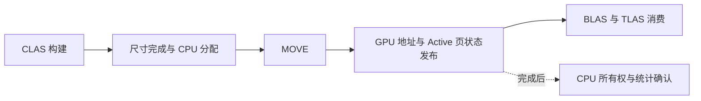

# MiniZorah：BLAS 复用、CLAS 发布、紧凑位置与帧间流水

2026-09-15。实现基线为 `2a16d75`，本机 RTX 5060 / 8 GiB / 驱动 610.47。四项改动已接入实时流送路径，未加入路径追踪 pass。

**已验证的是数据布局、发布顺序、静态 cut 复用和录制重叠。当前整帧数据受另一 Unity 进程持续渲染干扰，不能据此给出净加速或回退幅度。** [机器可读结果](E:/metallic/Documentation/MiniZorahGpuDrivenReuseResults.json) 保留修改前后各两轮完整数据，没有删除慢帧。

## 基准与测量范围

直接使用 [RunVkMiniZorahRoam.py](E:/metallic/Tools/RunVkMiniZorahRoam.py) 的 `make_route()`，读取原始 `zorah_main_public.v2.cfg`，重建 [既有报告](E:/metallic/Documentation/MiniZorahCfgRoam.md) 的路线：沿起始视线水平前进 12 单位、停留、原路返回，10 段各 300 帧。Replay SHA-256 与既有报告一致：

`feb79872154850af32db25a54ba3d22b48b9a04a10f7f2e8dadaf19f98f2f2d2`

既有 Metallic 基准只运行 VBuffer + MaterialResolve，CLAS 不被实时阴影消费。本轮给 [RunMetallicCfgReplay.ps1](E:/metallic/Tools/RunMetallicCfgReplay.ps1) 增加 `-Realtime`，在修改生产代码前采集同机基线，再使用完整实时图验证四项改动。

| 配置 | 修改前 / 修改后 |
| --- | --- |
| 输出 / DLSS-SR Quality 输入 | 1920×1080 / 1280×720 |
| 场景 | 既有 60,916,791,801 B MiniZorah cook，未重新烘焙 |
| 页 / 实例 | 1,356,959 / 19,144 |
| 几何 / CLAS / 动态 BLAS 预算 | 1024 / 512 / 256 MiB |
| LOD | 1.5 render px；质量检查使用实际 raster extent |
| 图 | VBuffer → Shadows → Deferred → DLSS-SR → AutoExposure → NR 透传 → FinalBlit |
| 光照 | 原环境图、方向光强度 10、EV100=2、自动曝光 |
| 时间 | 无帧率限制、固定每帧相机位置；不含窗口、UI、present |

上述预算沿用对比基准，**不是编辑器默认的 512/256 MiB 几何/CLAS 预算**。不能将旧 RTX 5070 Ti 的参考结果与本机结果直接相除。计时轮只在结束后读回完整 cut；独立质量轮另行执行 3,000 帧、15 个检查点。

## 已落地的改动

### 1. 动态 BLAS 跨帧复用

[MeshletStreamRuntime](E:/metallic/Source/Runtime/Render/Streamer/MeshletStreamRuntime.cpp) 与 [GPU 输入生成](E:/metallic/Shaders/Features/GPUDriven/GPUDrivenStreamAsset.slang) 保存上一帧完整 cut 的精确键：instance、page、cluster mask、cluster count，并比较 CLAS publication revision。

键与 revision 都未变化时，保留 instance BLAS 状态、地址和存储，间接 BLAS 构建数为零。LOD 改变、CLAS 地址发布/退役和录制取消会使缓存失效。TLAS 继续使用当前实例变换更新。

这版是 **整个 cut 的复用**。任一相关变化仍会重建整批动态 BLAS；尚未实现每实例缓存、跨实例 sharing/merging。精确键按 `maxActiveGroups` 预留 16 B/项；上限 2²¹ 时增加约 32 MiB，需要计入实际内存取舍。

### 2. CLAS 在 MOVE 所在提交中发布

[CompactClasPool](E:/metallic/Source/Runtime/Render/Streamer/MeshletStreamCompactClasPool.cpp) 把地址数组与页状态更新放进独立 staging，在 MOVE 之后通过 GPU copy 和 barrier 发布。之后的 BLAS/遍历在同一有序提交链上即可使用新地址。



CPU 状态、退休分配与取消重试仍按 completion 管理；回滚只恢复对应版本的发布记录，避免覆盖更新版本。测试直接在 MOVE 的提交内读回 Active 页状态，并确认此时 CPU `pageHasClas()` 尚未完成。

尺寸读回与 CPU 分配仍然存在。此项去掉的是 **MOVE 后再等一次 CPU 确认才让 GPU 可见**，不是完整的 GPU allocator 或 sparse CLAS 池。

### 3. Float32x3 位置格式

新 cook 写入 12 B XYZ。旧 Float32x4 页在 loader 解码时保留 XYZ 位模式，删除 W 与相应对齐空间；不改写旧缓存。驻留分配、上传准入、CLAS vertex stride、HW/SW 光栅以及所有材质解码入口均使用实际格式。

CPU 回归覆盖旧页转换、XYZ/属性逐字节一致、压缩页及重叠区间拒绝；RHI 覆盖旧 float4 fixture 与新 float3 cook。实时共享解码器位于 [VisibilityStreamDecode.slang](E:/metallic/Shaders/Features/VisibilityBuffer/VisibilityStreamDecode.slang)。

当前没有位置量化，精度没有降低。旧磁盘文件大小不变；固定 Vulkan 池容量也不会随已用页字节数自动缩小。

### 4. CPU 录制与上一帧 GPU 执行重叠

流送 params、raster bindings、清零上传使用 completion 保护的帧槽。阴影参数、LightGrid 资源和延迟着色的 GPU frame-info 使用独立快照/完成后复用，避免 CPU 改写在途数据。

纯流送 compact CLAS 路径在首屏就绪后允许 frame overlap；实时 Deferred、DLSS-SR 和关闭的 DLSS-NR 可参与。GPU 图输出、HZB 与历史仍保持帧间顺序，CPU 最多提前录制一个图帧。

NRD 编译路径、启用的 DLSS-NR、DLSS-RR、非流送/非 compact 路径保留原有等待。这不是所有 pass 的无条件并发，也没有让两个 GPU 帧同时修改同一份目标。

## 验证结果与性能边界

| 末端同一视图 | 修改前两轮 | 修改后两轮 |
| --- | --- | --- |
| 驻留 / CLAS 页 | 9,290 / 9,290 | 9,290 / 9,290 |
| 页分配器已用几何字节 | 187,943,424 | 150,612,224 |
| 已用几何 MiB | 179.24 | 143.64（减少 19.86%） |
| active groups / selected clusters | 19,394 / 162,989 | 19,394 / 162,989 |
| 可见超目标细化 / CLAS backlog | 0 / 0 | 0 / 0 |
| 动态 BLAS 间接构建数 | 原实现每帧构建，无对应读回计数 | 0，cacheDirty=0 |
| return_hold 前帧 CPU drain | 每轮 300/300 帧 | 每轮 0/300 帧 |

这里的 19.86% 是固定池中**已用页空间**的减少，不是整卡显存下降。32 MiB 的 BLAS key 缓存、固定池预留和帧快照需要另外计算。

最终保留的计时轮如下，单位为 ms：

| return_hold P50 | 修改前 m1 / m2 | 修改后 m1 / m2 |
| --- | --- | --- |
| Host frame | 10.920 / 11.412 | 29.165 / 29.237 |
| GPU 图区间 | 8.422 / 8.823 | 29.214 / 29.190 |

修改后两轮的进程级计数器记录 Unity PID 32936 的 3D 引擎活动样本中位数为 **68.94% / 68.87%**；测试退出后该进程仍占约 96–100%。这是 Windows 引擎计数器，不是整个 GPU 所有权占比，采样值可能略高于 100%。修改前没有进程级监测，所以当前数据不能分离代码变化与 GPU 竞争的影响。不能选择早期较快的一轮来宣称加速。

中间几个批次漏接了实时共享位置解码器，只显示环境背景，已排除性能结论。修复后已重新采集 `verified-realtime` 与最终 `delivery-realtime`。额外尝试过提交前等待上一帧的策略，但在受干扰环境中没有验证收益，已撤回；最终未修改 RenderGraphExecutor 的调度策略。

通过的检查：

- Release 构建 `MetallicRhiTests`、`MetallicSceneTests`、`MetallicGPUDrivenSample`。
- 30 项 RHI 专项检查，开启 Vulkan validation：CLAS 同提交发布/取消/退役，BLAS 静态复用/LOD 变化/取消/退役失效，LightGrid 生命周期，流送上传，HW/SW 与 indexed mesh 等价、调试身份、帧槽与跨队列依赖。
- 3 项 Scene MeshletStream 检查。
- Bunny 与 MiniZorah 实时图检查通过，并人工检查输出图。Bunny fixture 禁用 HDRI，避免用背景变化掩盖几何解码失败；同时验证分箱/非分箱一致、阴影衰减、相机 guides、resize 与流送会话保留。
- 独立完整质量回放通过 15 个检查点。启动第 29 帧仍有可见待细化，59 帧及之后检查点均为 0；不把粗级首屏就绪等同于细节收敛。

仍有两项验证限制：完整 Streamline 质量回放使用 `--rhi-no-validation`；专项 validation 通过不能代替完整图 validation。Streamline 在测试结束后的退出阶段仍可能停住，脚本仅在报告与测试终态落盘后回收自身进程，`Process.json` 明确记录 `forcedCleanupAfterCapture`，不标记为正常退出。

额外执行的 `frame_self_submit_two_slots` 未通过“独立 copy 分支在 graphics 阻塞时先完成”的断言。该测试和 Executor 与本轮修改前一致；当前图的 graphics 起始计时节点给 copy 分支增加了依赖。本轮没有改变此调度契约，也没有把这项失败计入上述 30 项通过项。日志保留在 `.cache/gpudriven-four/frame-copy-standalone.log`。

## 复现与证据

原始目录均在 `E:/metallic/.cache/gpudriven-four/`：`before-realtime` 为修改前，`delivery-realtime` 为最终计时两轮，`verified-realtime/quality` 为完整独立质量轮，`images` 为最终图像，`delivery-tests.log` / `delivery-scene.log` 为专项结果。

```powershell
# 先暂停其他持续渲染任务；使用由现有 make_route() 生成的同一 Replay.json。
Tools/RunMetallicCfgReplay.ps1 -Replay .cache/gpudriven-four/Replay.json `
  -OutputRoot .cache/gpudriven-four/idle-rerun -Realtime -QualityWithoutValidation

python Tools/SummarizeMetallicCfgReplay.py `
  --before .cache/gpudriven-four/before-realtime `
  --after .cache/gpudriven-four/delivery-realtime `
  --quality .cache/gpudriven-four/verified-realtime/quality `
  --output Documentation/MiniZorahGpuDrivenReuseResults.json
```

脚本保存 exe、相机回放、测试源码与 shader tree 哈希，检测采样中途修改；新增 [MeasureGpuCompetition.ps1](E:/metallic/Tools/MeasureGpuCompetition.ps1) 的 `GpuProcesses.csv`，补足仅有整卡 `nvidia-smi` 利用率的盲点。汇总工具拒绝失败或不完整计时轮，保留所有选定样本并标记 GPU 竞争，不自动删异常值。

下一步优先级：暂停竞争后重新取得可归因的同机性能基线；把 BLAS 复用从整个 cut 细化为实例/几何级缓存；再推进 GPU 尺寸分配与量化位置。当前功能与这些后续工作之间的边界已明确保留。
