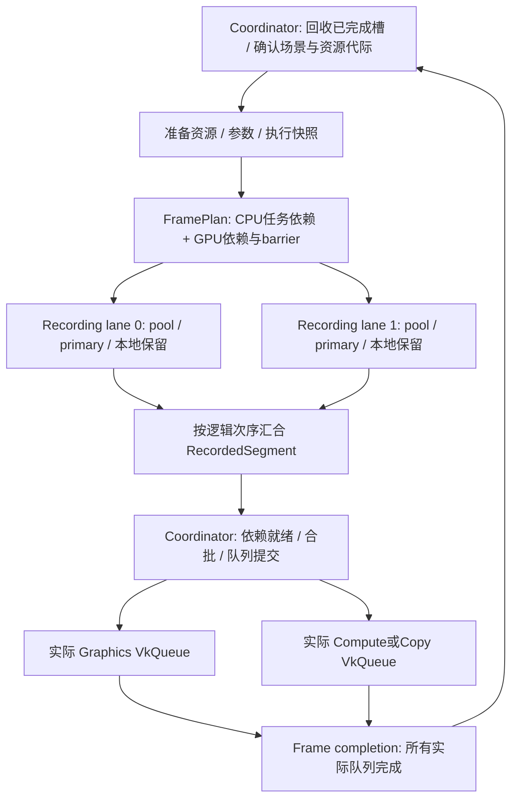

# Metallic 并行录制与提交改造方案

日期：2026-09-26。调研基线：`e4847f866`。第 1–13 节保留调研时的源码分析与后续设计建议；**首阶段实现、实际接口及验证结果见第 14 节**。已落地独占录制上下文、本地资源保留和按工作量分批，仍在整帧录完后提交；没有采集生产场景性能数据。

建议采用 **串行准备与同步规划 → 粗粒度并行录制 primary command buffer → 按实际队列串行、批量提交**。第一版保持“本帧全部录制完成，再开始提交”；边录制边提交、secondary command buffer 和更多 GPU 在途帧分别作为后续选项。

已有共享 registry、BufferSlice、BDA、EncodedParameters、PreparedExecution 应继续作为资源身份和执行数据的基础。主要工作是明确可变状态的归属，而不是增加另一套资源对象或通用命令解释器。

后续已对照本机 UE 5.7.4 源码，补充准备任务的汇合点、按工作量分组、三态 CPU 录制寿命与 native 提交回执。首版范围不变，长期目标从整帧汇合推进到按批次汇合；具体比较见 [UnrealParallelRecordingComparison.md](E:/metallic/Documentation/UnrealParallelRecordingComparison.md) 和本文第 13 节。

## 1. 应分别设计的四种并行

| 目标 | Metallic 当前状态 | 本方案的处理 |
| --- | --- | --- |
| CPU 多线程录制 | RenderGraph 及 pass 内分支仍依次调用录制函数 | 本轮主要改造目标 |
| GPU 多队列执行 | 已有 graphics / compute / copy 分段、timeline 和 fork/join | 保留现有正确性边界，再减少多余依赖 |
| CPU 准备下一帧与 GPU 当前帧重叠 | 已有两个 submission slots；共享 targets/history 在 GPU 上仍串行 | 保留两槽及外部输出消费者保护 |
| 多个 CPU 线程同时调用提交 | tracker 和 Queue::submit 要求外部串行 | 首版一个 coordinator 即可；独立提交线程需测量依据 |

线程数、VkQueue 数和 frame slot 数应独立配置。GPU 上 `A 写资源 → B 读资源`，通常只约束执行顺序；资源分配、参数和 barrier 已确定后，CPU 可以同时录制 A、B。只有真实的 CPU 数据生成、发布或共享可变对象，才应成为 CPU 任务依赖。

Vulkan 要求同一个 command pool 的使用外部同步，包括其中 command buffer 的录制；独立 pool 可以并行工作。Metallic 当前 queue 创建方式也要求同一个实际 VkQueue 的 host 访问串行。依据：[Vulkan threading](https://docs.vulkan.org/guide/latest/threading.html)、[vkQueueSubmit2 host synchronization](https://docs.vulkan.org/refpages/latest/refpages/source/vkQueueSubmit2.html)。

## 2. 当前实现中的阻塞点

以下行号对应调研基线，用于定位，而非声称这些位置已修改。

| 位置 | 已核实的行为 | 改造含义 |
| --- | --- | --- |
| `RenderGraphExecutor.cpp:2921` | `parallelCompute` 先调用 compute callback，再调用 graphics callback | 已有 GPU 并行不等于 CPU 并行；不能仅把两个 callback 扔进线程池 |
| `RenderGraphExecutor.cpp:1639` | `transition()` 修改 resource.state、lastAccess、lastScope、resourceQueues | 录制前生成确定的 barrier/access plan；worker 不推进全局状态 |
| `RenderGraphExecutor.cpp:1724` | `executeNode()` 混合绑定、scene/streaming hooks、prepareExecution、execute、统计与 query 分配 | 拆成准备、纯录制和汇总；旧 pass 先保留串行适配 |
| `RenderGraphExecutor.cpp:2795` | 每次槽复用清空 commandBuffers，再 reset pool；录制时重新创建 buffer | 先改为槽内持久复用 buffer，按历史峰值扩容 |
| `RenderGraphExecutor.cpp:3045` | 遍历 segment，每段一次提交且每次只提交一个 buffer | 建立 batch plan，合并兼容段，同时保留跨队列依赖切点 |
| `RenderFrameContext.cpp:62,265` | recording registry、retain vector 无并发保护 | worker 保存本地所有权/事务，coordinator 按逻辑顺序接收 |
| `RenderFrameContext.cpp:312` | 首次 submitSegment 成功后 frame 进入 Submitting | 现有类型不支持其他 worker 此后继续创建/绑定参数包 |
| `ResourceRegistry.cpp:133,368` | packet 检查 frame.recording；upload 在 registry mutex 内分配、map/copy/flush/unmap | 保留共享 registry；参数分配迁入 lane 独占 arena，frame identity 与可变提交状态逐步分离 |
| `ComputeProgram.cpp:171` 附近 | 兼容 descriptor tables/cache 仍有可变游标和容器 | PreparedExecution 不使整个 ComputeProgram 自动可重入 |
| `NrdRuntime.cpp:349` 附近 | 录制时修改 scheduled/history/clearPending、纹理状态，并登记取消恢复 | 相同 NRD context 先保持串行；共享资源身份不等于 SDK 并发安全 |
| `GAPI/Vulkan/VulkanRhi.cpp:8119` | 当前只分配 PRIMARY command buffer | 多个 primary 是最小扩展路径；secondary 需另建录制与继承契约 |
| `Task/TaskSystem.cpp:676` | worker 内调用 TaskGraphRun::wait 被拒绝 | 用平坦任务图；不能在 pass worker 内创建子图后同步等待 |
| `Profiling/CpuPhaseTrace.h:45` | active trace 是 thread_local，trace 内有可变 vector/depth | worker 本地采集后合并；直接共享主线程 trace 会有竞争 |

路径前缀除 Task 外均为 `Source/Runtime/Render/`；Task 为 `Source/Runtime/Task/`。

`supportsAsyncQueue()` 描述 GPU 私有访问与队列调度契约，`supportsFrameOverlap()` 描述前后帧资源保留。两者都不能当作“允许 CPU 并发调用 execute”的授权。现有 `prepareExecution()` 也接受 RenderGraphExecutionContext，并承担 camera/HZB/descriptor 设置，不能直接视为纯 CPU prepare。

## 3. 收益判断：先测当前剩余 CPU 工作

既有证据支持缩短提交前路径，但不支持“加录制线程就会显著提升 FPS”：

- [Deferred dispatch 拆分](E:/metallic/Documentation/ZorahFullDeferredDispatchCpu.md) 在旧实现中测得实际命令录制约 0.023–0.025 ms，描述符更新约 3.74–4.12 ms。后续 [材质纹理缓存](E:/metallic/Documentation/ZorahFullDeferredTextureCache.md) 已显著减少描述符成本；本次 RHI registry 改造又改变了这条路径。这些旧数字不能充当当前基线。
- [慢状态时间线](E:/metallic/Documentation/ZorahFullPacingTimeline20260925.md) 曾定位 Sleep 返回后约 8.68 ms 的提交前准备，其中包括大量 Streamer CPU 工作。后续 [pre-pacing maintenance](E:/metallic/Documentation/ZorahFullPrePacingMaintenance20260925.md) 已实现相位移动，缩短 post-Sleep 路径，但没有证明整帧吞吐提升。
- 当前代码确实保留 `StreamerSubsystem::prepareBeforePacing()` 与 `MeshletStreamRuntime::prepareMaintenance()`。新设计应复用其 completed-feedback 边界，而不是再次提议把同一批工作前移。
- 当前样例 graph 的静态节点数较少：`gpu_driven_realtime` / `realtime_lighting` 各 7 个，`lookdev_shading_compare` 5 个，`pathtracing_abeautiful_game_openpbr_dlss_rr` 4 个，`pathtracing_meet_mat_nrc` 3 个。节点数量并不代表工作量；最终收益很可能取决于 VisibilityBuffer 内部阶段和剩余 CPU 准备能否拆分。

第一版 CPU 耗时近似为 `串行准备 + 录制任务的关键路径 + 调度/汇合 + 提交`。只并行很短的 vkCmd 调用，无法消除重的串行准备；很多很小的 command buffer 还会增加绑定、调度与驱动开销。Khronos 的样例也要求合理录制粒度，并建议复用/reset pool，避免逐帧 allocate/free；其样例加速数字不能外推给 Metallic。[Command buffer usage](https://docs.vulkan.org/samples/latest/samples/performance/command_buffer_usage/README.html)

## 4. 目标结构与状态归属



图中展示已可冻结的一段工作。迁移期间，带 CPU 发布副作用的旧 pass 仍作为区域之间的串行边界；所有区域录完后再提交。这些计划类型尽量放在 RenderGraph 内部。RHI 只补上录制上下文、本地所有权接收和实际队列提交归属，不承担 pass 调度或场景逻辑。

| 状态 | 所有者 | worker 权限 |
| --- | --- | --- |
| Device registry / canonical leases | Device；保持唯一身份 | 使用准备好的 lease；必要注册走既有同步路径 |
| 场景 revision、纹理 snapshot、stream 发布 | coordinator / subsystem 的串行准备域 | 持有不可变快照，不能直接更新 live 世界 |
| GPU resource 状态与 barrier plan | coordinator / FramePlan | 读取本 job 的前后 barrier，按计划录入 |
| CommandPool、buffer 的缓存状态 | 每个 slot × queue family × recording lane | 同一 lane 同时仅一个 job 使用 |
| 参数 chunk、临时 CPU 数据 | frame/lane 独占 arena | 写自己的范围，seal 后发布 |
| 保留资源、SubmissionTransaction、诊断事件 | 每个 RecordedSegment | 本地追加，汇合时移动给 coordinator |
| Queue timeline、submit/present/waitIdle | 实际队列的共同提交所有者 | worker 不直接提交 |

Recording lane 是可独占的上下文，不必绑定永久 OS thread。一个 pool 可在不重叠的任务间迁移线程；不能让两个同时运行的 job 共用 pool。现有 TaskSystem 没有公开稳定 worker index，使用 lane 内顺序任务或预分配上下文更直接。避免让大量 worker 阻塞等待少量 lane；首批对比 1/2/4 lanes，并与 streaming/shader/IO 的线程占用一起评估。

## 5. Prepare、Record、Submit 的最小契约

建议新增独立 CPU 录制策略，默认串行。参考 UE 的寿命区分，目标接口分为三态；首版只启用 Serial / ParallelJoined，AsyncOwned 在后续拆分录制与提交状态后开放。以下只是形状示意，不要求把所有 pass 改成另一套类层次：

```cpp
enum class CpuRecordingPolicy { Serial, ParallelJoined, AsyncOwned };

// RenderGraph 内部：resource uses 直接引用已有 lease / slice / view 身份。
struct PreparedRecordJob {
    uint32_t logicalIndex;
    QueueIdentity queue;
    ImmutablePassPacket packet;
    BarrierBatch before;
    BarrierBatch after;
    // CPU prerequisites 与 GPU predecessors 分开保存。
};

struct RecordedSegment {
    CommandBuffer* commands;
    LocalRetentions resources;
    LocalTransactions transactions;
    LocalProfile profile;
};

Result<RecordedSegment> record(const PreparedRecordJob&, RecordingContext&);
```

具体约束：

1. 准备阶段确定资源分配、BufferSlice 范围、shader 参数、PreparedExecution 和实际需要的 native view。PSO/cache miss 或 SDK 调度生成尽量在此完成。lazy view 仍按需，提前物化本 job 必用的 attachment/SDK view 即可。
2. worker 只操作自己的 command buffer 和局部结果。每个 primary 自行绑定必要 pipeline/heap/动态状态；不能假设继承另一个 primary 的缓存状态。
3. 参数包及执行对象对 worker 不可变；job 捕获强所有权，不捕获会被后续 pass 修改的 context 引用。一次执行的 typed packet 保持同一 frame/generation 检查。
4. 所有权和事务按 `logicalIndex + job 内次序` 汇合，不按任务完成次序汇合。具有共享 CPU publication 的操作留在串行准备域或显式 CPU 依赖链；排列回调本身不能修复已经发生的数据竞争。
5. 旧 pass 通过串行适配执行原来的 scene hooks / prepareExecution / execute。存在动态发布时，以“准备并录制一段可冻结区域 → 汇合 → 串行旧 pass → 继续”为过渡，不能机械地把所有 prepareExecution 提到整帧最前面。
6. 第一阶段只有 owner 汇合后访问/更改 frame 容器；worker 的 begin、retain、packet bind 应转向本地 RecordingContext，汇合前 frame 不进入 Submitting。可以保留现有 frame 指针做身份兼容，但不能继续并发 push 到 frame 的 vector。

`execute(CommandBuffer&, ...)` 的外部命令缓冲接口继续保留串行语义。多个 primary 不能嵌入一个调用者已开始的 primary；若以后要给这个入口提供并行，需要改为返回可提交批次，或明确引入 secondary，不能静默改变调用者的提交所有权。

串行准备是首版边界，不应成为纯 CPU 工作的永久限制。后续把准备任务分成 BeforePlan（影响资源描述、use 或分段）和 BeforeRecord（只生成已知 packet 的内容），在对应位置汇合；共享状态发布仍由 coordinator 执行。PreparedRecordJob 可按工作量和合法边界组成 RecordBatch，一个 batch 不必只含一个 pass。

## 6. 资源与同步计划

资源使用声明至少包含：已有 allocation identity/lease、buffer byte range 或 texture subresource range、read/write、SyncScope、layout policy、queue access。BDA 地址是 shader 数据，不是资源调度身份；优先从现有 BufferSlice 的来源和范围生成 use。GPU 间接寻址、TLAS 引用和 shader 指针追踪无法从 POD 参数自动完整推断，必须声明对应场景快照、资源集合或保守访问域。

规划器在稳定逻辑顺序上工作；CPU 录制完成顺序不参与 hazard 决策：

- 首版沿用现有 GPU 依赖，包括 reader-reader 的保守边及 opaque boundary，只把状态推进从录制移到规划。
- 后续按重叠范围维护 last writer 与未结束 readers 集合：读等 writer，写等 writer 和全部 readers。不能仅保存最后一个 reader，否则跨队列 read fan-out 后的 write 会漏等。
- 读读放开还要求 layout/ownership 相容、初始化已完成；即使 unified GENERAL，也不能让多个分支各自从 Undefined 做首次 transition。由一个明确 producer 完成初始化。
- 同队列保留必要 pipeline barrier；跨队列生成 semaphore 依赖和对应可见性/layout 处理。队列提交顺序本身不能代替内存依赖。
- 按资源真实 queueAccess/sharing mode 处理 ownership。当前普通 buffer/texture 会依据 queueAccess 使用 concurrent sharing；不能据此假定所有 SDK/交换链/native heap 分配都相同。第一版拒绝或串行回退不支持的跨 family 使用；完善 exclusive ownership 时必须生成匹配的 release/acquire。
- 规划使用局部状态副本。录制失败且尚未提交时可丢弃；部分提交只登记实际被 queue 接收的段。迁移期间可继续沿用现有失败后 recompile/reset-history 路径，但必须先保留 accepted prefix，不能把未执行的计划终态当成实际状态。

在 unified GENERAL 和 optimal fallback 两种策略下分别验证。共享 registry 解决身份与寿命；不会替 shader 推断访问，也不会自动产生 barrier。

## 7. 参数 arena 与后端并发边界

`ParameterWriter::upload()` 当前持有 registry 大锁，覆盖 chunk 搜索、分配和 CPU 拷贝。为每个 worker 新建 registry 会重新制造重复 descriptor 身份；正确拆分是 **唯一 registry + lane 独占参数 arena**。

优先把已知 packet 在准备阶段一次编码；需要 worker 生成的参数使用 frame/lane 独占 chunk。chunk 用已有 BufferSlice/BDA 表示，seal 后不可再写。登记、descriptor 更新保留短临界区，普通 memcpy 不持有 registry 全局锁。使用非 coherent 内存时，lane 范围需要满足 nonCoherentAtomSize 隔离，或在汇合阶段统一 flush；不能只保证结构体地址不重叠，却并发 flush 同一个内存 atom。

首版按整个 frame completion 回收 chunk 和录制结果，简单且与现有语义一致。后续才考虑 segment retirement；同一 chunk 尚有其他录制作业、未提交 packet 或其他队列消费者时不能提前复用。设置 arena 与 pool 的高水位/预算，避免 lanes × slots 直接倍增整套 streaming staging。

另外应审计 Vulkan loader：`activateVolkDevice()` 在短锁里调用 `volkLoadDevice()`，后续调用使用全局入口。固定单 Device 且录制期间不切换 loader 时不必给每条 vkCmd 加锁；若支持多个 Device 并发，应迁入 per-Device `VolkDeviceTable`，并保留 Streamline/SDK interposer 的正确入口来源。volk 官方给出了按 Device 的函数表方案。[volk device tables](https://github.com/zeux/volk)

## 8. 提交设计：按实际队列统一归属，按依赖合批

当前 `submissionTrackers` 以 `Queue*` 为 key，而 graphics/compute wrapper 可能包装同一个 VkQueue。先按 Device + 实际 queue/family/index 归一；已有 `Queue::sameQueue()` 可用于识别。共同所有者应覆盖 graph、上传、编辑器、present 与 waitIdle，避免每个 executor 各自加锁仍同时触碰同一 queue。可以在后端共享 queue state，保留上层 Queue wrapper 的类型查询。

首版 coordinator 留在 render 调用线程，负责 timeline 分配、提交、事务回调和 frame completion 汇总。worker 不调用 Queue::submit。GPU 可以并行执行不同队列，host 的几次提交无需同时发生。独立提交线程只有在首个 ready batch 被主线程其他工作明显延迟时才值得引入。

合批规则：同实际队列、兼容 wait 集合、没有必须提前发布的中间 signal，并且合并后提交图仍无环。不要为减少调用次数把同队列所有段简单并成一个 batch：

```text
Graphics A  →  Compute B  →  Graphics C

A 与 C 合成一个等待 B 的 batch：A 无法先完成，B 又等 A，形成死锁。
```

保留 A 的 signal 和 C 的 wait 边界。同样，不应把原本 ready 的独立工作放到带额外 wait 的 batch 后面。第一版只合并稳定拓扑序中相邻且满足这些条件的段；以后若使用一次 vkQueueSubmit2 的多个 VkSubmitInfo2，也需保留 batch 边界和事务接收语义。

建议维持以下规则：

- 消费者仅在 producer 已成功提交后才提交；GPU wait 不变成 CPU 等待 GPU 完成。
- timeline 值由 queue owner 管理；没有被接收的提交不发布可依赖 completion。被取消的预留值不能冒充成功。
- 每个 frame completion 仍聚合所有实际队列的末值；graphics 完成不代表 copy/compute 完成，也不代表 presentation 完成。
- 外部输出消费者继续作为 GPU dependencies，并保留其 completion owner。正常帧不恢复无条件 CPU drain；resize、scene replacement 等破坏性更改仍按实际读者完成情况等待。
- 录制、输入与 Reflex 标记继续使用真实帧身份。新增提交线程时明确回调在哪个线程发生：当前 SubmissionTransaction 的成功回调由 Queue::submit 触发，不能无审计地迁到 worker。

保守的 producer-first 提交也简化取消和 teardown。Khronos timeline 样例明确展示了 wait-before-signal 在单队列回退、线程退出及 device wait-idle 下的死锁风险；本设计无需依赖这种乱序提交。[Timeline semaphore sample](https://docs.vulkan.org/samples/latest/samples/extensions/timeline_semaphore/README.html)

## 9. 边录制边提交需要第二套清晰状态边界

本节记录最初的改造约束；第 16 节已实现分批流水提交。原有 EncodedParameters::compatible、CommandBuffer::begin、ParameterWriter 都依赖 frame.recording；旧实现首次成功 submitSegment 后继续录制会违反接口契约，需要先拆开录制窗口和 GPU 完成状态。

后续应拆开：

- 不可变 frame recording identity/generation，供 packet 验证；
- 独立 segment 录制状态：Recording → Sealed → Accepted → Completed，未 Accepted 可 Cancelled；
- frame 的 admission/seal 状态与多队列 completion，由 coordinator 管理，不能被任意 worker 修改。

每个 segment seal 时交出 command buffer、packet/chunk 保留和事务；已交出的数据不可写。只有已 seal 且依赖 producer 已 Accepted 的 segment 才可提交。Frame seal 表示不再接收新段，之后 aggregate completion 才能作为完整 frame 的等待点。worker 使用冻结 token，不读取可变 frame 状态。

失败处理先停止接收依赖失败段的新工作，并汇合/停止还在访问 CPU 资源的 job；再取消未 Accepted 段，按逻辑逆序撤销 publication。已 Accepted 的段及其资源继续受实际 completion 保护。设备丢失走终止恢复路径，不能通过 host signal 提前推进正常退休 timeline 来假装 GPU 完成。`vkQueueSubmit2` 的内存不足失败有未改变资源状态的保证；DeviceLost 不能按普通未提交失败处理。[提交错误语义](https://docs.vulkan.org/refpages/latest/refpages/source/vkQueueSubmit2.html)

只有测量表明“所有录制汇合”仍造成明显的首次有效提交空档，才推进这一阶段；它比首版并行录制更容易影响 streaming publication、取消和场景切换。

## 10. Profiling 不应人为决定工作图

当前 `beginGpuTiming()` 在 graphics 前置段 reset 所有队列的 query 范围；节点都依赖这个段，末尾又有 graphics join。它测得统一 GPU envelope，但会让原本独立的 copy 等 graphics，影响实际调度。

这与既有 `frame_self_submit_two_slots` 的 “independent copy branch was blocked by the graphics branch” 失败吻合。仓库 [输出依赖记录](E:/metallic/Documentation/ZorahFullOutputDependencies.md) 和 [registry 回归记录](E:/metallic/Documentation/SharedResourceRegistry.md) 已记载该基线失败；本次只确认源码上的依赖关系，没有重新运行来确认当前测试结果。

改造需同时处理 query reset，不能直接删掉依赖：

- 查询并启用 hostQueryReset 后，在 query range 的 GPU 使用已完成、且没有并发 get/reset 时于 host reset，再分别在各队列录入 timestamp；当前启用特性列表未设置 hostQueryReset，不能直接调用。
- 无该特性时，graphics/compute 可使用各自合法的 reset 路径；transfer-only 的 reset 需合法辅助路径，或关闭其 GPU timing，明确标记缺测。保留旧 graphics start/join 的诊断模式必须明确它改变调度。
- 预分配 job query ranges，profiling/Tracy/debug events 使用本地结果；CPU trace 共享时间原点但独立 event vector 与深度，合并时保留 thread/job/queue 身份。
- 跨队列 envelope 需可比较/校准的 timestamp；无法可靠对齐时报告各队列区间和不确定性，不能相加当整帧 GPU 时间。

host reset 的特性及完成条件来自 [vkResetQueryPool](https://docs.vulkan.org/refpages/latest/refpages/source/vkResetQueryPool.html)。首版验收应比较 profiling 开关下的业务依赖图与独立分支进度。

## 11. 子系统迁移与 primary / secondary 选择

| 路径 | 建议首轮处理 | 后续可拆内容 |
| --- | --- | --- |
| Clear / Copy / 简单 compute、typed kernel | 审核后显式 ParallelJoined；先形成可验证闭环 | 把小 pass 合成粗 job，避免调度成本超过录制成本 |
| GPUScene | coordinator 解析 scene identity/lifetime/revision，发布同一个不可变 snapshot | 多个消费者并行读取，不复制一套 scene registry |
| Meshlet streaming | 已有 pre-pacing maintenance 继续在原归属执行；CPU/GPU publication 先串行 | 已完成反馈的纯计算与结果整理可产出 immutable delta，owner 按序应用；上传、CLAS/page table、cut 发布维持事务 |
| VisibilityBuffer / hybrid raster | 先拆准备包与录制；保留既有 GPU fork/join | producer / software raster / hardware raster / join 成为明确 jobs，不能继续异步捕获可变 execution context |
| ComputeProgram 兼容路径 | frameTables、descriptor cache 留串行适配 | 冻结 prepared dispatch packet 或迁移 typed kernel；不要靠全对象大锁长期串行化 |
| NRD | 同一个 NRD context 的 schedule/history 变更串行 | 复制 SDK dispatch plan、预备 pipeline、固定临时资源后，再评估独立录制任务 |
| DLSS / NRC 等外部 SDK | 保持现有串行/opaque 与 frame-overlap 限制 | 有明确 SDK 契约后按 context 建 CPU 串行域；必要 native view 在准备阶段物化并保留 |
| 编辑器输出 / swapchain | 主线程协调 acquire、提交和 present | 与 graph 共享实际 queue owner，保留外部读者依赖和 resize drain |

普通 pass 之间采用多个 primary；compute、copy、AS 构建也适合这种分段。Secondary 优先级较低：只有测量证实一个 rendering scope 内的大量 CPU draw 录制占主导，才为该 scope 分片。Metallic 的 indirect/DGC/meshlet GPU-driven 路径本身已经减少逐对象 CPU 命令，未必具备传统多 draw 场景的同等收益。

若引入 secondary，要补充 command level、executeSecondary、pool/child lifetime、状态重新绑定、query 和 dynamic rendering 的继承匹配；format、samples、viewMask 等都在 Vulkan 契约内。参考：[vkCmdExecuteCommands](https://docs.vulkan.org/refpages/latest/refpages/source/vkCmdExecuteCommands.html)、[dynamic rendering inheritance](https://docs.vulkan.org/refpages/latest/refpages/source/VkCommandBufferInheritanceRenderingInfo.html)。

UE 5.7.4 源码对照还提供了另一候选：其 Vulkan dynamic rendering 并行 raster 用多个原生 primary 的 suspend/resume，传统 render pass 分支才用 secondary。后续单 scope 分片应比较这两种实现，验证 attachment、提交批次和中间操作约束；首版普通 pass 之间的多个 primary 不需要这项复杂度。

## 12. 建议实施顺序与验收

| 阶段 | 交付 | 进入下一阶段的条件 |
| --- | --- | --- |
| A：基线与非线程化整理 | 当前路径分阶段计时；实际 queue identity；持久 pool/buffer；厘清 profiling 额外依赖 | 现有取消、外部消费者、多队列完成测试可解释；有当版 CPU 成本分布 |
| B：最小并行闭环 | FramePlan、lane、local retention/transaction、CPU 录制 opt-in、简单 pass 并行；全部录完再提交 | 1/2/4 lanes 的输出、生命周期和计划一致；验证层无新增错误 |
| C：生产路径与合批 | VisibilityBuffer jobs、兼容 dispatch snapshot、lane 参数 arena、依赖安全合批 | 真实 GPU-driven / pathtrace / SDK 场景通过；报告关键路径和整帧指标 |
| D：按瓶颈选择 | early submission 或单 scope secondary，必要时独立 submit thread | 前三阶段数据证明相应瓶颈值得增加复杂度 |

阶段 B 可以把全部参数先在 coordinator 编码，以缩小第一批变更。阶段 C 再释放参数生成并行度；这比同时改 frame 状态机、SDK、descriptor allocator 和 queue scheduler 更容易定位回归。

建议新增或扩展的高价值测试：

1. 同一个计划用 1/4 lanes，随机改变 CPU 完成顺序，核对 GPU 输出、barrier/submit 依赖以及回调顺序；用活跃 job 计数证明发生并行，不用易抖动的速度阈值作正确性断言。
2. 两个帧槽的 pool/参数范围复用、chunk 增长、wrapper/pipeline/view 提前销毁；非 coherent 对齐与 canary，Mapped/Native descriptor 模式分别覆盖。
3. 录制失败时尚无任何提交，所有未提交事务恰好逆序取消；部分提交失败保留 accepted prefix；沿用现有 registry partial multi-queue / streaming publication retry 用例。
4. 实际队列别名、单队列回退、graphics 被 gate 时 copy 能独立推进、fan-out readers 后 write 等待全部读者；禁止同队列 future self-wait。
5. profiling 开关、query range 复用、调试 checkpoint/capture、opaque SDK 边界；`frame_self_submit_two_slots` 需要重新确认，不能继续把排除它后的结果称为全绿。
6. 保持 `frame_output_consumer_gpu_dependencies`：录制下一帧不新增 CPU 等待，GPU 不覆盖尚有读者的共享输出，重建等待真正读者。
7. 阶段 D 再加“部分段 Accepted 时其余仍 Recording”、失败停止 admission、设备丢失和关闭流程测试。

性能验收使用同一构建的 1/2/4 lanes 与 batching 开关，固定场景/路线、LOD、分辨率、Reflex、VSync、两槽及流送预算。分别测冷启动/编译与暖缓存，正确性用 validation，性能用 Release 且关闭 validation。至少报告：

- prepare、实际 command recording、job queue delay、join、submit 的 CPU wall time 与 P95；worker 时间总和与关键路径分别列出；
- 首个**有效业务**提交时间、每队列 submit/buffer 数、batch 大小、queue wait/idle 证据，不能用仅包含 timestamp 的首包宣称缩短渲染延迟；
- 整帧 mean/P95/P99、超过目标帧时的比例、Reflex 报告和各队列 GPU 时间；CPU 局部缩短不代替这些指标；
- arena/pool 高水位、显存及 staging 峰值、feedback age、load failures、场景换代及历史有效性。

保留既有上传预算与完成门控；此前扩大上传批次/在途数曾出现 VRAM 回归，不能将其与本次录制线程数一起扩大。该历史约束不是本轮重新测量的容量结论。优先完成 A/B，再由当前生产数据决定 C 中哪些 pass 值得拆分，以及是否进入 D。

## 13. UE 源码对照后的修订

对照本机 UE 5.7.4 / `8284a0e654e` 的 RDG、RHI executor 与 Vulkan 后端后，保留直接原生录制、独占 context、稳定逻辑顺序和按实际队列提交的总体方向，细化以下目标：

1. **准备任务可并行，共享 mutation 有单一 owner。** 借鉴 UE Compile/Execute 两个 setup 等待点，避免所有 CPU 准备长期聚集在主线程。
2. **录制单位是工作量可控的 batch。** 小 pass 合并，重 pass 显式拆 job；既保持 render scope 和同步边界，也避免每个节点对应一个调度任务。
3. **CPU 执行策略携带寿命契约。** ParallelJoined 在调用返回前汇合；AsyncOwned 允许越过返回点，必须拥有捕获数据并延迟清理。两者都独立于 GPU async-compute 和 frame overlap。
4. **区分录制结束、native 提交被接受、GPU 完成。** 将来提交线程的“软件队列入队成功”不能替代现有 Queue::submit 的接收语义，事务需要 accepted receipt。
5. **整帧汇合是第一批实现策略。** 数据结构从一开始按 RecordedBatch 封装，后续可缩小汇合范围；不因未来流水化而新增通用 RHI 软件命令解释层。
6. **单 raster scope 不只有 secondary。** 把 dynamic rendering primary suspend/resume 作为后续对照候选，而不是首版前置条件。

本节记录设计修订。完整源码锚点、UE 实际提交链及与 Metallic 的差异见 [UE 对照报告](E:/metallic/Documentation/UnrealParallelRecordingComparison.md)。下节记录随后完成的首阶段实现。

## 14. 首阶段实现与验证

### 实际执行边界

协调线程按图顺序创建并开始命令缓冲区，规划资源状态、写入 barrier / heap 前导命令，复制每个节点的属性和资源视图，并调用 `prepareExecution()`。随后将连续、兼容的节点按工作量组成录制任务。每个任务独占所属帧槽、队列和 lane 的 `CommandRecordingContext`，在工作线程录制 pass 的 `execute()`。独占所有权检查也拒绝同一线程的重入。

每一波最多使用配置的 worker 数，全部任务汇合后才继续准备下一波或串行 pass。资源状态规划、共享子系统 hook、查询范围分配和统计合并仍由协调线程负责。所有波次、串行 pass 和 epilogue 均结束后，才进入原来的提交循环。CPU 完成顺序不改变 GPU 依赖、提交顺序或逆序取消顺序。

这是**录制任务分批**：一批可以包含多个 pass 的 primary command buffer；目前保留每个原有 segment 的提交粒度。没有引入提前提交、提交线程、软件 RHI 命令流或更多 GPU 在途帧。每个 raster pass 仍拥有完整且独立的 rendering scope。

相关实现：

- [RenderFrameContext.h](E:/metallic/Source/Runtime/Render/RenderFrameContext.h)：`CommandRecordingContext`、全帧录制完成检查。
- [RenderFrameContext.cpp](E:/metallic/Source/Runtime/Render/RenderFrameContext.cpp)：独占录制、重置与取消、本地资源保留。
- [RenderGraphExecutor.cpp](E:/metallic/Source/Runtime/Render/RenderGraph/RenderGraphExecutor.cpp)：协调线程准备、节点输入快照、工作量分批、TaskSystem 汇合和结果合并。
- [VulkanRhi.cpp](E:/metallic/Source/Runtime/Render/GAPI/Vulkan/VulkanRhi.cpp)：原生命令录制完成发布及队列接受后的资源交接。

### 资源与事务寿命

`CommandBuffer::retainResource()` 只写本命令的保留列表。EncodedParameters、ComputeKernel、ComputeProgram 的表和采样快照、history、NRD 和 CLAS publication upload 均沿此入口保留。共享 registry 仍使用既有锁，参数 packet 的寿命归录制命令；没有复制 descriptor registry，也没有扩大 streaming 的上传预算。

`Queue::submit()` 在 native 提交前预留帧保留列表容量。只有 `vkQueueSubmit2` 成功后，才把本次接受命令的资源移动到帧，再执行提交事务回调。资源交接阶段无需重新分配。未提交命令逆序取消并释放自己的保留项；部分提交失败时，已接受前缀仍由帧保留到所有参与队列完成。

帧生命周期、命令准备和提交属于协调线程。取消帧或重置上下文前必须先汇合所有录制任务。原生 `end()` 与事务能否提交是不同条件：取消的事务可以使队列拒绝命令，但不能阻止结束其原生录制，否则会破坏部分提交的恢复契约。

### Pass 契约和配置

`CpuRecordingPolicy` 提供 `Serial` 和 `ParallelJoined`，默认 `Serial`，独立于 `supportsAsyncQueue()` 和 `supportsFrameOverlap()`。首批 opt-in 为 ClearColor、CopyColor、RenderGraphBufferWrite 和 RenderGraphBufferCopy。

`ParallelJoined` 的 execute 只能修改自己的私有状态和本地录制结果，读取已准备的输入；不能写帧列表、共享 scene/history/streamer 状态，也不能等待嵌套 TaskGraph。准备阶段不能依赖另一个并行节点 execute 后才产生的 CPU 数据。有场景准备资源、显式 subsystem 要求或首次外部 feature reservation 的节点仍走串行路径。GPUScene、streaming、NRD 和其他 SDK pass 尚未启用 CPU 并行。

`RenderGraphSubmitDesc` 新增：

| 参数 | 默认值 | 行为 |
| --- | --- | --- |
| `recordingWorkerLimit` | `0` | 自动使用至多 8 个 TaskSystem worker；`1` 使用原串行路径 |
| `recordingBatchWorkload` | `8` | 单批的目标工作量；节点用 `recordingWorkload()` 给出相对权重，默认 1 |

批次按连续节点累加权重，超过目标或切换队列时开始下一批；过重的单个 pass 独占一批。只有一批时内联执行。没有 TaskSystem、调用者已经处于 TaskSystem callback 或附加 debug observer 时，整个调用安全回退到串行录制。外部提供 `CommandBuffer` 的 execute 重载也保持串行。

新增统计为 `recordingBatchCount`、`recordingTaskCount` 和 `parallelRecordedPassCount`。它们表示分批与调度量，不是性能提升或瞬时活跃线程数。GPU 计时为每个并行节点预留独立查询范围，最多保留原有的 256 个内部 section；结果只检查实际使用的查询，未写入的预留槽不会阻塞采样回收。CPU/GPU section 和 Tracy zone 元数据在汇合后按节点顺序合并。

### 已运行的验证

使用现有 `build-full` Debug / MSVC 配置构建 `Metallic`、`MetallicRhiTests`、`MetallicTaskTests`、`MetallicNrdTests`。新增 5 项 GPU 测试：

- `parallel_recording_context_lifetime`：拒绝并发/重入所有权，拒绝整帧尚未录完时提交，取消尾部及时释放，接受前缀保留至完成，上下文可复用；未封口的已接受前缀在上下文析构前也必须完成。
- `parallel_recording_workload_and_order`：用有超时的线程 rendezvous 证明 3 批实际同时执行；权重 `[3,1,2,2,1]`、目标 4 分成 3 批；串行/并行 GPU 结果一致，回调与逆序取消稳定，混合队列、串行节点边界和嵌套 TaskSystem 调用可用。
- `parallel_recording_two_slots`：GPU gate 未释放时，两个帧槽均完成并行录制和提交，第三帧按零超时返回；资源不提前回收，完成后 lane pool 可在下一帧复用。
- `parallel_registry_packets`：4 个上下文同时共享一个 registry 和 ComputeKernel 编码/录制；Mapped、Native 两种 descriptor 模式均通过，提前销毁源 buffer wrapper 和 kernel 后 GPU 输出仍正确。
- `parallel_recording_builtin_pixels`：实际 ClearColor/CopyColor pass 在串行与并行模式、graphics/copy 队列之间得到逐像素一致的红色和绿色输出。

最终扩大回归执行 35 项，**34 项通过，1 项既有失败，无跳过项和 Vulkan 验证层消息**。失败为 `frame_self_submit_two_slots`，错误为 `independent copy branch was blocked by the graphics branch`；使用改动前、最后写入于 2026-09-24 的 `build-relwithdebinfo/tests/MetallicRhiTests.exe` 复现了相同失败。它对应第 10 节讨论的 graphics 计时 prologue 依赖，本次没有修改该 GPU 提交拓扑。不能将此结果称为整个 RHI 测试集全绿。

扩大回归命令：

```powershell
.\build-full\tests\MetallicRhiTests.exe --rhi-bindless --rhi-async-compute '--gtest_filter=*parallel_*:*registry_*:*frame_*:*submission*:*prepared_execution*:*buffer_slice*:*ordinary_data*:*synchronization*:*gpu_profiling*:*render_graph_buffer*' --gtest_color=no --output-dir build-full/rhi-parallel-output
ctest --test-dir build-full -R '^Metallic(Task|Nrd)Tests$' --output-on-failure
.\build-full\Source\Metallic.exe --smoke-test
```

TaskSystem 和 NRD 两个 CTest 目标通过。主程序 smoke 完成 `ABeautifulGameMaterialVisualization` 图的单帧录制、提交和 present。完整日志在本地 `build-full/parallel-recording-regression-final.log`、`parallel-recording-existing-baseline.log`、`parallel-recording-cpu-tests.log` 和 `parallel-recording-smoke.log`。

这些结果证明首阶段的并发与寿命契约，不代表生产场景已有帧率收益，也不替代长时间视觉/时序验证。生产 pass 拆分、lane 参数 arena、命令缓冲区复用、提交合批和消除计时 prologue 的额外 GPU 依赖仍按后续阶段评估。


## 15. 纯准备任务、VisibilityBuffer 与 prepared dispatch

在首阶段的整帧录制汇合与本地资源保留基础上，增加 `RenderGraphExecutionContext::prepareJoined()`。调用者先固定输入，提交若干独立的 `RenderPreparationTask`，等待所有已启动任务结束，再由原调用者应用结果。任务只计算独立 CPU 输出、复制 lease 或通过线程安全的 registry 编码参数；不得捕获可变 execution context、录命令、发布 GPUScene/streaming/history 状态、取消帧或提交。

准备批次与录制批次独立。两者使用 `recordingWorkerLimit`；`preparationBatchWorkload` 默认 1，按任务权重合并连续准备项，每轮最多使用该数量的 worker，单批内联。外部 command buffer、单 worker、debug observer、嵌套 TaskSystem callback 和无 TaskSystem 时均内联。Result 失败或异常不会提前返回并留下正在访问输入的任务；结果按声明顺序检查，失败不进入调用者的发布阶段。CPU profile 先写本地槽，汇合后发布为 CPU-only section；`preparationTaskCount` 统计实际派发的批次数，不代表加速比。

### VisibilityBuffer 的实际迁移

GPUScene 同步/扩容、view 发布、image descriptor 注册仍由 coordinator 执行。随后形成两个独立准备任务：

- 相机任务读取按值保存的属性、view、边界、帧号、HZB 与冻结相机状态，生成完整 GPU 参数及新的冻结相机状态。任务不 map buffer，也不修改历史有效性。
- 资源任务读取在汇合前保持不变的 lease 来源，构造资源保留包。包持有同一个 registry 中的 lease、resident LOD、hybrid rasterizer 和 streaming owner，不新增另一套场景或资源 ID。

两项成功后 coordinator 写入已完成等待的帧槽、应用相机/HZB 状态、写 rasterInfo，再发布依赖新相机的 streaming bindings。最后补齐其 lease 并发布 `shared_ptr<const PreparedBindings>`。录制只把整个包交给 command-local retention 并绑定 registry，省去原先逐项 `retain` 的循环。prepare 入口会清除上次的包，失败不会执行旧包。

这不是把整个 VisibilityBuffer pass 标为 ParallelJoined：GPUScene、streaming 和 history 的可变操作仍有原来的串行 owner，software/hardware raster 保留现有 GPU fork/join，所有原生命令仍全部录完后提交。准备任务目前只在单个调用内汇合，不跨 pass 或跨帧悬挂。

### PreparedComputeDispatch

`ComputeProgram::prepareDispatch(frame, desc, out)` 和 `prepareIndirectBatch(frame, desc, items, out)` 不访问 command buffer，要求 `desc.commandBuffer == nullptr`。完成前调用者保持 program、输入 wrapper、frame generation 和各自 profiler/stats 输出稳定；多个任务可共享同一个只读 program 和 registry，但各写自己的结果。

返回的不可变包持有 executable、按值复制的 constants、descriptor lease、普通数据 BDA allocation、sampled-image snapshot owner，以及带范围的 indirect argument slice。输入 wrapper、pushData 和 program 可以在准备后销毁；indirect batch 的兼容 permutation 也被保留。批次间需要的 barrier 由 `record(commands, betweenDispatches)` 的调用者在录制期传入，包不保存指向临时 barrier 数组的指针。

`record()` 先验证 device、recording 与 frame generation，再把包保留到本地 command，绑定 registry/execution 并派发。它不查询或改写 program 的 descriptor cache，也不依赖原始资源 wrapper。旧帧、已取消帧和错误目标均不能使用已有包；准备失败清空输出。共享 resource-table 路径的原有 dispatch/dispatchIndirectBatch 也统一通过该编码器；无 frame 的即时调用仍有直接适配。`usesResourceTable=false` 的旧诊断 shader 保留原串行适配，显式准备返回 Unsupported。

VisibilityBufferMaterialPass 已拆为准备期捕获/验证 scene、rasterInfo、GPUScene 与 stream 输入，生成 prepared dispatch，execute 只录制包。外部无 frame 的旧调用继续即时适配。该 pass 尚未启用跨 pass 的并行录制，因为它仍需要串行 scene/subsystem 协调。sampled-image 写入/命中统计改为登记操作返回本次是否写入，避免并行时用全局计数差误归因。

### 验证与边界

复用 `build-full` 的 MSVC Debug 配置，构建 Metallic、MetallicRhiTests、MetallicTaskTests、MetallicNrdTests。新增测试：

- `parallel_preparation_join_failure_and_batching`：权重 `[3,1,2,2,1]`、目标 4 形成三批，带超时的会合证明三批同时运行；覆盖串行、失败、异常、嵌套回退与大目标合批。所有输出完成前不会发布，失败不提交。
- `prepared_dispatch_parallel_snapshot_lifetime`：Mapped/Native 各自并行准备和录制同一 program；冻结 constants，保留 direct/indirect permutation，提前销毁 wrapper/program 后输出正确；GPU gate 保护寿命，下一代帧拒绝旧包，失败清空输出。
- `visibility_preparation_serial_parallel_pixels`：Stanford Bunny + VisibilityBufferMaterialPass，16 组透视/正交、标准/反向 Z、相机冻结和 SPD 设置，共 96 帧；1/4 worker 逐像素一致，GPU branch 拓扑相同，准备批次统计分别为 0/2。检查了输出图 `build-full/rhi-prepare-output/VisibilityPreparedMaterial.png`。

最终扩大回归 44 项，43 通过、1 个已知基线失败，无跳过和 Vulkan 验证层错误。失败仍是第 14 节已用改动前二进制复现的 `frame_self_submit_two_slots`。通过项包括原有 frame/registry/提交/范围/BDA 测试、stream_metadata_vbuffer、hybrid raster 深度/覆盖/溢出、稳定 bins 与 108 帧场景等价测试。日志位于 `build-full/parallel-prepare-regression-final.log`。TaskSystem/NRD CTest 与编辑器 smoke 通过，日志为 `parallel-prepare-cpu-tests.log`、`parallel-prepare-smoke.log`。

其中还通过 `visibility_buffer_material_edit_refresh` 与 `visibility_buffer_async_scene_handoff` 两项真实场景回归，无跳过和验证层错误，日志为 `parallel-prepare-scene-refresh.log`。资源包准备还会检查每个 lease 的 registry 来源，保留旧逐项 retain 的来源验证。

本阶段完成并行准备和寿命契约迁移，没有测量 Release 端到端帧率收益。小场景中两个准备任务的调度成本可能超过计算收益，可用 worker limit 1 或较大的准备批次目标比较。lane 参数 arena、跨 pass 准备流水线、VisibilityBuffer 分支的并行原生录制和提前提交均未在本阶段引入；共享 registry 的参数分配锁、既有 streaming 预算和完成门控保持原策略。

## 16. Batch seal、接收回执与按批流水提交

本轮把录制窗口从 GPU 完成状态中拆出。帧 generation 的共享身份在整个录制/提交窗口内不变；`recording()` 读取独立原子状态，首批被接收不会关闭窗口。`GpuCompletionPoint` 的状态原子发布，读者只在 Submitted 后读取不可变 signals，避免 worker 检查旧参数包时读取 coordinator 正在扩展的队列完成列表。

| 接口 | 含义 | 不代表 |
| --- | --- | --- |
| `RecordedBatch::seal(frame, commands)` | 接管已经结束的命令录制，固定批内命令列表 | 队列接受、GPU 完成、关闭整帧 |
| `QueueSubmissionTracker::submitBatch(batch, synchronization, frame, receipt)` | 当前队列成功接收该批；返回独立 `SubmissionReceipt` | 整帧已录完或 GPU 已完成 |
| `receipt.completion()` | 该批的已提交 timeline 完成点，可用于下一批跨队列等待 | 同帧其他批次或队列完成 |
| `frame.sealRecording()` | 所有录制结束后关闭新录制/参数编码入口 | 所有已封口批次已被接收 |
| `frame.finishSubmission()` | 关闭窗口，取消未接收尾部，发布已接收工作的多队列完成点 | GPU 已完成 |

`seal` 检查 native recording 已结束、frame generation、重复命令及所有权。事务取消在提交接收前重新检查，保持环境贴图等已有部分提交恢复语义。batch 持有本地 submission state，wrapper 移动/销毁或 pool reset 会使其失效；command buffer、pool 和 device 仍须活到对应 GPU 工作完成。seal 后禁止重新 begin 尚未提交的录制。接收失败时 receipt 清空，不发布预留 timeline 值；`submitSegment` 是旧接口适配器，失败仍保留调用者原有 completion 输出。

`RenderFrameContext::begin` 默认 Joined，保留低层调用者的整帧录完门控。显式 Pipelined 模式允许只检查当前已封口批次；直接 `Queue::submit` 拒绝该模式的 frame command，必须经过 tracker 更新完成账本。成功事务回调仍在提交 coordinator 上执行，必须不抛异常、不重入提交/帧生命周期。接收资源从 command-local 容器移交到 frame，直到所有已接收队列完成才释放。`StreamUploadCompletion` 仍要求实际 copy 事务成功和帧完成，不提前发布未完成的 streaming 数据。

### Executor 调度与启用范围

`RenderGraphSubmitDesc::submissionMode` 默认请求 Pipelined；实际启用要求所有 pass 显式返回 `supportsPipelinedSubmission()`，且无 scene dependency、显式 subsystem、外部 history manager 或 debug observer。此契约覆盖 prepare、execute 和接收回调：后续 CPU 工作不得改写已提交批次使用的 host 数据/descriptor，不得等待后续录制。它与 CPU 并行录制、GPU async queue、跨帧重叠是不同契约。

已审计并启用 ClearColorPass、CopyColorPass、RenderGraphBufferWritePass、RenderGraphBufferCopyPass。VisibilityBuffer、GPUScene/streaming、NRD 和其他 SDK pass 继续 Joined；上一阶段的纯准备任务与 prepared dispatch 保持有效，但不凭这一点自动获得提前提交资格。`pipelinedSubmission` 和 `submissionBlockingPasses` 暴露实际模式与阻止启用的 pass；history/debug/subsystem 边界也会使实际模式回退。

仍按 workload 与 queue 分批，每波有界派发到独占 context。worker 完成整批、释放 context 后发布结果；coordinator 在其他 worker 仍录制时收取完成批次并提交。为保留实际 queue 顺序（包括别名队列），当前按图顺序推进已封口前缀，不做跨越未完成前批的乱序调度。跨队列 waits 只引用已接收 producer 的 receipt，无 wait-before-signal 预留。

只把同一显式工作量批次的连续同队列命令合成一次 native submit；不会跨队列间隔合并，也保留串行 pass 内 GPU fork/join 的原有提交边界，避免把硬件分支并入 join 的 compute 等待。prologue、serial island、后续 wave 和 epilogue 均可在各自完成后推进提交。单 worker 或 TaskSystem 内嵌调用仍内联录制，并可在安全的 pass 边界流水提交；没有额外提交线程。

worker Result 失败、异常或队列拒绝时停止接收新批次，先汇合全部已启动 worker，再逆序取消未接收录制。已接收前缀的资源和 pools 不会重置，取消操作发布覆盖前缀的 frame completion，后续重编译/销毁仍等待它。任务系统提前取消未启动任务时，有界等待会检查 graph run 完成状态，不依赖每个任务一定发出完成通知。

`submittedBatchCount` 统计实际接收的批次数，包含计时前后段；`batchesSubmittedWhileRecording` 统计 coordinator 观察到其他录制批次尚未结束时推进的提交。它们用于验证调度行为，不是 CPU/GPU 加速比。

### 参数 arena 与验证

同一帧允许在前批接收之后继续生成 ParameterWriter/PreparedComputeDispatch 包。arena 仍按 aggregate frame completion 回收，前批 GPU 单独完成不会复用其地址；上传起点按 buffer 的 host write alignment 对齐，使独立写入不共享 non-coherent flush atom。此规则也处理前一包末尾的 padding，保留公开 ABI 对齐约束。

新增回归：

- `pipelined_batch_receipt_and_frame_completion`：seal/接收/关闭三种状态，拒绝直接提交、重复命令、旧 generation 和移动后的 wrapper；GPU gate 下保留前缀，取消未接收尾部；独立队列完成不能回收尚未完成的另一队列。
- `pipelined_graph_gpu_progress_and_failure`：让后续 CPU 批次等待前批 copy 后的 GPU timestamp 可用，证明前批确实在整波录完前执行；覆盖失败、异常、混合队列、内联、显式 Joined 和未审计 pass 回退，并检查逐字 readback、回调线程和逆序取消。
- `registry_pipelined_parameter_append`：Mapped/Native 两种参数 ABI，在前批等待及完成后继续追加包，检查地址不复用、旧包再次派发输出正确、关闭窗口后拒绝编码。

最终复用 MSVC Debug `build-full`，构建 Metallic、MetallicRhiTests、MetallicTaskTests、MetallicNrdTests。相关 GPU 回归 47 项，46 通过、1 个已知基线失败，无跳过或 Vulkan 验证层错误；唯一失败仍为 `frame_self_submit_two_slots`，使用 2026-09-24 的 `build-relwithdebinfo/tests/MetallicRhiTests.exe` 再次复现相同的 copy 被 graphics 计时 prologue 阻塞问题。新流水测试、环境贴图部分提交恢复和原有 GPU fork/join 均通过。

```powershell
.\build-full\tests\MetallicRhiTests.exe --rhi-bindless --rhi-async-compute '--gtest_filter=*parallel_*:*pipelined*:*registry_*:*frame_*:*submission*:*prepared_*:*buffer_slice*:*ordinary_data*:*synchronization*:*gpu_profiling*:*render_graph_buffer*:*hybrid_*:*visibility_preparation*:*stream_metadata_vbuffer*:*visibility_buffer_material_edit_refresh*:*visibility_buffer_async_scene_handoff*' --gtest_color=no --output-dir build-full/rhi-pipeline-output
ctest --test-dir build-full -R '^Metallic(Task|Nrd)Tests$' --output-on-failure
.\build-full\Source\Metallic.exe --smoke-test
```

TaskSystem/NRD 两个 CTest 目标和编辑器 smoke 通过。实际 VisibilityBuffer 串行/并行准备像素对照、材质编辑刷新、场景 handoff、stream metadata 与 hybrid raster 回归通过，并检查 Bunny 输出 `build-full/rhi-pipeline-output/VisibilityPreparedMaterial.png`。完整日志为 `pipeline-final-build.log`、`pipeline-regression-final.log`、`pipeline-known-baseline.log`、`pipeline-cpu-tests.log`、`pipeline-smoke.log`，均在 `build-full` 下。

当前实现仍维持两个 frame slot、既有 streaming 上传预算与完成门控；没有增加 GPU 在途帧数。本轮未测量 Release 生产场景的帧率收益，也未进行长时间场景压力测试。non-coherent atom 隔离在 coherent 硬件上的测试不能替代该内存类型的实际验证。
