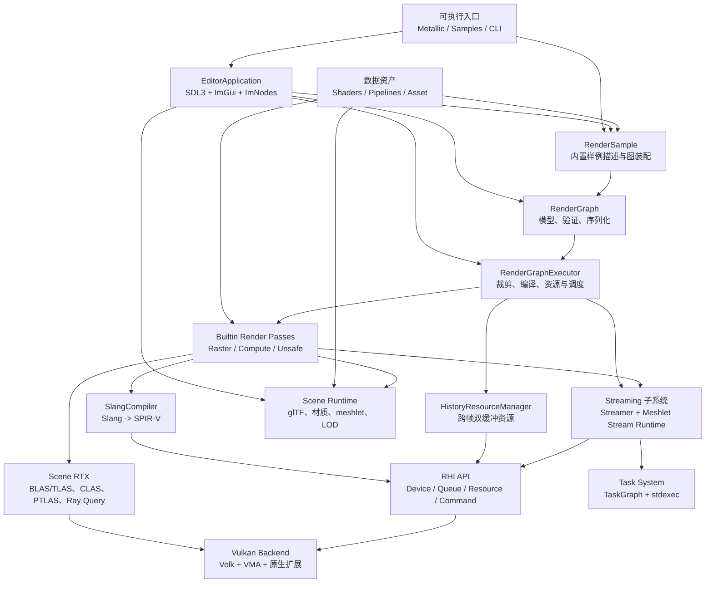
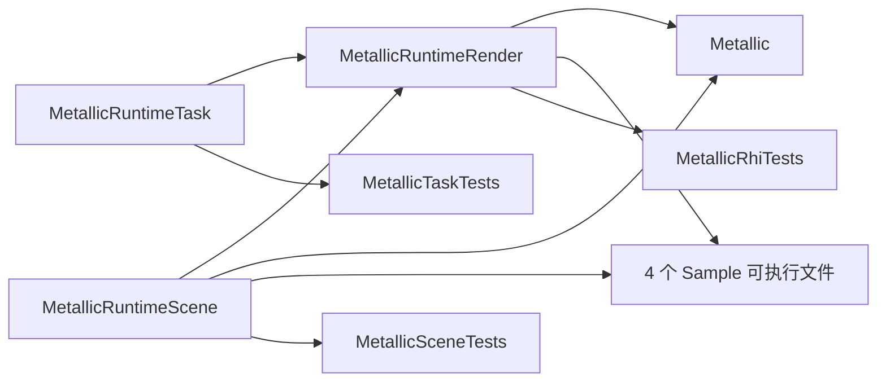
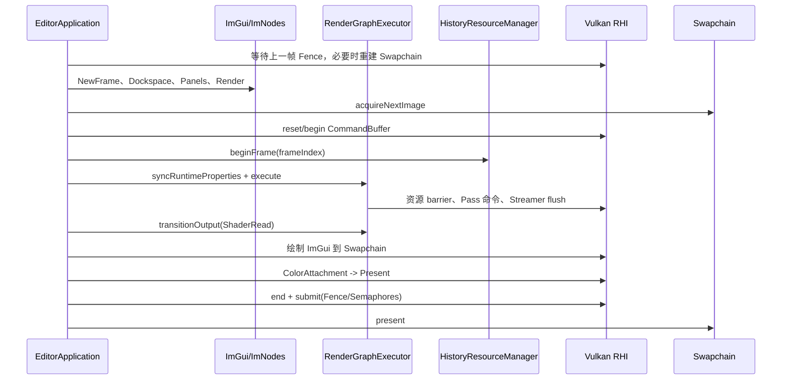
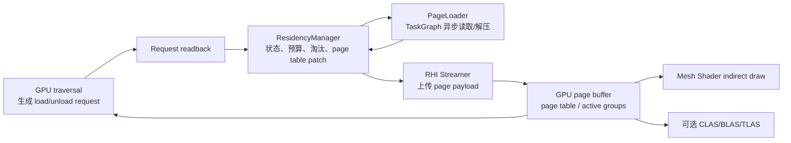

# Metallic 项目架构

> 本文基于 2026-07-18 的仓库实现整理，描述当前代码已经形成的组件边界、依赖关系和运行流程。它是“现状架构”文档；若文档与代码不一致，以代码和 CMake 目标为准。

## 1. 项目定位

Metallic 是一个以 C++23、Slang 和 Vulkan 为核心的实验性实时渲染框架。项目同时提供：

- 基于 SDL3、Dear ImGui 和 ImNodes 的编辑器外壳；
- 可序列化、可视化编辑的 RenderGraph；
- 面向纹理、缓冲、Bindless、动态渲染、Mesh Shader、Ray Query 的 RHI；
- glTF 场景导入、材质/相机/灯光提取和 meshlet/LOD 数据生成；
- 路径追踪、材质可视化、RTXDI、NRD、DLSS-RR 和 GPU-driven 等内置 Pass；
- 面向大场景的 meshlet StreamAsset 离线构建、异步分页和 GPU 驱动驻留；
- TaskGraph、性能分析、GPU 监控和分层测试设施。

当前抽象层虽然为设备和队列保留了通用接口，但实际图形后端是 Vulkan；编辑器和光追模块仍直接使用部分 Vulkan 类型与原生句柄。

## 2. 总体架构



架构的主干是“数据驱动 RenderGraph + 反射式 Pass + Vulkan RHI”。编辑器只负责组织交互、选择输出和提交一帧；图资源的创建、状态转换和 Pass 执行顺序由 `RenderGraphExecutor` 统一管理。

## 3. 目录与职责

| 路径 | 职责 |
| --- | --- |
| `Source/Main.cpp` | 主程序入口；编辑器、RHI smoke test 和 StreamAsset 离线构建 CLI |
| `Source/Samples/` | 各领域样例可执行入口，复用同一个 `EditorApplication` |
| `Source/Editor/` | 编辑器生命周期、面板、节点编辑、视口、性能分析和 NVML 监控 |
| `Source/Runtime/Task/` | 进程级 TaskSystem、依赖图执行、取消、快照和观察者事件 |
| `Source/Runtime/Scene/` | glTF 导入、场景扁平化、meshlet/LOD 构建与 StreamAsset 文件格式 |
| `Source/Runtime/Render/RenderGraph/` | 图模型、Pass 接口、序列化、编译器、执行器和流送帧作用域 |
| `Source/Runtime/Render/RenderPass/` | 内置 Pass 注册和实现 |
| `Source/Runtime/Render/GAPI/` | RHI 公共接口、Streamer、场景光追接口 |
| `Source/Runtime/Render/GAPI/Vulkan/` | Vulkan RHI、场景光追、NRD、Streamline、CLAS 的具体实现 |
| `Source/Runtime/Render/Profiling/` | Nsight/NVTX 标记与 Aftermath GPU 崩溃转储 |
| `Shaders/` | Slang shader 模块和 NRD 配置头 |
| `Pipelines/` | `.metallic_graph.json` RenderGraph 资产及样例图 |
| `Asset/` | glTF/GLB、纹理、HDR 环境和预生成 meshlet 数据 |
| `tests/task/` | TaskGraph 生命周期、依赖、并发、取消和观察者测试 |
| `tests/scene/` | 场景导入、材质、相机、meshlet、LOD、缓存和 StreamAsset 测试 |
| `tests/rhi/` | RHI、RenderGraph、光追、流送和渲染输出测试 |
| `cmake/` | Slang、Streamline、Nsight 和 Aftermath 等集成配置 |
| `External/` | 第三方依赖；不属于 Metallic 自身模块 |

## 4. 构建目标与依赖



主要目标如下：

| CMake 目标 | 类型 | 说明 |
| --- | --- | --- |
| `MetallicRuntimeTask` | 静态库 | TaskGraph/TaskSystem，依赖 `stdexec` |
| `MetallicRuntimeScene` | 静态库 | Scene 和 StreamAsset，依赖 TinyGLTF、meshoptimizer、MathLib |
| `MetallicRuntimeRender` | 静态库 | RHI、Vulkan、RenderGraph、Pass、流送、Slang，公开依赖 Task 与 Scene |
| `Metallic` | 可执行文件 | 通用编辑器与工具入口 |
| `MetallicMaterialVisualizationSample` | 可执行文件 | 材质诊断样例 |
| `MetallicPathTracingSample` | 可执行文件 | OpenPBR 路径追踪，可切换 DLSS-RR |
| `MetallicRtxdiSample` | 可执行文件 | RTXDI/ReSTIR DI 样例 |
| `MetallicGPUDrivenSample` | 可执行文件 | 预加载、StreamAsset 和 RTAS 可视化变体 |
| `MetallicTaskTests` | 测试可执行文件 | TaskSystem GoogleTest |
| `MetallicSceneTests` | 测试可执行文件 | Scene GoogleTest |
| `MetallicRhiTests` | 测试可执行文件 | 自定义 RHI 用例注册表适配到 GoogleTest |

## 5. 程序入口与编辑器层

### 5.1 入口模式

[`Source/Main.cpp`](../Source/Main.cpp) 同时承担三类入口：

1. 默认启动 `EditorApplication`；
2. 运行 RHI、三角形预览或 Bindless smoke test；
3. 通过 `--build-meshstream` 将 glTF/GLB 离线转换为 `.meshstream.bin`，支持断点检查点和 `none`/`byte-rle` payload 压缩。

`Source/Samples/` 下的入口不复制渲染主循环，而是给 `EditorApplication::run()` 传入内置样例 ID、场景覆盖路径或 StreamAsset 覆盖路径。

### 5.2 EditorApplication

[`EditorApplication`](../Source/Editor/EditorApplication.h) 是应用编排层，持有：

- SDL 窗口、RHI Device/Queue/Swapchain/CommandBuffer 和同步对象；
- ImGui/ImNodes 上下文和 Vulkan 后端资源；
- `RenderGraph`、`RenderGraphExecutor`、`HistoryResourceManager`；
- 编辑器侧 `Scene` 和 `SceneRtxBuilder`；
- Profiler、NVML Monitor、视口描述符和 UI 状态。

初始化顺序是：全局 TaskSystem → SDL/窗口 → Vulkan RHI → 历史资源 → Swapchain → ImGui/ImNodes → NVML → RenderGraph/样例。关闭顺序反向执行，并在销毁 GPU 资源前等待 Device idle。

编辑器主要面板包含 Viewport、Scene Browser、Inspector、Assets、Console、Profiler、NVML Monitor、Statistics，以及独立 RenderGraph 编辑窗口。场景和 RenderGraph 文件也可通过拖放加载。

### 5.3 每帧流程



编辑器视口不会执行另一套渲染器：它将活动图输出转成 `ShaderRead`，再通过 ImGui Vulkan 描述符显示。图结构或编译期属性变化会触发重新编译；仅运行时属性变化时，执行器尝试原位同步。

## 6. RenderGraph 子系统

### 6.1 数据模型

[`RenderGraphNode.h`](../Source/Runtime/Render/RenderGraph/RenderGraphNode.h) 定义了可序列化图模型：

- `RenderGraphNode`：稳定 ID、实例名、Pass 类型、编译期属性、运行时属性和编辑器坐标；
- `RenderGraphEdge`：`srcPass.srcField -> dstPass.dstField`；
- `RenderGraphOutput`：被外部消费或作为视口候选的输出；
- `RenderGraph`：增删改查、校验、dirty 标记和 JSON 读写。

`.metallic_graph.json` 当前版本为 `1`，顶层包含 `name`、`nodes`、`edges`、`outputs` 和 `version`。图文件只保存声明，不保存 GPU 资源或已编译 Pass。

### 6.2 Pass 反射与类型

[`RenderGraphTypes.h`](../Source/Runtime/Render/RenderGraph/RenderGraphTypes.h) 将 Pass 分为：

| 类型 | 默认队列 | 语义 |
| --- | --- | --- |
| `RasterPass` | Graphics | 典型光栅化 Pass |
| `ComputePass` | Compute | 典型计算 Pass |
| `UnsafePass` | Graphics | 可混合 graphics/compute/transfer；图尚不能证明更细粒度 hazard 时保守执行 |

每个 Pass 必须实现：

- `reflect()`：声明输入/输出、纹理或缓冲类型、格式、尺寸、访问方式、Bindless 需求；
- `execute()`：通过 `RenderGraphExecutionContext` 获取资源并录制命令；
- 可选 `compile()`：编译 shader、创建 pipeline 或准备场景数据；
- 可选 `runtimeSettings()`：向编辑器暴露 Bool/Int/Float/Float3/Color/Enum/ActionCounter 设置。

字段反射是图验证和自动资源管理的共同事实来源，Pass 不应绕过它私自假设图资源状态。

### 6.3 编译阶段

[`RenderGraphExecutor`](../Source/Runtime/Render/RenderGraph/RenderGraphExecutor.h) 的编译阶段依次完成：

1. 校验节点、边、字段方向/类型和输出；
2. 从标记输出及 `extraOutputs` 反向构建活动子图；
3. 对活动节点拓扑排序并创建注册表中的 Pass 实例；
4. 调用 Pass 反射和 `compile()`；
5. 为输出创建纹理/缓冲和视图，并将输入映射为上游输出别名；
6. 汇总上下游 usage、格式、尺寸和 host-readback 需求；
7. 按反射计划创建 Bindless heap 并写入描述符；
8. 初始化每帧 Streamer 和队列提交上下文。

只有能到达所选输出的 Pass 会进入执行序列。当前资源分配以逻辑输出为粒度，代码没有实现跨输出的瞬时资源别名复用。

### 6.4 执行阶段

每个节点执行前，执行器根据反射访问类型把资源转换到目标状态；同为 `General` 且存在写 hazard 时也会发出 barrier。随后构造 `RenderGraphExecutionContext`，绑定图级 Bindless heap，执行 Pass，并在成功后 flush Streamer。执行器同时收集每个节点与整图的 CPU 时间。

提供两种执行入口：

- `execute(CommandBuffer&, HistoryResourceManager*)`：由调用者提供命令缓冲；编辑器使用此路径，整图位于图形命令缓冲中；
- `execute(RenderGraphSubmitDesc)`：执行器管理各队列命令池、命令缓冲与 timeline semaphore。

多队列接口当前不支持跨队列资源边；遇到此类依赖会返回 `Unsupported`。因此新增队列类型时不能假设已有自动 queue ownership transfer。

### 6.5 跨帧资源与上传

`HistoryResourceManager` 按名字维护纹理/缓冲的 Current/Previous 双槽，负责尺寸变化后的重建、有效性、写入标记、失效和状态转换。相机、环境或带 `invalidateHistory` 的运行时参数变化时，编辑器会清空相关历史。

`RenderGraphStreamingSubsystem` 为图创建统一 `Streamer`。每帧 `beginFrame()`，每个成功 Pass 后 `flush()`，帧末 `endFrame()`，并统计 buffer/texture 传输次数和字节数。Pass 应优先使用 `RenderGraphExecutionContext::streamer()`，避免各自维护重复上传环。

## 7. 内置 Render Pass

内置 Pass 在 [`BuiltinRenderPasses.cpp`](../Source/Runtime/Render/RenderPass/BuiltinRenderPasses.cpp) 中注册：

| 类别 | Pass | 作用 |
| --- | --- | --- |
| 基础 | `ClearColorPass`、`CopyColorPass` | 清屏和颜色复制 |
| 基础 | `TriangleRasterPass`、`ImageSamplePass` | 三角形和全屏纹理采样 |
| 场景光栅 | `BunnyWireframePass` | Stanford Bunny 重心坐标线框 |
| 场景光栅 | `SceneMaterialShaderObjectPass` | 通过 `VK_EXT_shader_object` 显示 glTF 材质 |
| Ray Query | `SceneMaterialVisualizationPass` | 材质参数诊断 |
| Ray Query | `SceneRayQueryVisualizationPass` | 加速结构可视化 |
| 路径追踪 | `ScenePathTracePass` | glTF/OpenPBR Ray Query 路径追踪、累积及可选 DLSS-RR guides |
| RTXDI | `SceneRtxdiPass` | 多灯光 ReSTIR DI，输出 NRD 所需 noisy radiance/guides |
| RTXDI | `RtxdiCompositePass` | 合成去噪 diffuse/specular、材质和 emissive |
| 去噪 | `NrdDenoisePass` | NRD RELAX 去噪 |
| 去噪 | `StreamlineDlssRrPass` | NVIDIA Streamline DLSS Ray Reconstruction |
| GPU-driven | `GPUDrivenPreviewPass` | 预加载 meshlet 的 Mesh Shader 可视化 |
| GPU-driven | `GPUDrivenStreamAssetPass` | 分页 StreamAsset、GPU LOD/遍历和 Mesh Shader 绘制 |
| 测试 | `RenderGraphBufferWritePass`、`RenderGraphBufferCopyPass` | 缓冲、Bindless 和拷贝路径验证 |

Pass 的可用性受 `DeviceCapabilities` 和编译期 SDK 检测约束。可选能力缺失时，相关 Pass 应返回 `Unsupported`，而不是让整个基础运行时无法构建。

## 8. 场景与资产管线

### 8.1 Scene 数据

[`Scene`](../Source/Runtime/Scene/Scene.h) 使用 TinyGLTF 读取 glTF/GLB，并生成两类数据：

- 保留层级关系的 `SceneNode`、Mesh、Camera、Light 和资产元数据；
- 面向渲染的扁平 `RenderNode`、`RenderPrimitive`、`RenderMaterial`、Image 和 Texture。

`RenderPrimitive` 保存 position/normal/tangent/UV/index，并可生成 meshlet cluster、多级 LOD group/cluster 及其 bounds、cone 和误差。材质覆盖 metallic-roughness 基础字段及 transmission、IOR、thickness、attenuation、diffuse transmission 等扩展数据。

场景加载会生成/读取 meshlet 缓存，`LoadResult` 记录缓存是否命中或保存。编辑器侧加载场景后会：同步相关 Pass 的 `path` 属性、应用场景相机、失效历史，并构建普通三角形 BLAS/TLAS 供编辑器统计和调试。

### 8.2 Meshlet StreamAsset

StreamAsset 是独立于普通 `Scene` 常驻数据的分页资产格式。离线构建器把 glTF 几何转换为：

- primitive/instance/geometry 元数据；
- LOD level、group 和层级 node；
- page 表和带格式/压缩标记的 payload；
- 保底 fallback pages；
- 源文件大小和时间戳，用于陈旧性检查。

构建支持部分检查点，以便大场景按 geometry budget 分多次完成。运行时用 `MeshletStreamAsset::open()` 校验并以内存视图访问元数据和 page payload。

### 8.3 GPU-driven 分页运行时



`MeshletStreamRuntime` 管理 GPU 元数据、page table、请求/回读缓冲、活动 group、遍历 work queue、indirect draw 和可选光追资源。`MeshletStreamResidencyManager` 在 resident byte/page 预算内维护页面状态，通过 LRU/年龄策略卸载，并限制每帧上传数量和并发读取数。

`MeshletStreamPageLoader` 使用全局 TaskSystem 并行准备 payload；`StreamingTaskQueue` 把 request、storage、unload 和 update 阶段组织成可观测任务。启用 cluster RTX 时，运行时还可从 resident cluster 建立 CLAS、动态 BLAS 和 TLAS。

## 9. TaskSystem

Task 子系统由 [`TaskGraph`](../Source/Runtime/Task/TaskGraph.h) 和 [`TaskSystem`](../Source/Runtime/Task/TaskSystem.h) 组成：

- TaskGraph 保存 move-only 回调、元数据和 prerequisite/dependent 边；
- 提交前验证空名称、非法句柄和环；
- 独立根节点可并行运行，失败会影响依赖分支但不阻断无关分支；
- `TaskContext` 提供协作式停止标记；
- `TaskGraphRun` 提供取消、快照和等待；
- `ITaskEventSink` 接收提交、节点状态变化和完成事件。

TaskSystem 是显式初始化的进程级服务。编辑器和 RHI 测试在进入主体前初始化，在所有异步工作排空后关闭。目前它主要服务于 StreamAsset 页面读取，但接口并不依赖渲染模块。

## 10. RHI 与 Vulkan 后端

### 10.1 公共 RHI

[`Rhi.h`](../Source/Runtime/Render/GAPI/Rhi.h) 提供 move-only RAII 对象：

- `Device`、Graphics/Compute/Copy `Queue`；
- `Swapchain`、`CommandPool`、`CommandBuffer`；
- `Fence`、timeline `Semaphore` 和 Swapchain binary semaphore；
- `Buffer/BufferView`、`Texture/TextureView`；
- graphics/compute pipeline、shader object program；
- `BindlessHeap` 和跨帧动态 `Streamer`。

命令接口覆盖动态渲染、barrier、buffer/texture copy、传统 draw、Mesh Task indirect draw 和 compute dispatch。能力以 `DeviceCapabilities` 暴露，调用方通过软请求创建设备，再对实际 capability 做降级处理。

### 10.2 Vulkan 实现

`VulkanRhi.cpp` 使用 Volk 加载 Vulkan，并用 VMA 管理资源内存。PImpl 隔离大多数 Vulkan 类型，但以下位置仍显式依赖 Vulkan：

- `SceneRtx.h` 直接把公共光追类型别名到 `vulkan::*`；
- 编辑器通过 `VulkanNative.h` 把原生命令缓冲交给 ImGui；
- 编辑器视口 sampler/descriptor 使用 `VkSampler`、`VkDescriptorSet`；
- NRD、Streamline、CLAS 和 partitioned acceleration structure 均在 Vulkan 目录实现。

因此增加第二后端时，仅实现 `Rhi.h` 还不够，还需要拆分编辑器呈现桥接与场景光追接口。

### 10.3 光追能力

场景光追层包含：

- `SceneRtxBuilder`：普通三角形 BLAS + TLAS；
- `SceneClusterRtxBuilder`：cluster acceleration structure、cluster BLAS + TLAS；
- `ScenePartitionedRtxBuilder`：partitioned TLAS；
- `SceneRayQueryProgram`：SPIR-V、descriptor binding 和 compute dispatch 封装；
- `MeshletStreamClasPool`：面向驻留 page 的 CLAS 分配和更新。

这些能力均必须先检查扩展/设备能力。普通场景路径与 StreamAsset 路径分别维护加速结构，避免强迫所有场景进入同一种驻留模型。

## 11. Shader、Pipeline 与 Sample 的关系

`SlangCompiler` 根据 module、entry point、profile、capability 和宏定义生成 SPIR-V。大部分 Pass 在 `compile()` 阶段按自身属性选择 Slang 模块/入口并创建 RHI pipeline。

三类资产的关系是：

```text
Asset/*.gltf|*.glb|*.hdr  <- 节点 properties 中的路径
Pipelines/*.metallic_graph.json <- Pass 节点、边、输出和参数
Shaders/*.slang          <- Pass compile() 中选择的 shader 模块
```

`RenderSample` 是三者之间的装配描述：它给出样例 ID、场景路径、图路径、需要覆盖场景/环境的节点名，以及默认视口输出。当前内置样例覆盖 OpenPBR 路径追踪、DLSS-RR、RTXDI、材质可视化和三种 GPU-driven 变体。

## 12. 可选集成与第三方依赖

| 能力 | 主要依赖 | 构建行为 |
| --- | --- | --- |
| 窗口/输入 | SDL3 | vendored 优先，否则 `find_package(SDL3)` |
| 编辑器 UI | Dear ImGui docking、ImNodes | 构建为本地静态库 |
| Vulkan 加载/内存 | Volk、VMA | Vulkan RHI 基础依赖 |
| Shader | Slang | 必需；默认 `External/slang`，可用 `SLANG_ROOT` 覆盖 |
| 场景 | TinyGLTF、meshoptimizer、MathLib | Scene 基础依赖 |
| JSON/日志 | nlohmann/json、spdlog | RenderGraph/配置与日志 |
| 并行任务 | stdexec | TaskSystem 基础依赖 |
| 去噪 | NRD | 找到 `NRD` 目标时定义 `METALLIC_HAS_NRD=1`，否则 Pass 返回不支持 |
| Ray Reconstruction | NVIDIA Streamline | Windows/Vulkan 可选；SDK 不完整时编译为不支持 |
| GPU 标记 | NVTX/Nsight Events | 找不到头文件时 marker 为空操作 |
| GPU 崩溃分析 | Nsight Aftermath | Windows/Vulkan 可选，并复制运行时 DLL |
| GPU 监控 | NVML 动态加载 | 编辑器可选监控，不作为 RHI 基础依赖 |
| 测试 | GoogleTest | task/scene/rhi 三类测试入口 |

顶层配置还提供 `METALLIC_BUILD_TESTS` 和实验性的 `METALLIC_CLUSTER_LOD_TOPOLOGY_NYX` 选项。

## 13. 扩展指南

### 13.1 新增 Render Pass

1. 在 `Source/Runtime/Render/RenderPass/BuiltinPass/` 新建 Pass，选择 `RasterPass`、`ComputePass` 或 `UnsafePass`；
2. 在 `reflect()` 中完整声明输入输出、访问、格式和 Bindless 需求；
3. 在 `compile()` 中检查 `DeviceCapabilities`、编译 Slang 并创建资源；
4. 在 `execute()` 中仅通过 `RenderGraphExecutionContext` 使用图资源、历史资源和 Streamer；
5. 在 `BuiltinPasses.h` 暴露工厂，并在 `BuiltinRenderPasses.cpp` 注册稳定类型名；
6. 加入 `MetallicRuntimeRender` 的 CMake source 列表；
7. 添加序列化/编译/执行或图像输出测试。

Pass 类型名会写入 Pipeline JSON，应视为资产兼容性标识，不能随意重命名。

### 13.2 新增内置 Sample

1. 在 `Pipelines/Samples/` 创建并验证图资产；
2. 在 `RenderSample.cpp` 实现描述类，指定 scene、environment target 和 preview output；
3. 注册到 `builtInRenderSamples()`；
4. 若需要独立命令行入口，在 `Source/Samples/` 增加薄封装并配置 CMake；
5. 至少覆盖图加载、目标节点存在性和 smoke test。

### 13.3 修改共享 RHI 接口

修改 `Rhi.h` 前应同时检查：Vulkan PImpl、RenderGraph 状态映射、Scene RTX、Streamer、编辑器 native bridge 和 `tests/rhi/`。RHI 对象是 move-only 且由 owner 控制生命周期，新增 API 应保持这一约束。

## 14. 测试与验证

推荐验证路径：

```powershell
git submodule update --init --recursive
cmake -S . -B build -DMETALLIC_BUILD_TESTS=ON
cmake --build build --config Debug
ctest --test-dir build -C Debug --output-on-failure
build\Source\Debug\Metallic.exe --smoke-test
```

可按标签运行：

```powershell
ctest --test-dir build -C Debug -L task --output-on-failure
ctest --test-dir build -C Debug -L scene --output-on-failure
ctest --test-dir build -C Debug -L rhi --output-on-failure
```

RHI 测试支持原有便捷参数 `--list`/`--filter`，并会转换到 GoogleTest 的 `--gtest_list_tests`/`--gtest_filter`。依赖设备扩展的测试在能力缺失时以 GoogleTest skip 处理；生成图像写入测试输出目录，不应提交到源码树。

## 15. 当前架构约束

- **后端边界尚未完全闭合**：公共 RHI 有抽象，但编辑器、Scene RTX 和 NVIDIA 集成仍与 Vulkan 耦合。
- **RenderGraph 的并发调度有限**：已有多队列提交接口，但跨队列资源边尚不支持。
- **资源生命周期以整次编译为主**：图输出独立分配，尚无 transient aliasing 或通用资源池。
- **历史资源显式管理**：跨帧数据不属于普通图边，Pass 必须通过 `HistoryResourceManager` 约定名字和有效性。
- **高级功能按能力降级**：Mesh Shader、Ray Query、CLAS/PTLAS、NRD、Streamline、Shader Object 都不能作为基础设备必有能力。
- **StreamAsset 是独立运行路径**：普通 Scene 全量驻留与分页 meshlet runtime 不应混为同一资源所有权模型。
- **法线空间必须稳定**：Ray Query shader 在构建 TBN 和应用 normal map 前，不得在 `traceClosest()` 内按当前 ray 翻转 authored/world-space `normal` 或 `geometryNormal`；如 BSDF 需要同半球法线，只对最终 shading normal 做 face-forward。

## 16. 关键源码索引

- 编辑器主循环：[`Source/Editor/EditorApplication.cpp`](../Source/Editor/EditorApplication.cpp)
- RenderGraph 模型：[`Source/Runtime/Render/RenderGraph/RenderGraphNode.h`](../Source/Runtime/Render/RenderGraph/RenderGraphNode.h)
- Pass/反射接口：[`Source/Runtime/Render/RenderGraph/RenderGraphTypes.h`](../Source/Runtime/Render/RenderGraph/RenderGraphTypes.h)
- 图编译与执行：[`Source/Runtime/Render/RenderGraph/RenderGraphExecutor.cpp`](../Source/Runtime/Render/RenderGraph/RenderGraphExecutor.cpp)
- RHI 公共接口：[`Source/Runtime/Render/GAPI/Rhi.h`](../Source/Runtime/Render/GAPI/Rhi.h)
- Vulkan 后端：[`Source/Runtime/Render/GAPI/Vulkan/VulkanRhi.cpp`](../Source/Runtime/Render/GAPI/Vulkan/VulkanRhi.cpp)
- 场景数据：[`Source/Runtime/Scene/Scene.h`](../Source/Runtime/Scene/Scene.h)
- StreamAsset 格式：[`Source/Runtime/Scene/MeshletStreamAsset.h`](../Source/Runtime/Scene/MeshletStreamAsset.h)
- 分页运行时：[`Source/Runtime/Render/MeshletStreamRuntime.h`](../Source/Runtime/Render/MeshletStreamRuntime.h)
- TaskSystem：[`Source/Runtime/Task/TaskSystem.h`](../Source/Runtime/Task/TaskSystem.h)
- 构建目标：[`Source/CMakeLists.txt`](../Source/CMakeLists.txt)
