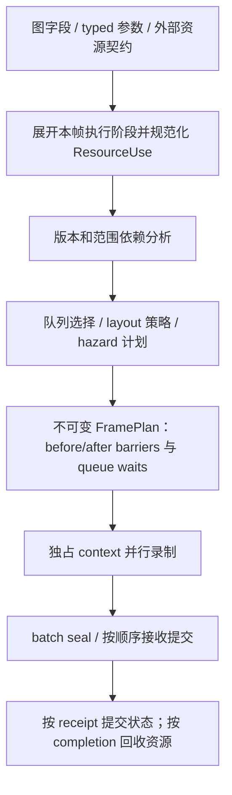

# RenderGraph 自动同步方案调研

日期：2026-09-26。调研基线：`c596cd1af729386a74c37263c379a2f8d708afd4`。第 1–8 节描述该基线与设计方向，第 9 节记录跨 pass 计划，第 10 节记录 AutoExposure 内部阶段的落地。

结论：值得推进。目标是让图编辑者和普通 pass 作者只表达资源用途、读写和数据流，由 RenderGraph 生成同步计划。同步责任归入图编译器与后端；它不能对图编译器本身不可见，也不能仅凭 Buffer / Texture 类型或连线方向推断所有访问。

推荐在现有共享 registry、BufferSlice、typed 参数、prepared dispatch、batch receipt 上增加统一的 **ResourceUse → HazardPlan → Barrier / QueueWait** 编译流程。保留现有 Vulkan 同步编码器，不重建另一套资源身份体系。第 1–8 节的完整 API 属于设计草案；已经实现的范围以第 9–10 节为准，尚未测得新性能收益。

## 1. 当前已经自动化了什么

| 位置 | 当前行为 | 限制 |
| --- | --- | --- |
| [RenderGraphTypes.h](../Source/Runtime/Render/RenderGraph/RenderGraphTypes.h)，`RenderGraphField` / `RenderGraphResource` | 字段声明 sampled、storage、transfer、attachment 等用途；资源保存 state、lastAccess、lastScope | storage 只有 ReadWrite；字段没有访问 stage、mip/layer/aspect 或 byte range；资源只有一份整资源状态 |
| [RenderGraphExecutor.cpp](../Source/Runtime/Render/RenderGraph/RenderGraphExecutor.cpp)，`transition`，约 1701 行 | 同状态写入也同步；读 stage 累积；识别换队列；生成整个纹理/缓冲的 barrier | 访问与 layout 仍通过 ResourceState 间接耦合；缺少独立 writer、reader 集合及可见性覆盖记录 |
| 同文件 `prepareNode`，约 1788 行 | 遍历 reflection 的输入、输出，自动转换并批量调用 synchronize | 已能让简单 pass 不手写图资源 barrier；看不到 pass 内多阶段及私有资源 |
| 同文件 `lastResourceUse`，约 3469 行 | 每个逻辑资源的所有使用串起来，包括 read/read；Unsafe pass 形成串行边界 | 队列依赖与 barrier 由两条独立路径构造，信息粒度不一致 |
| [VulkanRhi.cpp](../Source/Runtime/Render/GAPI/Vulkan/VulkanRhi.cpp)，`CommandBuffer::synchronize`，约 5997 行 | 校验 scope；相同 stage pair 合并 global memory barrier；保留 image layout transition；选择 unified GENERAL / optimal fallback | 只能优化调用者已给出的单次 barrier 批；不能恢复未声明的资源访问或跨调用消除依赖 |
| [HistoryResources.cpp](../Source/Runtime/Render/HistoryResources.cpp)，约 506 / 549 行 | HistoryManager 自己维护状态和 transition | 状态与 graph 的资源账本分离；需要进入同一访问计划 |
| [NrdRuntime.cpp](../Source/Runtime/Render/RenderGraph/NrdRuntime.cpp)，`dispatch`，约 407 行 | 已有逐 dispatch resource 列表；每阶段显式转 GENERAL，并维护 pool state | 很适合映射为内部图阶段；不需要把 NRD 当作无法分析的黑盒 |

因此，问题不是“现在完全没有自动 barrier”，而是自动化只覆盖 graph field 的 pass 边界，剩余同步分散在复杂 pass、history、GPUScene 和 streaming 中。

一个具体的过度声明例子是 [RenderGraphBufferPasses.cpp](../Source/Runtime/Render/RenderPass/BuiltinPass/RenderGraphBufferPasses.cpp)：Copy pass 的 source 与 destination 都使用 `storageReadWrite()`。即便实际只读 source，图也会把它作为潜在写入者。首先需要表达精确用途，才有可靠的优化空间。

## 2. 类型和连线可以推导到什么程度

可自动获得：dispatch 的 compute stage、copy 的 transfer stage、indirect 参数读取、attachment 的固定功能用途、typed slice 的 allocation/range、显式图输出的生产者。

仍需声明或由受约束的参数绑定生成：storage 的 Read / Write / ReadWrite、修改哪个版本、写入是否覆盖整个有效范围、bindless/BDA 能访问的资源集合、外部 SDK 的入/出状态、跨帧历史依赖。

例如相同 `float4` buffer 可以是 compute 输出、indirect 参数、AS build 输入或普通 shader 数据；相同 texture 可以采样、storage 访问或作为附件。`RWTexture2D` 表示允许读写，不证明一次具体 dispatch 只写。资源的创建 usage 表示合法用途集合，也不等于本次使用。带范围的 BDA 保留了来源，但通过 GPU 内存中存储的地址继续追踪指针，仍需要应用提供可达集合。

CPU/GPU 参数 ABI 不需要改变：可以为参数添加只存在于 CPU 的 `ReadBuffer<T>`、`WriteBuffer<T>`、`ReadWriteBuffer<T>` 等访问包装，底层仍编码现有 `ShaderDataSpan` 或 wire handle。shader 反射可补充 stage、绑定类别并校验声明，不能成为恢复动态地址和内容依赖的唯一正确性依据。

附件还要结合 load/store、blend、depth/stencil 测试推导读写；局部 clear 或有写掩码的 draw 不证明整张图被覆盖。ray query 的 AS 读取属于执行查询的 compute/fragment 等 stage，不能因资源是 AS 就一律填 RayTracingShader。host 写入、非一致内存 flush/invalidate 与 GPU 完成等待也要保持独立契约，不能期待自动 GPU barrier 替代它们。

## 3. 统一访问描述，复用原有身份

建议把字段及实际命令输入规范化成如下语义记录：

```cpp
// 概念接口，尚未实现。
struct ResourceUse
{
    ResourceRef resource;       // 既有 allocation / lease 的图视图，不是另一套 GPU handle
    ResourceVersion version;   // 逻辑内容版本；与 allocation generation 区分
    ResourceRange range;       // Buffer 字节区间；Texture aspect / mip / layer
    AccessMode access;          // Read / Write / ReadWrite
    ResourceUsage usage;        // Sampled / Storage / Indirect / Attachment / Copy / AS...
    PipelineStageBits stages;  // 通常由执行阶段与参数元数据生成
    ContentPolicy contents;    // Preserve / Discard；不以 Discard 取消旧访问依赖
};
```

这里的 version 是图中的数据流版本，不新增一套资源所有权。两次读取同一版本可以分叉；原地修改产生新版本，并等待旧版本的读取。没有版本/显式顺序约束的多个 writer 应报告歧义，不能任意用节点遍历顺序解释用户意图。

身份规范化要求：

- Buffer 使用 `BufferSlice::allocationIdentity()`、所属 device、强 allocation lease 和 byte range；不能用 Buffer wrapper 地址或裸 GPU address 作持久键。
- Texture 使用 underlying image allocation 和 aspect/mip/layer。`TextureView::retainTexture()` 已能保留 owned image，但 borrowed swapchain image 返回空，需要补充带 swapchain generation 的导入身份。不能用 descriptor index 区分 hazard，因为多个 descriptor/view 可能覆盖同一 image。
- `ResourceLease` 当前主要封装描述符和寿命，`ParameterWriter` 目前只收集资源保留项。应增补可查询的 canonical resource/range 信息或从参数构造阶段携带该信息；不能把所有 retained owner 都当成本次 GPU 读写。
- descriptor heap 自身的读写与其指向资源的读写分开建模。TLAS 与其可达 BLAS / backing buffers 的依赖也不能只靠保留 TLAS owner 表达。
- graph 只增加使用记录和同步账本，registry 继续负责身份/描述符/寿命。同步账本由 coordinator 持有，worker 不修改 registry 中的全局状态。

把旧 `RenderGraphField.access/state` 适配到 ResourceUse，完成迁移后不再维护相互独立、可能冲突的公开 state 与 access。读写关系、retention 和参数绑定应从同一份参数描述生成；不能要求 pass 作者长期手写两份一致性列表。

## 4. 一个编译器生成 barrier 和队列依赖



静态编译缓存 pass 拓扑、阶段模板和访问语义；每帧准备解析 history slot、streaming allocation、动态 view/range 和具体队列，再实例化 FramePlan。现有 `prepareNode` 在准备时就写 barrier，部分 scene prepare 也直接录制 GPU 工作；迁移时需把这类 GPU 操作变成可声明的阶段，不能仅在最外层增加一次“compile barriers”。

建议对每个有重叠的资源区间保存：最后 writer、所有尚未被后续写入覆盖的 reader frontier、writer 对不同目标 queue/stage/access 的可见性覆盖、当前 layout 与 sharing/ownership、关联的已接收 completion。Buffer 使用区间分割和相邻等价区间合并；texture 先按 aspect/mip/layer 处理，不做任意 texel 级证明。

### 必须满足的同步语义

同队列的 WAR 通常只需执行顺序；RAW/WAW 需要正确的内存依赖。image layout transition 本身可能访问内存，所以即使用户访问都是读，改变 layout 也可能要求排序。Discard 丢弃内容，不代表之前的 GPU 访问已经完成。依据：[Vulkan 同步规范](https://docs.vulkan.org/spec/latest/chapters/synchronization.html)。

针对 Metallic 的规划规则：

| 访问组合 | 计划 |
| --- | --- |
| 不相交的 byte / subresource 范围 | 无该范围的资源依赖；不能因此忽略共享物理内存 alias |
| Read → Read | 在 layout、owner 兼容，且所有读者均已被原 writer 的可见性覆盖时，不增加读者之间的边 |
| Write → Read | 保留 producer 到各 consumer 的 RAW 关系，按 stage/access 生成可见性；可合并兼容读者的目标 scope |
| Read(s) → Write | 等待全部相关 reader frontier，不能只等最后记录的那个 reader |
| Write → Write / ReadWrite | WAW / RAW 按所需范围处理；不能因“会覆盖旧值”直接省略同步 |
| 内容首次使用或显式 discard | 分开处理 image 初始化与内容有效性；第一次读取未初始化内容应报错 |
| 跨帧 / 外部导入 | 从明确的初始状态和 completion token 开始；导出状态与 token 交还下一使用者 |

**不能直接把当前 read/read 快路径当成完整算法。** 当前 `transition()` 在同状态读取时只累积 lastScope，不再保留 writer 的可见性覆盖。对于“compute 写 → compute 读 → fragment 读”，如果第一道窄 barrier 仅对 compute 读可见，之后仅合并 reader stage 不能自动证明 fragment 读也可见。这是源码静态审计发现的需要专项验证的情形，本轮未用 GPU 复现，也不据此认定现有生产场景已经出错。新 planner 必须用 writer-frontier/visibility 模型覆盖它。

跨队列必须由同一 hazard 边生成 semaphore wait 和必要的 layout/ownership 操作。正确覆盖生产/消费 scope 的 semaphore 依赖可以替代没有 layout/ownership 变化的额外内存 barrier，但不能据“换了队列”就随意清空 source scope。[Khronos 同步示例](https://docs.vulkan.org/guide/latest/synchronization_examples.html#_interactions_with_semaphores)。

Metallic 当前 `acquireFromQueue` 只适用于已共享到目标 family 的资源，backend 使用 `VK_QUEUE_FAMILY_IGNORED`，并不是 exclusive ownership transfer。第一阶段继续遵守这一前提；将来支持 exclusive 跨 family 导入时，必须成对生成 release/acquire。相同 VkQueue 的逻辑 graphics/compute 标签应合并成一个实际队列域。

`GpuCompletionPoint::appendWaits()` 当前统一使用 AllCommands。先保留这个安全边界，把必要的 hazard 边做对；再引入计划专用的 consumer scope wait，证明它覆盖 image transition/ownership 的完整依赖链。不能只将等待 stage 替换成 shader stage，而遗漏前置布局操作。

### 合并与“最优”的边界

规划器先决定哪些依赖必要，再由现有 `synchronize()` 编码。相同边界、相同 stage pair 可以合并 access；不应把互不相关的 source/destination stage 全部做并集，以免产生额外排序。范围分析能消除虚假的图依赖，但当前 buffer 最终使用 global barrier，原生同步范围仍可能比逻辑资源范围宽；保留将来选择 per-resource barrier 的后端策略空间。

GENERAL policy 不消除 hazard。`VK_KHR_unified_image_layouts` 允许在适用情况下高效使用 GENERAL，但仍有初始化、present 等例外，部分硬件也可能更适合 image barrier。因此应继续保留 unified / optimal 两条策略及 descriptor layout 一致性。[扩展说明](https://docs.vulkan.org/features/latest/features/proposals/VK_KHR_unified_image_layouts.html)。

可承诺的是“完整声明下生成正确、避免明显冗余、可测量优化的同步”，不是所有 GPU/驱动上的全局最优。少一条 API barrier 不一定比更窄的 stage/range 更快；阶段选择也影响 GPU 重叠。[Khronos 性能示例](https://docs.vulkan.org/samples/latest/samples/performance/pipeline_barriers/README.html)。

## 5. pass 内部也透明：内部阶段，而非增加编辑器节点

只看 pass 输入输出，无法推断 `dispatch A → dispatch B` 中间的依赖。应允许一个可视化节点展开为内部执行图，使用同一个 planner；GPU 工作划分和 CPU recording batch 划分仍是不同层次，不要求每个阶段创建一个 worker task 或 native submit。

[AutoExposurePass.cpp](../Source/Runtime/Render/RenderPass/BuiltinPass/AutoExposurePass.cpp) 当前手写 history、histogram、exposure 三处 barrier，是合适的首个迁移样例：

| 内部阶段 | 读取 | 写入 |
| --- | --- | --- |
| Histogram | source HDR | histogram |
| Reduce / Adapt | histogram、有效 history | history、exposure |
| Apply | source HDR、exposure | color |

首次无 history 的路径必须声明初始化/重置语义；跨帧 history 还需要引用上一次写入的状态/token。Reset 不意味着可忽略仍在使用旧 history 的工作。

```cpp
// 概念接口：声明由 typed 参数生成，三个 dispatch 没有显式 barrier。
auto histogram = phase.dispatch(histogramProgram,
    HistogramParameters{read(source), write(histogramOutput)});
auto exposure = phase.dispatch(adaptProgram,
    AdaptParameters{read(histogram), readWrite(history), write(exposureOutput)});
phase.dispatch(applyProgram,
    ApplyParameters{read(source), read(exposure), write(colorOutput)});
```

这些 token 表示阶段/资源版本，不是 CPU 立即执行的返回数据。绑定所需对象仍使用现有 immutable parameter packet / prepared dispatch。`PreparedComputeDispatch::record(..., betweenDispatches)` 的 barrier 参数可在迁移后的路径上由计划替代；底层兼容调用在迁移期继续存在。

后续优先对象：

- **NRD**：`NrdPlan::schedule()` 已给出 dispatch 顺序、resource 类别和 pool index；sampled 输入标 Read，storage 输出先保守 ReadWrite，审计 shader 后才能收窄 Write。永久资源、临时资源和 ping-pong 统一作为 registry allocation 的图引用，逐步去掉 NrdRuntime 的独立 state 数组。
- **VisibilityBuffer**：将 reset、cull、classify、stable bins、software raster、hardware raster、merge、HZB 表达为内部阶段。保留 software/hardware GPU 分叉与 join；间接参数必须声明 IndirectRead，HZB 按 mip 声明，不能以一个整体“读写可见性输出”代替内部关系。
- **GPUScene / streaming**：上传 copy、decompression、page table 更新、CLAS/BLAS/TLAS build 与消费分别声明；初期只迁移可确定的区域。GPU 驱动的动态索引集合用不可变可达资源集或保守合法范围，不能猜测运行时访问。
- **History / external / SDK**：导入当前物理 slot、有效性、初始 access/layout/queue/completion；使用结束导出预定的最终契约。旧 Unsafe/SDK callback 可以作为声明边界的 opaque stage，适配器内部暂留必要的显式同步。若连入/出状态也未知，宽 memory barrier 不能修复未知 image layout，必须补齐契约。

任意 shader 内部的 workgroup 同步、原子算法、同一 dispatch 内通信仍属于 shader/算法，不能由 command-level RenderGraph barrier 替代。rendering scope 内也不能任意插入跨阶段 pipeline barrier；planner 必须选择合法边界，必要时拆 rendering scope，而非仅把同步点插进任意回调中。

## 6. 与已完成的并行录制、提交回执相容

FramePlan 在 worker 开始录制前冻结，包含每批实际需要的 before/after barriers、跨队列依赖和输出版本。worker 只读取计划并编码命令。这样既不需要线程争抢全局 state tracker，也不依赖 CPU 谁先录完来决定 GPU 状态。

状态分成计划中、已被队列接收、GPU 已完成三层：

- seal 只冻结命令和计划，不提交资源最终状态；
- receipt.accepted 后，把该批的计划状态与 receipt completion 写入 coordinator 的账本；这表示已经安排的未来状态，不是 GPU 此刻已执行；
- 取消未接收尾部不修改已接收前缀；后续消费者必须携带前缀 token；
- 资源回收继续等待已有 aggregate frame completion。没有增加 GPU 在途帧数，也不扩大 streaming 上传窗口。

当前失败路径通过使 graph 失效并重新编译来处理录制期推进的资源状态；新 planner 可先保留这条可靠恢复路径，再实现精确的提交状态增量。不能为了实现自动 barrier，提前把“录完”或“计划完”的状态发布成“已提交”。

跨调用异步录制、MaterialResolve 的 frame-overlap 开关不随自动 barrier 自动开启。GPU 同步正确性无法证明 CPU 单例状态、host buffer、descriptor 改写也已安全；两类契约需要分别审计。

## 7. Unreal 对照与方案取舍

Unreal RDG 的公开接口通过 pass 参数元数据获得依赖，由图处理资源/subresource transition、async compute fences、并行录制，并提供使用验证。这支持“参数声明 + 图编译”方向；它也要求资源使用被 RDG 看见，而非分析任意 lambda 的实际 GPU 行为。[Unreal RDG 官方文档](https://dev.epicgames.com/documentation/en-us/unreal-engine/render-dependency-graph-in-unreal-engine)。本轮只核对公开文档，不声称审计了 Unreal 私有源码的当前 backend 实现。

Metallic 适合借鉴其声明与编译分离，不需要照搬宏系统、另一套 RHI resource wrapper 或立即实现 split barriers / transient aliasing。当前 typed 参数、资源 lease 与 prepared dispatch 可以成为更直接的访问元数据入口。

| 路径 | 判断 |
| --- | --- |
| 仅升级当前 transition helper | 可改善简单 pass，但无法消除复杂节点内部 barrier，不足以达到目标 |
| 在每次 RHI dispatch/draw 自动猜资源并同步 | 无法恢复 bindless/BDA 的完整使用集，难以跨队列/并行录制规划；不选作主架构 |
| 共享 ResourceUse + 图/内部阶段 planner | 推荐；前端透明、信息明确，复用既有 registry 与提交协议 |
| 立刻建立全量 draw command IR 并全仓改造 | 能扩大可观察范围，但迁移成本高；先用已有 prepared execution 与分阶段回调即可 |

## 8. 分阶段落地与验收

### 第一阶段：完整的跨 pass 访问与同步计划

扩展读写模式、usage、range、版本语义；统一 normalized resource identity；加入纯 CPU hazard planner，替代独立的 `lastResourceUse` 和在线 transition 推演。默认按现有顺序/队列执行，不同时改变 GPU 调度策略。选择 Clear/Copy 和 graph buffer pass 校验，修正只读 source 的过度声明。

先支持整资源，再在同一模型内启用精确范围；不能在“整资源阶段”宣称已消除 HZB mip 或 streaming page 的内部 barrier。所有未迁移 pass 保持显式 legacy/opaque 契约，迁移完成的 pass 由 debug validator 拒绝漏报访问或混用手动状态。

### 第二阶段：内部阶段 + 持久资源

先迁移 AutoExposure 完成闭环，再接入 NRD dispatch plan、HistoryManager 导入/导出、prepared dispatch 参数访问包。要求这条路径上不再有手写 histogram / exposure / history barrier，并用同一 planner 生成跨帧和 pass 内依赖。

### 第三阶段：GPUScene、VisibilityBuffer、streaming

逐条迁移内部阶段、indirect、AS 和动态可达资源集；保留既有上传预算与事务。以 MiniZorah 验证，其他程序占用 GPU 时不启动 ZorahFull。最后才评估收窄 semaphore wait stage、减少同状态同步、跨队列 read fan-out，以及 native barrier 策略。

### 测试矩阵

| 验证层 | 必测情形 |
| --- | --- |
| CPU planner | RAW/WAR/WAW；writer → 多 reader → writer；compute 写 → compute 读 → fragment 读；不存在覆盖关系的读者不能删除 writer 边 |
| 范围与版本 | 分离/部分重叠 buffer slices；mip/layer/aspect；两个 view 指向同 allocation；未初始化读取；原地更新版本；未排序多 writer 拒绝；allocation generation 复用 |
| 队列 | 1 队列与多队列；逻辑队列映射到同 VkQueue；读者并行后写入 join；layout 变化；共享 family 与 exclusive transfer 明确区分 |
| 提交与失败 | 单/多 worker 任意完成顺序仍产生相同计划；seal 后拒绝；已接受前缀 + 失败尾部；跨帧导入/导出和 resource lifetime |
| GPU | deterministic readback；Vulkan Synchronization Validation；GENERAL 与 optimal fallback；AutoExposure 数值/时序、NRD history、MiniZorah LOD/streaming/CLAS 与画面检查 |
| 性能 | 图准备/编译时间、区间数量、实际 native barriers、barrier scope、queue waits、GPU pass/整帧耗时；相同场景/设置/预热，分开记录诊断开销 |

已有 `synchronization_scopes_batch_and_validation` 验证的是编码器 scope 校验/合并，不替代新 planner 的依赖正确性测试。验证层对动态 shader 访问也有覆盖限制；不能以“没有 validation 错误”证明 bindless/BDA 使用集完整。[Khronos VVL 配置与 shader access 限制](https://github.com/KhronosGroup/Vulkan-ValidationLayers/blob/main/layers/VkLayer_khronos_validation.json.in)。

每个计划依赖都应保留资源、范围、producer/consumer、hazard 原因和 layout/queue 决策，支持导出解释。目标是让 barrier 对日常编写透明，同时对调试可追溯。

原始调研阶段只核对源码/官方资料；后续实现与运行验证如下。性能价值首先体现在减少分散状态管理与漏同步风险；实际 GPU 收益应在迁移后的 MiniZorah 对照中测量，不能从 barrier 数量预先承诺。

## 9. 已实现：跨 pass 统一访问计划

新增 [RenderGraphAccessPlan.h](../Source/Runtime/Render/RenderGraph/RenderGraphAccessPlan.h) / [.cpp](../Source/Runtime/Render/RenderGraph/RenderGraphAccessPlan.cpp)。这是不调用设备的 CPU planner：输入规范化的资源、实际队列身份、pass 访问；输出每个 pass 的规范化访问、barrier 和前驱 pass。执行器在任何 pass 录制前完成计划，worker 不再推进全局 hazard tracker。

### 访问与依赖

- 新增 `storageRead()` / `storageWrite()`，保留 `storageReadWrite()`。Compute、Raster、Unsafe 以及 transfer/attachment/constant 用途转换为明确的 stage/access。Buffer Write 的输出改为只写；Buffer Copy 的 source 改为只读，destination 改为只写。
- 图拥有的每个物理分配对应一个稳定的 resource slot；所有输入别名解析到该 slot。此次没有创建第二套 registry，也没有扩大图资源的所有权范围。
- 保留真正的数据 writer、全部 reader frontier，以及独立的 image layout anchor。`compute write → compute read → fragment read` 的第二个读取仍依赖 writer；后续 write 等待全部 reader。
- 同 layout 的跨队列读分叉不再因为“上一次是另一个 reader”而串行。layout 变化仍等待之前的访问，后续读取也依赖产生该 layout 的操作；layout 转换自身的写入不会被读/读快路径忽略。
- 远端 producer 通过 semaphore 依赖提供可见性，不把远端专有 stage 放进本队列 barrier。只有本队列的纯 WAR、且不改变 layout 时，使用无 memory access 的 execution dependency。
- 同一 pass 内多个字段引用同一资源时先合并访问。buffer 的 ShaderRead/General 可合并；互不兼容的 texture layout 声明会在 preflight 被拒绝，不再按字段顺序插入实际上不存在的阶段转换。

### 执行与提交

两个 `execute()` 入口和外部 `transitionOutput()` 都使用该 planner。self-submit 在规划前通过 `Queue::sameQueue()` 归一化实际队列；前驱 pass 映射到其最终完成 segment，包含 GPU fork/join。删除原先独立的 `lastResourceUse`、`resourceQueues`，以及资源上的 `lastAccess/lastScope`。

图资源只保留计划中的边界 state。GPU 已完成仍由 `RenderFrameContext` / completion 判断；batch seal、提交接收回执和已接受前缀的取消行为保持原契约。失败的图执行会使 graph 失效，重新编译前等待已有工作，不把录制期推进的 state 当成已完成状态。

### 当前边界

本阶段覆盖**图拥有资源的跨 pass、整资源访问**。随后第 10 节加入单队列 compute 阶段，第 12 节推广到混合内部阶段、私有纹理和 History/NRD。buffer slice 精确区间、texture mip/layer/aspect、动态 bindless/BDA 可达集合以及 exclusive ownership transfer 尚未纳入；opaque 子系统内部同步继续承担这些责任。

跨帧和外部命令边界暂时使用现有 completion waits，加保守的 `AllCommands / MemoryRead|MemoryWrite` 初始范围。第 11 节已加入同一计划内按 queue/stage/access 的可见性覆盖，消除重复 RAW barrier。不同逻辑 texture state 仍可能保守生成 layout 依赖，即使后端采用 GENERAL policy；不宣称全局最优或 GPU 性能提升。

### 验证记录

复用 `build-scheduling-release` 的 MSVC/Ninja Release 配置，构建 `Metallic`、`MetallicRhiTests`、`MetallicTaskTests`。新增 [RenderGraphAccessPlanTests.cpp](../tests/rhi/RenderGraphAccessPlanTests.cpp)，输出与日志放在被忽略的 build 目录。

| 验证 | 结果 |
| --- | --- |
| 新增 CPU planner / GPU fanout | 8/8；7 个 CPU 用例，GPU 六消费者 × 32 帧，1/4 workers、Joined/Pipelined、实际不同 queue family 与显式队列别名，输出字节一致 |
| 现有图/队列/回执/失败恢复回归 | 19/19；涵盖外部 execute、transitionOutput、buffer、bindless texture、双帧槽、跨队列与接受前缀后失败 |
| optimal-layout 与像素回归 | 7/7；包含 VisibilityBuffer 准备路径串行/并行像素一致性；检查了生成的 `VisibilityPreparedMaterial.png` |
| MiniZorah | 600 帧固定机位，4 recording workers、CLAS 开启、1080p；断言通过，未启动 ZorahFull |
| TaskTests | CTest 通过 |

GPU 运行启用 Vulkan validation 与 Synchronization Validation，日志未发现 VUID / SYNC-HAZARD。可用 `VK_LAYER_VALIDATE_SYNC=1` 启用同步检查；早期验证使用等价的旧 `VK_LAYER_ENABLES=VK_VALIDATION_FEATURE_ENABLE_SYNCHRONIZATION_VALIDATION_EXT` 设置，验证层仅提示该设置已弃用。

MiniZorah 使用现有 cook/OS 文件缓存/PSO cache，保留原有上传和显存预算。此次没有相同负载的前后性能对照，没有进行长路线时序与完整画面验收；NRD 在该构建配置中未启用。

## 10. 已实现：AutoExposure 内部阶段闭环

新增 [`RenderGraphExecutionContext::executeComputeStages()`](../Source/Runtime/Render/RenderGraph/RenderGraphComputeStages.cpp)。它将一组命名 compute 阶段与各阶段的资源访问编译为局部计划，调用原有 `buildGraphAccessPlan()` 和共享的 `recordGraphAccessBarriers()`。跨 pass 与 pass 内同步没有各自维护一套 hazard 算法或原生 barrier 编码。

[`AutoExposurePass.cpp`](../Source/Runtime/Render/RenderPass/BuiltinPass/AutoExposurePass.cpp) 已移除手写的 history、histogram、exposure barrier，声明如下：

| 阶段 | 读取 | 写入 |
| --- | --- | --- |
| Histogram | source | histogram |
| Reduce | histogram、history | history、exposure |
| Apply | source、exposure | color |

Histogram 使用外层已经同步好的图资源边界。Reduce 前的计划合并 histogram 的 RAW 和 history 的先前访问；Apply 前同步 exposure 的 RAW。外层 histogram/exposure 保留反射中的读写聚合契约，color 收窄为只写，外层消费者仍从同一跨 pass 计划获得同步。Profiler 中可查看 Histogram、Reduce、Apply 三个阶段。

### 图资源与私有 history

图资源导入局部计划时保留真实 state/layout，并设置 `boundarySynchronized`，避免把父边界当成新的写入者或重复转换为 Undefined。阶段读取/写入与 shader stage 必须是外层反射权限的子集；禁止在局部阶段改变图像 layout，以免破坏外层允许的跨队列读分叉。局部计划不回写外层预先生成的资源状态。

私有 history 以 `RenderGraphBufferImport` 导入，携带现有 `BufferSlice` 的 allocation identity 及 `BufferStorageReadWrite` 边界契约。相同底层 buffer 的多个名字或 slice 归一为同一个 hazard；当前仍按整 allocation 同步。私有导入不能绕过图字段的访问权限，也不能给同一个 allocation 提供冲突的边界契约。

`state_->valid` 只决定曝光内容是否需要重置，不再决定 history 有没有先前 GPU hazard。即使首次使用、显式 reset 或取消录制导致 valid=false，也按保守的 Compute ReadWrite 契约同步 history。沿用原有取消事务使内容失效，不增加 CPU 等待或读取 history。AutoExposure 继续固定 graphics queue；此导入接口不自动增加跨队列等待。

### 录制契约与生命周期

在任何阶段 callback 前验证完整序列并生成计划；晚出现的非法资源名、隐藏写入、超范围 stage、layout 切换均不执行前面的 callback。一个 pass 执行只允许调用一次该入口，拒绝递归调用和阶段内 `parallelCompute()` fork。回调必须仅录制所声明的访问；此接口不能从任意 C++ 或动态 shader 地址访问中发现漏报资源。

图纹理与 buffer allocation 在回调前保留，命令录制资源随现有提交接收协议转移到 frame completion 生命周期；不依赖临时 CPU slice 或原始 Buffer wrapper 活到 GPU 完成。共享 barrier 编码器也保留不需要首个 barrier 的 buffer 使用。

这是单队列 compute 阶段入口，尚不支持内部 raster scope、内部跨队列调度或精确 subresource/range。shader 内的 `GroupMemoryBarrierWithGroupSync()` 仍属于 workgroup 算法，保持不变。

### 验证

复用 `build-scheduling-release` 构建 `Metallic`、`MetallicRhiTests` 和 `MetallicTaskTests`。所有 GPU 运行设置 `VK_LAYER_VALIDATE_SYNC=1`，日志未发现 VUID / SYNC-HAZARD，也没有测试跳过。

- 16 项专项测试通过：9 项访问 planner/GPU 分叉测试，3 项阶段 API 测试，以及 AutoExposure 的 3 项 GPU 测试和 HDR 输出测试。
- 阶段 API 测试覆盖完整序列预验证、10 种错误声明、不同范围 slice 的 allocation 别名、重复/递归调用与 fork 拒绝。
- AutoExposure GPU 检查覆盖曝光校准、百分位、EV 限制、补偿、适应速度、帧重叠、resize、sRGB/HDR，以及下游 pass 对每个 histogram tile、exposure 数值和 color 像素的回读。新增用例交替 external/self-submit，验证已完成帧之后取消一次录制的历史重置，覆盖 1/4 recording workers 与两种 layout policy；AutoExposure 本身仍串行录制。
- 20 项现有图/队列/提交/像素回归和 TaskTests 通过。
- MiniZorah 600 帧、1080p、CLAS、4 workers 短程回归通过，用于检查共享编码器对生产图路径的影响；此负载本身不包含 AutoExposure，不能替代上述专门的曝光测试。没有启动 ZorahFull，也未进行新的性能对照或长路线画面验收。

本地证据为 `build-scheduling-release/exposure-stages-build.log`、`exposure-stages-tests.log`、`exposure-stages-regression.log` 与 `exposure-stages-minizorah.log`，生成文件不纳入源码。

## 11. 已实现：重复 RAW barrier 消除

统一 planner 为 data writer 和 image layout anchor 分别保存已建立的目标可见性，记录实际 queue 与完整的 stage/access 对。后续只读访问没有改变 layout，且已被同队列先前的一道 barrier 完整覆盖时，省略该 producer 的重复 barrier source。跨 pass 和 `executeComputeStages()` 自动共享此行为，无需 pass 作者修改声明。

此复用依赖执行器保持每个实际队列的输入顺序；现有 `submitReady()` 用 `nextSubmission` 按图顺序接收批次，涵盖 Joined/Pipelined 和 Queue wrapper 别名。Vulkan barrier 的目标范围包含同一队列提交顺序中后续的匹配访问，因此可跨 command buffer 和 submit 复用：[vkCmdPipelineBarrier2](https://docs.vulkan.org/refpages/latest/refpages/source/vkCmdPipelineBarrier2.html)。

### 覆盖规则

- stage/access 必须作为一对判断子集。`Compute / ShaderRead` 加上 `Fragment / UniformRead` 不会虚构 `Fragment / ShaderRead` 的可见性；新增 stage 或 access 仍建立依赖。
- 新 writer 从空覆盖开始，前置 barrier 不会覆盖其后执行的新写入。写入和 layout 转换始终完整消费 writer、layout anchor 和 reader frontier，保留 WAR/WAW。
- layout 转换清除原 writer 的覆盖，并建立新的 layout anchor。转换 barrier 自身的目标 scope 可作为这个 anchor 的首条覆盖；随后新增 shader stage 仍需同步转换产生的写入。
- producer 前驱、完整 reader frontier 和资源使用记录始终保留。远端 producer 继续通过原有 semaphore 等待提供可见性，不复用其他队列的本地覆盖，也不删除跨队列等待。
- 缓存只活在一次计划构建中。不同执行、取消后重建和跨帧初始边界都重新规划，不把 CPU 录制、提交接收或内容有效性当作已完成 GPU 同步。

当前按明确 bit 子集保守判断：不展开 `AllCommands`、`MemoryRead` 等语义别名，不把多条覆盖拼成新的 scope，也不提前扩大首道 barrier 以覆盖尚未到来的读者。这是消除已有覆盖内的重复操作，尚非全局最少 barrier 求解；整资源范围和原有 import/export 边界保持不变。

### 验证

新增 5 项 CPU 回归和 1 项内部阶段编码统计回归。`writer → 6 个同队列同 scope reader` 从原算法的 6 道 RAW barrier 收敛到 1 道，仍保留每个 reader 到 writer 的依赖。内部 `write → 6 reads → write → 2 reads` 的原生 memory barrier 累计增量断言为 `[0,1,1,1,1,1,1,2,3,3]`：保留中间写入的 WAR/WAW 和新 writer 的首次 RAW。编码统计用例不执行 shader，GPU 数据正确性由实际 fanout、AutoExposure 和像素回归验证。

复用 `build-scheduling-release`，构建 `Metallic`、`MetallicRhiTests`、`MetallicTaskTests` 通过；GPU 运行启用 `VK_LAYER_VALIDATE_SYNC=1`：

- 22 项访问计划、内部阶段、AutoExposure/HDR 专项通过；GPU fanout 覆盖 32 帧、6 消费者、1/4 workers、Joined/Pipelined、实际分离队列与显式别名，回读数据一致。
- 20 项现有图/提交/取消恢复/像素回归通过，TaskTests 通过。
- optimal-layout 下 10 项检查通过，包含新增的 5 项 CPU 用例和 5 项 GPU 路径；检查了生成的 `VisibilityPreparedMaterial.png`，串行/并行像素一致性由测试断言。
- MiniZorah 600 帧、1920×1080、CLAS、4 workers 短程回归通过，复用已有 cook/shader/PSO 缓存。保留原有上传和显存预算，未启动 ZorahFull。

所有上述测试均未跳过，日志未发现 VUID / SYNC-HAZARD。MiniZorah 本身不含 AutoExposure，曝光行为由专项 GPU 用例验证。本轮没有端到端性能 A/B，也未完成长路线时序及全场景视觉验收，不能由 barrier 数量推导帧率收益。

本地构建和运行日志为 `build-scheduling-release/raw-visibility-{build,tests,regression,optimal,minizorah}.log`；场景报告为 `raw-visibility-minizorah/Baseline.json`，均留在 build 输出目录。

## 12. 已实现：推广到 RenderPass 内部阶段

新增 `RenderGraphExecutionContext::executeStages()`，将 compute、raster、transfer 与 opaque SDK 操作编译为同一 `GraphAccessPlan`。旧 `executeComputeStages()` 的严格校验保持不变。Pass 声明访问及操作回调，跨 pass 和内部阶段的 RAW/WAR/WAW、layout 转换与重复 RAW 消除都使用共享 planner；不再在各 BuiltinPass 中维护一套原生 barrier。

### 反射边界与私有资源

- `RenderGraphField::stageAccess(access, kind)` 声明内部用途并扩展原生 usage；字段原有 `access/state` 是固定的外层边界。外层计划聚合所有内部 scope/写入。内部发生 layout 转换的只读字段也作为独占访问，避免与跨队列读分叉竞态。序列结束统一恢复边界。
- 出口仅恢复实际改变的纹理 layout；buffer 和已处于返回 layout 的纹理不额外生成 scope-only barrier。后续消费者的可见性由外层计划或下一次 import 保证，避免刚消除的 RAW 又在序列出口重复出现。
- `input.name` / `output.name` 可区分同名字段；短名仅在唯一时有效。完整序列预验证包括名称、权限、usage、设备与 allocation/view 一致性，非法后续阶段不会先执行有效前缀。
- `RenderGraphTextureImport` 提供真实初态与可选最终状态；`RenderGraphBufferImport` 使用现有 `BufferSlice`。别名按 allocation 合并，不能通过私有导入绕过图字段权限。当前按整 allocation 同步，导入不引入跨队列等待，调用方仍负责排序先前外部工作。
- buffer 与 texture 在共享编码器中保留到 completion，首个访问没有 barrier 也保留。`HistoryResourceManager::publishTextureState()` 只发布已规划状态及内容有效性，事务绑定物理槽位和 allocation generation，取消会回滚并使历史内容失效。
- Unsafe storage 访问包含 `AllCommands` 与对应 `MemoryRead/MemoryWrite`，覆盖 SDK 内隐藏的 copy/fill/indirect 操作。普通 Compute/Raster 保持精确 shader scope。`TextureSampleReadGeneral` 表达 GENERAL 中的 sampled 访问，不会为 DLSS 的 D32 输入误加 Storage usage。

### 已迁移路径

| 路径 | 计划负责的内部依赖 |
| --- | --- |
| VisibilityBuffer | Init/LOD/Cull、Raster、HZB、Composite；冻结相机私有纹理；统计与诊断私有 buffer 的局部阶段 |
| GPUDrivenStreamAsset | early/late Cull、Raster、HZB、Deferred、Composite 及私有颜色 buffer |
| PathTrace | LUT 上传、普通/间接 shading、history、SHaRC clear/update/resolve/query、NRC BeginFrame/update/query/train/resolve/tonemap |
| RTXDI / Confidence | ReSTIR history；gradient/filter ping-pong/resolve；首次描述符可达纹理初始化 |
| DLSS NR / Streamline | bypass/fallback copy、SDK 边界、SR 私有 depth、alpha/guide/slider；失败才执行 fallback 的 transfer 计划 |
| NRD / shadow | clear、逐 dispatch 的真实纹理访问；shadow trace/denoise/output/copy 边界 |

另外收窄了 FinalBlit、LightGridDebug、SliderDebug、材质/法线可视化、RTXCR、VisibilityBufferMaterial、RTXDI/Composite 的 graph 读写反射，去除无实际用途的 StorageReadWrite 声明。原生 layout policy 保持不变。

### 并行、取消和保留边界

Visibility 的 Raster 阶段显式使用 `Unsafe + allowParallelCompute` 保留原软件/硬件光栅 fork/join。只有原本已保证分支独立且完整 join 的 opaque 操作可以选择它；阶段结束重新获取 join command buffer，并在最终 segment 保留资源。这不是新的内部多队列自动调度器。

私有 history、冻结相机纹理、LUT 上传和缓存有效性通过现有 submission transaction 处理取消。NRC 的 EndFrame pending 在提交接受后发布，遵守 SDK 已提交要求；NRD 在 schedule 后准备失败也强制历史失效，防止槽位已轮转却沿用旧历史。未改变提交策略、缓存容量或上传预算。

GPUScene、ResidentLOD、HybridRasterizer、streaming、MaterialBinning 和 SDK 仍是具有自身内部同步契约的 opaque 操作。推导覆盖它们的声明边界，不猜测动态 BDA/bindless 使用集；shader workgroup barrier 仍属于算法。当前模型不宣称全局最少 barrier、精确 subresource 跟踪或自动 queue ownership transfer，也不能仅由 barrier 数量推断帧率收益。

### 验证入口

新增混合阶段 GPU 测试覆盖 transfer copy/像素回读、纹理 allocation 别名、同名 input/output、最终状态恢复、非法声明全序列拒绝和显式 Unsafe fork/join；History 专项覆盖多次发布、取消、槽位轮转与 resize。构建/运行证据保存在 `build-scheduling-release/pass-stages-*.log`，NRD 使用独立 `build-pass-stages-nrd` 配置，保持现有 SDK 配置不变。

本轮启用 `VK_LAYER_VALIDATE_SYNC=1`，通过了 27 项访问计划/阶段/曝光专项、22 项图执行/提交/像素回归、10 项 NRD CPU/GPU 测试（含 preflight 失败后的真实历史输出）、RTXDI/Confidence 与 SIGMA 的 2 项图测试、DLSS-NR 原生运行/slider/支持 shader 的 3 项测试，以及 TaskTests。MiniZorah 600 帧固定机位与 streaming 首帧检查通过，使用 4 recording workers、CLAS、1080p 和已有 cook/OS/PSO 缓存；未启动 ZorahFull。检查了输出图像，没有进行性能 A/B 或长路线视觉验收。

验证仍有明确限制：

- `render_graph_final_blit_pipelines` 的静态目录清单漏掉仓库已有的 `gpu_driven_realtime.metallic_graph.json`；该清单和 pipeline 本轮未修改，单独记录此失败。
- NRC 缓存阶段的像素/history/取消重录断言通过，但设备销毁时报告 112 个 Vulkan 对象残留。临时诊断确认同一 context 的 Create/Configure/EndFrame/Destroy 均返回成功，且 Shutdown 已完成，仍不能宣称该 SDK 生命周期完整通过。新增 gated 测试将设备销毁也纳入验证计数。
- DLSS-SR realtime 图的相机运动、guide、NR 开关、resize 断言通过；进程 teardown 出现 Streamline exception 与一个 semaphore 残留，退出码 `0xC0000005`。这是失败的完整运行，不能仅按 GoogleTest 的帧内 PASS 报告成功。证据为 `pass-stages-realtime.log`。

缓存取消回归还发现无 `RenderFrameContext` 的 external 录制没有可用 GPU completion，却会查询尚未执行 reset 的 timestamp。此路径改为仅保留 CPU scope；需要 GPU timing 的调用者必须使用带 frame completion 的录制。队列接受回执不等价于 GPU 完成，query availability 也不能区分尚未 reset 的旧 generation。

修复后的 5 项 profiling 测试与 SHaRC 小缓存取消重录测试通过；新增的 timeline gate 验证已接受但 GPU 未完成时不会发布无依据的时间戳。NRC gated 用例在包含 device teardown 后如实报告失败，原始日志保留于 `pass-stages-lifecycle.log`。仅初始化/关闭 Streamline 的反射对照正常退出（`pass-stages-streamline-control.log`）；因此尚未证明 realtime 退出异常是既有问题，也未把它归因于 barrier 推导。

出口去重后的最终验证选择共 65 项：64 项在 `pass-stages-final-tests.log` 通过，bindless workflow 迁移到真实 frame/receipt 后在 `pass-stages-bindless-final.log` 单独复测通过，原有时间戳和像素断言保持。NRD 10 项、NRD 图 2 项、DLSS-NR 3 项与 MiniZorah 2 项均在 `pass-stages-*-final*.log` 复测通过；NRC 的最终 gated 运行仍因上述退出泄漏失败（`pass-stages-nrc-final.log`），帧内未发现同步验证错误。
