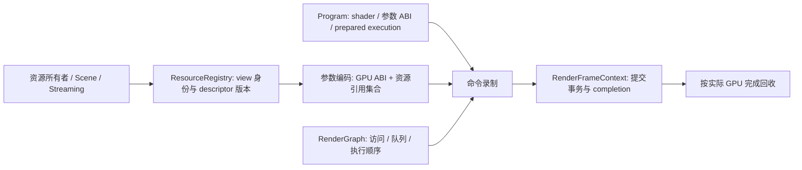

# Metallic RHI 简化调研

日期：2026-09-26。结论：继续收敛现有 RHI 有较高架构价值；完整换用 NoGraphicsAPI 的收益不足以抵偿功能补齐和迁移成本。第一轮应完成共享资源身份、typed 参数和提交期所有权，随后分别评估普通 buffer 地址化、同步和执行接口。

本文基于用户提供的 Pro 讨论，对照当前源码重新核实。它是设计与实施建议，不表示方案已经实现或测得性能收益。

后续第一批代码实现、已迁移路径及验证边界见 [SharedResourceRegistry.md](SharedResourceRegistry.md)。

## 调研基线

- Metallic：`modernization_/gapi-dr-full`，`470982feae846325d065296a4b737f4363e30f52`。
- NoGraphicsAPI：公开 `main` 在调研时指向 [`db2a8d807a72e21b8eaccd3de81d15907185ee7e`](https://github.com/sebbbi/NoGraphicsAPI/tree/db2a8d807a72e21b8eaccd3de81d15907185ee7e)，提交时间 2026-09-23。核对了公共头文件及设计、Vulkan 支持文档，未构建运行该库。
- Metallic 的既有 GPU 验证引用 [DynamicResourceUpgradeStatus.md](DynamicResourceUpgradeStatus.md) 的最新章节。本轮没有重新运行这些测试。
- 开始时的工作区已有 `External/microprofile` 子模块内未跟踪内容。本轮不修改生产代码、依赖或这些内容。

## 与 Pro 讨论相比，需要补充或修正的判断

| 议题 | 当前证据 | 对实施的影响 |
| --- | --- | --- |
| 跨 program 共享身份 | `ComputeProgram::Impl` 继承 descriptor tables；初始化创建 heap，`acquireTables()` 再创建提交期 heap 快照 | 优先删除这项职责；不能只把 binding 改名 |
| heap bind 去重 | `bindBindlessHeap()` 已比较 `currentBindlessHeap` 并跳过相同对象 | 不再把“跳过重复 bind”当作新收益；应统计实际 heap 切换及外部状态失效 |
| 无原生 image view 的 descriptor | `writeImages()` 已直接用 `VkImageViewCreateInfo` 编码；但 `createTextureView()` 总会创建 `VkImageView` | 剩余任务是延迟创建原生 view、调整对象模型，不是重写 descriptor writer |
| 地址式命令 | `dispatchIndirect(Buffer&, offset)` 已调用 `vkCmdDispatchIndirect2KHR`，copy 已调用 `vkCmdCopyMemoryKHR` | 公开 `GpuRange` 主要减少表示转换；不能重复计算底层扩展收益 |
| 地址查询 | `Buffer::deviceAddress()`、`writeStorageBuffer()` 仍调用 `vkGetBufferDeviceAddress` | 可单独缓存 backing buffer 地址，不必等待 BDA shader 迁移 |
| 参数 arena | `Streamer` 已有按 completion 管理的 constant allocation；满容量会拒绝覆盖在途数据 | 复用寿命契约及分配基础，补 typed/alignment/chunk 支持，不再发明一套 frame 回收系统 |
| 同步 | `ResourceState::General` 当前对应 `ALL_COMMANDS + MEMORY_READ/WRITE`；graph 的 transition helper 按整个资源逐项发 barrier | 优先拆开访问语义与 layout，再合并依赖边界；不能仅把全部状态改成 General |
| unified layouts | `Source/` 中未发现该扩展的启用代码 | 需要设备能力查询、启用和 backend policy；目前不能假定有扩展效率保证 |
| 首个纵向样例 | 材质分桶的三个 ComputeProgram 共用 9 个输入/输出绑定，后接现成的间接着色批次 | 先迁移这条链，比一开始覆盖整个 streaming/culling 更集中 |

核心证据：[`ComputeProgram.cpp`](../Source/Runtime/Render/ComputeProgram.cpp) 的 `ComputeDescriptorTables`、`acquireTables()`、`dispatchImpl()`；[`VulkanRhi.cpp`](../Source/Runtime/Render/GAPI/Vulkan/VulkanRhi.cpp) 的 `setupResourceHeap()`、`writeImages()`、`bindBindlessHeap()`、`stateInfo()`；[`UploadStreamer.cpp`](../Source/Runtime/Render/Streamer/UploadStreamer.cpp) 的 `beginFrame()`、`streamConstantData()`。

当前源码的调用面统计如下，只用于估计迁移规模，不表示动态调用次数：

- `ComputeProgram.cpp` 927 行；除其头文件/实现外，22 个 `Source` 文件使用 `ComputeProgramBindingDesc` 或 `ComputeDispatchBinding`。
- 39 个 `Shaders` 文件含 `getResource<T>` 或 `getResourceArray<T>`。
- 除 Vulkan 实现外，10 个 `Source` C++ 文件调用 `createBindlessHeap()`。
- `rhi.h` 有 37 行 `Buffer*` 声明，包括 AS、CLAS、PTLAS、复制和解压参数等。

可用 `rg -l 'ComputeProgramBindingDesc|ComputeDispatchBinding' Source`、`rg -l 'getResource(Array)?<' Shaders` 和 `rg -n 'createBindlessHeap\(' Source -g '*.cpp'` 复核。行数不是迁移完成标准。

## 哪些 NoGraphicsAPI 思路适合 Metallic

上游已支持多队列和独立 command pool 的并行录制，不能按早期单队列原型评价。其公开接口仍保留 graphics/mesh/compute PSO；间接命令接收 CPU root，draw count 仍是 CPU 参数。公开头文件没有 Metallic 所需的 CLAS、PTLAS、OMM、GPU 解压等接口，完整替换需要重新补齐这些功能。[固定版本公共接口](https://github.com/sebbbi/NoGraphicsAPI/blob/db2a8d807a72e21b8eaccd3de81d15907185ee7e/include/NoGraphicsAPI/NoGraphicsAPI.hpp)、[设计比较](https://github.com/sebbbi/NoGraphicsAPI/blob/db2a8d807a72e21b8eaccd3de81d15907185ee7e/docs/no-graphics-api-comparison.md)。

值得采用的是数据模型：普通数据以地址或 typed handle 表达，纹理 view 在共享 heap 中获得身份，Program 只负责代码及执行 ABI。分配策略、资源寿命和同步仍由 renderer/runtime 承担；上游也把这些工作留给应用及 utility 层。[项目说明](https://github.com/sebbbi/NoGraphicsAPI/tree/db2a8d807a72e21b8eaccd3de81d15907185ee7e)。

不建议把采用该风格与“删除 Buffer 类”“全部 shader 改 native”“统一所有 descriptor stride”“替换 VMA/提交/WSI”捆绑。前者可以逐子系统交付，后者会显著扩大每次失败的排查范围。

## 推荐的职责划分



`ResourceRegistry` 放在 renderer/device 服务层，可由现有 subsystem host 持有；不要放进每个 Program，也不要与逻辑 GPUScene 合并。GPUScene 管对象、页面和可见性，registry 管这些对象对应的 GPU view。

建议将资源 API、shader lowering、buffer 访问形式作为独立维度。先在显式 Mapped 基线上推进 typed 参数，再用相同参数 ABI 验证 Native，最后单独比较 descriptor buffer 与 BDA buffer。当前 AS resolver、normalizer 和 cache 身份契约均继续有效。

## 第一优先级：共享 registry 与 typed 参数

### 资源身份必须有明确作用域

CPU `ResourceRef<T>` 保存 registry、资源 ID/generation、view 身份；GPU handle 只保存经过验证的 shader ABI。不能把现在含 `kind/index/shaderIndex` 的 `BindlessHandle` 整体复制到 shader。

同一个资源可以有多个合法 descriptor：不同 range、mip/layer、format、swizzle、sampled/storage 用途或访问 layout。跨 Program 复用的单位应是“同一资源版本的同一语义 view”，不是单纯相同 `Texture*`。buffer 内容更新通常不需要换 descriptor；allocation、range、view 或编码 layout 改变才需要新 descriptor 版本。内容同步仍另行处理。

资源注册返回可保留底层资源的 lease，避免缓存只保存地址又误命中同地址新对象。registry 自身的缓存不能永久强持有全部卸载资源；最后一个 owner/lease 退出后，descriptor 及底层资源按 completion 进入回收队列。

### 必须先解决 heap 扩容与索引稳定性

当前 heap 把 image 区放在 buffer 区前面，`bufferShaderIndexBase()` 取决于 image 区大小。增大 image 容量再按旧 allocator 顺序重建 heap，会改变仍在使用的 buffer indices。旧设计中“扩容复制 descriptor 并保持索引”不是现有 `createBindlessHeap()` 自动提供的能力。

首版建议保留现有 typed stride，预留有预算上限的固定分区，在一个 heap epoch 内保持 indices 不变。容量不足返回明确错误或进入受控重建，不静默移动 live indices。CPU handle 要能校验 registry/epoch；每个参数包与其绑定的 heap epoch 必须匹配。

后续增长需要新 allocator 保持 live 字节位置，或显式重建受影响的参数、材质 remap 和 GPU 常驻记录；旧 heap 保留到旧提交完成。不能只修新一帧的 root，因为 GPU 常驻数据也可能嵌有 indices。

统一 resource stride 是可选的后续 ABI 决策，不是共享 registry 的前置条件。先记录各类型 descriptor size、容量高水位、reserved range 和内存预算，再决定是否值得为单一索引单位增加 descriptor 内存。AS 的正式地址 ABI也不能通过统一 stride 自动变成普通 heap index。

### 参数包必须同时解决 GPU ABI 与 CPU 寿命

以下为建议接口概念，并非现有可编译代码：

```cpp
auto args = BinningArguments{
    .visibility = visibilityRef,
    .records = sceneRecordsRef,
    .instances = instancesRef,
    .materials = materialsRef,
    .bins = binsRef,
    .tiles = tilesRef,
    .arguments = indirectArgumentsRef,
    .extent = extent,
};
auto encoded = frame.encodeParams(args, registry);
cmd.dispatch(classifyProgram, encoded, groups);
```

CPU arguments 可以包含有类型的 `ResourceRef`，编码结果才是 C++/Slang 一致的 GPU POD。`encoded` 在 CPU 上关联参数内存、heap epoch、被引用资源集合；Program/execution 本体也要保留到完成。直接 `uploadParams(POD)` 不可能从任意 uint64 或 GPU 指针自动恢复所有权，不能将这个责任隐藏在示例里。

初版可以用明确的序列化 helper 加 `ResourceUseSet`，后续再生成字段编码和 ABI 校验。GPU 结构中的大小、offset、alignment、array stride、handle 格式由固定工具链 reflection/SPIR-V 和 `static_assert` 验证；参数 ABI 版本和 heap ABI 进入 cache 身份。不要引入运行时字符串 binding 或逐 dispatch shader reflection。

Graph 仍需要访问声明。参数编码能够收集资源引用，却不能从 shader 指针推导读写、跨队列依赖以及间接访问的全部范围。scene/material/page table 等间接资源应作为显式资源组或 snapshot 参与声明和保留。

### 复用现有上传和提交设施

`Streamer::beginFrame()` 已检查 slot completion，`streamConstantData()` 在 completion 管理下不会回绕覆盖旧数据。可以先包装它验证 typed packet，但它目前按 constant-buffer alignment 分配、固定容量且每次 map/flush/unmap，不应直接宣称它就是最终高效 params arena。

最终参数 arena 使用稳定地址的 chunk；增长增加新 chunk，旧 chunk 不移动。分配对齐来自参数 ABI，非一致内存的 flush 满足设备 atom/alignment 要求。并行录制用线程所属 chunk 或明确同步的批量分配；已经发布的 descriptor/packet 不再改写。

保留 `RenderFrameContext`、`GpuCompletionPoint`、`SubmissionTransaction`、`DeferredReleaseQueue`：录制取消释放未提交部分，部分提交保留已接受部分，多队列全部完成才回收。第一方新接口要求有效 recording context；不能让无 frame 的 convenience overload 悄悄失去这些保证。

### 旧接口的退出条件

迁移后的 Program 不再包含 `BindingState`、`frameTables`、`resourceTableCount/index`、heap 分配或资源 descriptor 写入。旧 ComputeProgram 可作短期 adapter，但已迁移子系统必须不再走 slot API。

`Core.slang` 不再隐式引入全局 `gComputeResources`。参数 root 归独立 ABI 模块；基础算法显式接收 typed context。批次 permutation 的兼容检查改为参数/heap ABI，去除“不同 Program 必须按同一顺序分配相同 indices”的约束。

## 首个生产样例：材质分桶到间接着色

建议先用小型两 kernel probe 验证 ABI/lease，然后迁移完整链：

`MaterialBinning Reset → Classify → Arguments → ScenePathTrace 间接着色消费`。

[`MaterialBinning.cpp`](../Source/Runtime/Render/MaterialBinning.cpp) 的三个 Program 都声明 9 个绑定，调用时上传同一组资源。当前普通成功路径会写 3 次 sampled image 和 24 次 storage buffer descriptor，共 27 次 descriptor 写入操作；这是源码推导，不是 capture 计数。registry 的目标是每个唯一 view/版本只写一次，稳定且已注册的版本不再按 dispatch 重写。`streamRecords` 回退到 `records` 时还可能进一步去重。

后续 [`ScenePathTracePass.cpp`](../Source/Runtime/Render/RenderPass/BuiltinPass/ScenePathTracePass.cpp) 已用 `dispatchIndirectBatch()` 在材质类别间共用一个只读 table，因此不能再把“每类别重复上传全场景纹理”当作当前问题。新方案要保留这个批处理优势，并进一步让分桶和消费者共享资源身份。

验收覆盖 bins/tile mask/arguments 的 GPU 回读、每个像素恰当覆盖、空 bin、混合材质、resize、两帧在途、Program 提前销毁、失败录制及 permutation ABI 不匹配。现有 `material_binning_indirect_coverage` 是入口，真实 path-trace 消费链也必须通过。

第二个样例再覆盖 `GPUSceneSubsystem::createBindings/releaseBindings`、resident/stream culling、indirect HW/SW raster 和页面驱逐。culling 当前已有自有 heap 与 GPUScene 绑定路径，仅修改 ComputeProgram 无法覆盖它；必须使其消费同一 registry。NRD 随后迁移：它已有按 view 缓存 descriptor 的实现，收益主要是共享身份和集中所有权。

## 第二优先级：线性数据与命令地址化

先引入非 owning 的 GPU wire range 和携带 provenance 的 CPU slice。底层仍可由现有 Buffer/VMA 对象拥有；只有确认跨子系统子分配需求后，再抽取 `GpuAllocation`，避免仅给 Buffer 换名。

CPU slice 至少能够校验 device、资源 generation、范围、用途、alignment 和寿命。命令再降为 `address + byteSize + 必要 flags`。当前 `dispatchIndirect()` 对 usage、4-byte alignment、范围和 device 的验证不能因签名简化而丢失。

尤其不能照搬只有两字段的 `GpuRange` 后猜 Vulkan flags：当前 `addressCommandFlags()` 根据 backing Buffer 的 Storage usage 生成提示；引入 alias/suballocation 后，要按实际 backing 范围生成或采用合法的 unknown 选项。规范要求 storage usage flags 与实际存储一致；错误提示并非总是无害。[device-address commands 规范](https://docs.vulkan.org/features/latest/features/proposals/VK_KHR_device_address_commands.html)。

第一批 shader BDA 候选选分桶的 bins/tiles/arguments 等布局简单、有完整 producer-consumer 的线性数据，之后再扩展到 scene 和 streaming。长期仍以 PageId/ResourceId 表示资源身份，由当前 resident snapshot 解析地址；eviction、搬迁、AS compaction 不应留下不可追踪的永久裸指针。

shader physical pointer 不自动得到 descriptor buffer 的边界保护，需验证 count/range 和对齐；但不能把这个结论泛化到所有地址式命令，`VkDeviceAddressRangeKHR` 命令仍有相应的 robust range 语义。[Khronos BDA 样例](https://docs.vulkan.org/samples/latest/samples/extensions/buffer_device_address/README.html)、[地址命令说明](https://docs.vulkan.org/features/latest/features/proposals/VK_KHR_device_address_commands.html)。

AS 保留独立语义类型，正式 shader 继续经过 `resolveDescriptor()`。现有 slot 路径一边写 AS descriptor、一边上传 AS address；在新 typed 地址路径确认不再需要该 descriptor 后，可删除对应冗余分配/写入。不能对旧 mapping 或 SDK 路径全局删除。AS index bridge 仍是独立 PoC，详见 [AsHandleInvestigation.md](AsHandleInvestigation.md)。

## 后续：同步、view 与执行入口

### 同步拆成两步实施

第一步让 graph/pass 表达访问用途、stage 和范围，backend 决定 layout；保留现有 layout policy 先验证行为一致。第二步在同一真实依赖边界合并 barrier，并在能力支持时评估 GENERAL policy。

新增访问模型必须覆盖 indirect、AS build/read、decompression、descriptor heap read、copy、attachment 和 host；现有 `PipelineStageBits` 主要服务 timestamp/submit，不能未经扩展直接充当完整 barrier 模型。

buffer 普通依赖可以合并为 global memory barrier，image 初始化、present、SDK layout 和需要的资源范围信息仍保留。unified layouts 扩展保证适用情况下 GENERAL 的效率，不保证所有硬件上 global barrier 都优于 image barrier。Khronos 同步示例建议在不需要 layout/ownership 变化时考虑 global barrier；扩展提案同时指出有些硬件仍需 image barrier 获得最佳性能。[同步示例](https://docs.vulkan.org/guide/latest/synchronization_examples.html)、[unified layouts 提案](https://docs.vulkan.org/features/latest/features/proposals/VK_KHR_unified_image_layouts.html)。

当前 `acquireFromQueue` 是针对已经共享到目标 queue family 且有 semaphore wait 的 acquire 语义，Vulkan barriers 中 queue family 是 IGNORED；不能把它误当完整 ownership transfer 实现。以后引入 exclusive allocation 才另加 release/acquire ownership 模型。

当前 graph transition helper 多数按整个资源跟踪。新的 arena/suballocation 如果需要更细粒度调度，应显式增加范围和 alias hazard 信息，而不是假定 graph 已完全支持。保持 scene-binding 契约：资源身份和 scene revisions 变化仍由 executor 集中处理，不能因 registry 新增而绕过 mixed-producer 校验。

### TextureView 保留语义对象，原生 view 按需创建

先把 `TextureView` 的语义描述与 `VkImageView` 分离。shader descriptor writer 直接用描述；attachment、ImGui、NGX/NRC/native export 才确保原生 view 存在。按需创建要能返回失败，并明确并发创建和缓存寿命，不能在一个无错误返回值的 getter 中隐藏所有工作。SDK 并非都可以只拿 `VkImage`。

此项后端已有基础，成本较低；但收益主要在资源创建/销毁和对象数。稳定缓存建立后，不应预期它带来大的每帧 GPU 收益。[图像 descriptor API](https://docs.vulkan.org/refpages/latest/refpages/source/VkImageDescriptorInfoEXT.html)。

### 统一 prepared execution，不重建大状态机

为 pass 提供一致的 compute/raster 执行入口，内部保留 Shader Object 与 PSO。创建、编译和兼容性检查在 prepare 阶段完成，录制时只绑定已准备对象和参数。raster state/attachment formats 进入需要它们的 execution key，不无条件污染 shader variant key。

现有 `notifyGeneratedCommandsExecution()`、`notifyExternalDescriptorSetBinding()`、`recordIsolatedCompute()` 已承担状态失效/恢复职责。统一入口必须保留这些边界；对 push 重复上传的优化应分别检查 heap 切换、pipeline 切换和外部调用后重建，不能只增加一个“当前已绑定”的布尔值。

## 实施顺序与停止条件

成本是按调用面和风险给出的相对估计，不是工期承诺。

| 阶段 | 范围与预期交付 | 相对成本 | 继续条件 |
| --- | --- | --- | --- |
| 0 | 建立同 HEAD/同二进制基线；补 descriptor 写入/缓存/heap epoch/参数分配计数 | 小 | 所有数字能归到具体 view、Program 和 dispatch；记录已有 native 差异 |
| 1 | registry + 不可变 lease/packet + typed ABI；完成材质分桶到间接消费 | 中至大 | 该链删除 slot 配置及 Program 私有 heap；稳定 view 不按 dispatch 重写；寿命回归通过 |
| 2 | 扩展 GPUScene、resident/streaming、普通 compute 与 NRD；退出旧所有权 | 大 | 跨 program/子系统身份一致；页面驱逐、场景重载、SDK 接口通过 |
| 3 | CPU slice/range 命令 + 一个完整线性数据子系统的 BDA | 中至大 | bounds/alignment/atomics/relocation 正确；CPU/GPU 成本独立测量 |
| 4 | 访问语义与 layout 分离、barrier 合并、lazy native view、prepared execution | 分成多个中型改动 | async overlap、present/SDK、热重载无回归；不再长期维护平行接口 |

地址缓存、lazy view 可以作为独立小改动提前实施；它们不能代替阶段 1 的所有权收敛。同步变更和 buffer BDA 也应分别提交、分别验证，不要求等所有 pass 全部迁移后才开始局部实验。

## 验收与价值判断

架构验收看删除了哪些一致性约束：新增 pass 是否只需 shader、typed arguments、graph 访问声明；相同 view 是否跨 Program 复用身份；普通录制是否还查数字 binding/分配 resource table；旧 API 是否真正退出第一方路径。

资源寿命优先复用现有测试 `frame_descriptor_snapshots`、`frame_sampled_image_cache`、`frame_upload_growth_burst`、`frame_completion_lifecycle`、`frame_multi_queue_completion`、`frame_parallel_compute_join_and_cancellation`、`frame_submission_transactions`、`render_graph_scene_binding_contract`。新增跨 program handle 一致、同地址 generation、descriptor 替换、heap 容量边界/epoch、非零 range、不同参数包及 Program 提前销毁的 GPU 用例。测试应断言行为，不断言必须存在旧 table 类。

性能记录至少包含 descriptor 写入个数/字节和 cache hit、实际 heap 切换、push 次数/字节、参数 chunk 数/高水位、CPU prepare/record 时间、GPU pass/frame 时间、async 重叠和峰值显存。固定提交与 SPIR-V 哈希、相机、render extent、功能、resident 页面状态；冷热缓存分开，图像验证和诊断回读不混入计时样本。比较差异与运行噪声后再声明性能变化。

Native resident 细分的两项图像差异，以及 NRC 退出对象告警是当前升级记录中的已知限制。本次没有重跑或证明它们已消失。新架构先在 Mapped 下达到行为一致，再对 Native 做配对验证，不能把已有错误和迁移错误混在一起。

迁移值得以减少重复资源身份、descriptor 写入和维护负担立项。GPU 帧时间改善目前没有证据；BDA、全局 barrier 或更大的 arena 都可能增加访存依赖、同步范围或内存高水位。若阶段 1 只增加一套新框架而旧 Program heaps、binding arrays 和 table snapshots 全部保留，就没有达到简化目的，应先收敛该样例再扩展。

本轮完成附件阅读、当前源码/调用者/测试调查、固定上游提交与 Khronos 规范比对。未运行构建、GPU A/B 或新的运行时测试；交付物仅为本文及 `.cache/rhi-simplification-research/` 中的上游调研快照。
