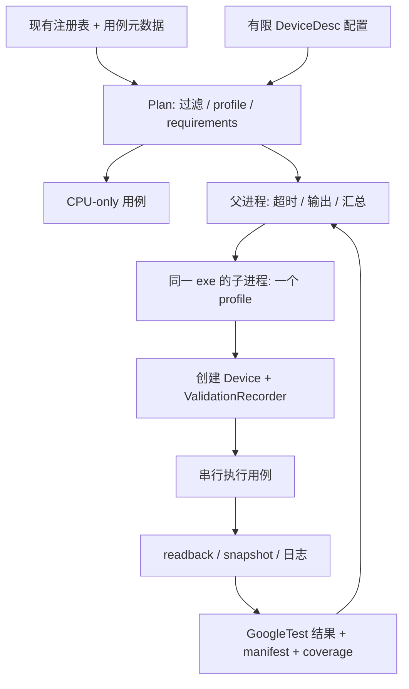

# Metallic RHI Testbench 实现方案

日期：2026-09-27。设计代码基线：`34cca1d72`。本文保留完整设计，M1 已按其中的有限范围落地，具体命令、行为和边界见 [M1 使用说明](RhiTestbench.md)。下文的完整类型和后续阶段仍为提案，以使用说明及代码为准。

目标是把现有 `MetallicRHITests` 演进为可复现、按能力选择、能够定位错误层级的正确性 testbench。沿用 `RHITestRegistry`、GoogleTest、Slang probe 和 CTest。性能测量继续归入 `tests/perf` 或独立 benchmark 作业，不把墙钟耗时作为正确性判定。

## 1. 现状与设计决策

| 已核对的实现 | 对方案的影响 |
| --- | --- |
| [RHITest.h](../tests/rhi/RHITest.h) 只有 Validation / Resource / Command / Rendering 分类和 pass / fail / skip | 增加声明式元数据及结构化原因，保留旧 suite/test 名称和过滤方式 |
| [Main.cpp](../tests/rhi/Main.cpp) 的全局环境先创建一台设备，再运行所有用例 | CPU 测试、不同 feature 配置和失败隔离不能继续依赖同一个全局 Device |
| `Main.cpp` 的默认 validation 为 true，但 [tests/CMakeLists.txt](../tests/CMakeLists.txt) 的聚合 CTest 显式传入 `--rhi-no-validation` | 增加独立的 conformance validation 作业；不把旧聚合测试重命名后当成覆盖已经完成 |
| 当前 sink 只累计 `messageIdName` 含 `VUID-` 的消息，adapter 不统一审查计数；部分用例自建 Device 没有传入 sink | 完整捕获消息并统一审查，覆盖非 VUID 的同步 hazard、设备创建、cleanup 和销毁阶段 |
| Vulkan 后端使用 `activateVolkDevice()` / `volkLoadDevice()` 切换进程全局函数表，SDK 初始化也有进程级状态 | 首期采用“一个设备配置一个子进程”，不引入常驻多 Device 并行池 |
| [DeviceDesc](../Source/Runtime/Render/GAPI/RHI.h) 明确要求 shader object，`enableShaderObject=false` 返回 InvalidArgument | 不设计 shaderObject ON/OFF 设备矩阵；测试 shader object 与 graphics pipeline 的执行形式对比、状态切换和禁用请求拒绝 |
| `DeviceCapabilities` 主要反映本次设备可用/已启用能力，没有完整公共物理设备、format 支持枚举接口 | 支持、请求、启用和实际执行分开记录；未知状态保留 Unknown，不能由 enabled=false 推断硬件不支持 |
| 已有 [RenderGraphExecutionSnapshot](../Source/Runtime/Render/RenderGraph/RenderGraphExecutionSnapshot.h)，包括资源、scope、predecessor、segment 和 batch | 优先复用结构断言；其 wait 信息注明不完整，不能充当最终 Vulkan submit/barrier 的完整 trace |
| GAPI 之上的封装已迁到 `Runtime/Render/Core` | ComputeKernel、ResourceRegistry、FrameContext 等测试标记为 Core；不能全部算成裸 RHI 覆盖 |
| 已有 OMM、CLAS、DGC、PositionFetch、UnifiedTopLevel 等测试 | 先核实 oracle 和覆盖边界，再迁移；不重写一套同名演示程序 |

NRISamples 作为能力清单和小型 workload 参考，特别是 CopyTests、DedicatedQueues、DescriptorManagement、GraphicsPipelineStates、Queries。它的 [CopyTests](https://github.com/NVIDIA-RTX/NRISamples/blob/main/Source/CopyTests.cpp) 使用程序化数据、非整齐纹理尺寸和 readback 比较，值得借鉴。Metallic 只覆盖自己公开的契约；NRISamples 中 Metallic 尚未暴露的 API 列为产品缺口，不列成“已支持但测试跳过”。完整类别可查 [NRISamples README](https://github.com/NVIDIA-RTX/NRISamples#samples)。

## 2. 测试模型：层级、能力、判据分别表达

一个用例只指定一个主要责任层级，允许多个标签。以下维度不能合并成一个越来越大的枚举。

| 维度 | 取值示例 | 用途 |
| --- | --- | --- |
| Layer | RHI / Core / RenderGraph / SceneIntegration / Sdk | 错误归因、依赖边界 |
| Domain | Resource / Binding / Execution / Synchronization / RayTracing | API 覆盖组织 |
| Check | Contract / Semantic / Differential / Lifetime / Progress | 描述实际证明了什么 |
| Validation | Off / Core / Synchronization / GpuAssisted | 本次验证配置；GpuAssisted 单独作业 |
| Isolation | SharedDevice / FreshDevice / FreshProcess | 生命周期；首期后两者都由单用例子进程承载 |

`SharedDevice` 表示同一 profile 的子进程内串行复用一台设备，不表示用例或多台设备并发。跨队列、并行录制等并发行为发生在用例内部，由测试明确控制。

概念接口如下，`CapabilityId` / `FormatRequirement` 是 harness 类型，复用 RHI 的枚举和字段，不创建另一套生产 feature API。

```cpp
struct RhiTestRequirements
{
    TestLayer layer = TestLayer::RHI;
    TestIsolation isolation = TestIsolation::SharedDevice;
    bool requiresDevice = true;
    bool requiresWindow = false;
    std::vector<CapabilityId> capabilities;
    std::vector<QueueRequirement> queues; // 类型、独立性、实际 family/queue 约束
    std::vector<FormatRequirement> formats; // format + usage + samples + extent
    ValidationMode minimumValidation = ValidationMode::Core;
};

struct RhiTestMetadata
{
    std::string stableId;
    RhiTestRequirements requirements;
    std::vector<CoverageClaim> coverage;
    std::chrono::milliseconds timeout;
};

// DeviceDesc 的规范化配置模板；不包含 callback 指针或临时路径。
struct TestDeviceProfile
{
    std::string id;
    render::DeviceDesc desc;
    ValidationMode validation;
};
```

保留 `RHITest::run(RHITestContext&)`。增加 `metadata()` 和证据服务；harness 的设备创建、等待、readback helper 均返回现有 `render::Result<T>`，不增加吞错 convenience overload。测试 verdict 与 RHI Error 是不同概念，必须分开：预期 InvalidArgument 被准确观察到时，用例是 Pass。

CPU-only 用例通过 plan 在创建 SDL/Device 前识别，直接运行；GPU 用例初期仍保留 SDL video 初始化，因为当前 `createDevice()` 使用 `SDL_Vulkan_GetInstanceExtensions()`。`requiresWindow=false` 只承诺不创建窗口，暂不宣称无显示服务的 Linux headless 支持。

## 3. 执行架构与有限配置矩阵



同一个 `MetallicRHITests` 可执行文件支持 plan、coordinator、child 三种模式，不增加一套 sample executable。父进程不创建 GPU Device；它先落盘计划，再启动 child。首期采用同一 GPU 串行调度，Windows 用受控子进程句柄/Job Object 管理超时与退出，避免超时后遗留进程。其他平台的进程实现后续补齐，不影响现有直接 GoogleTest 模式。

建议配置集如下，具体 `DeviceDesc` 值由单一 Profiles.cpp 展开并写入证据。profile 是测试配置名，不保证其请求的可选能力全部存在。

| Profile | 主要配置 | 运行范围 |
| --- | --- | --- |
| `core` | shaderObject 开；关闭可关闭的 DGC、RT、SDK；optimal layouts | 资源、copy、基础 shader/graphics、query、错误传播 |
| `binding` | core + bindless | buffer/image/sampler/AS 绑定、复用、PreparedExecution |
| `async` | binding + async compute；核查独立 copy/compute | 跨队列、frame completion、query reset、RenderGraph progress |
| `ray-query` | bindless + AS + rayQuery；参考路径关闭 OMM / positionFetch | 解析几何、标准 TLAS、AS 生命周期 |
| `gpu-driven` | binding + mesh/task/DGC 等相关请求 | indirect、DGC、mesh；用例另外声明精确子能力 |
| `advanced-as` | ray-query + CLAS/PTLAS/OMM 请求 | 高级 AS；每个测试单独检查需要的能力组合 |
| `sdk` | 按 SDK 分拆的配置，FreshProcess | Streamline / DLSS / Aftermath 等集成 |

Unified/Optimal、OMM off/on、positionFetch off/on 是具体 differential case 的两个 variant，不把每个开关乘进全局笛卡尔积。A/B 分别在子进程运行同一输入，把原始结果交给父进程比较；核对 GPU UUID、驱动、shader 内容 hash 和除指定开关外的配置一致。两端都退回 fallback 时，只能记录 fallback 已执行，不能记为扩展对比通过。

已有用例自建 Device 的迁移：先标注 FreshProcess，并记录 validation coverage 不完整；随后改为通过 harness 创建，继承 sink、设备诊断和 profile。验证跨 Device 参数拒绝确实需要两台设备的用例标为特例，单进程独占、串行操作、不启用 SDK；不把它推广成通用 DevicePool。

保留现有 `--gtest_filter`、`--gtest_list_tests`、`--rhi-*`。新 `--tb-profile` 与冲突的旧 feature flags 同时出现时明确报错，不猜优先级。迁移阶段显式执行旧模式仍按原行为；新 conformance CTest 只选择已迁移的元数据用例。

## 4. Requirements、跳过和覆盖率

每个 capability 的记录至少包括：`physicalSupport`（True/False/Unknown）、`requested`、`enabled`、`executed`、`reason`。初期用小型 Vulkan 测试诊断模块读取 adapter UUID/driver、queue family、format properties 和所需 feature；生产可用状态仍以 `Device::capabilities()` 为准。维护一份 CapabilityCatalog 将 ID 映射到现有字段或精确 property predicate，不复制两份启用逻辑。

注意 DGC compute pipeline binding 等子能力：仅 `deviceGeneratedCommands=true` 不能保证所有命令形态。独立队列也不能只检查非空 `Queue*`；用 capability、实际 queue identity/family 和 flags 判断是否真的覆盖了不同队列/不同 family。

| 情况 | Verdict / 原因 |
| --- | --- |
| 用例全部 requirements 满足，oracle 和 validation 通过 | Pass |
| 硬件缺必要 feature / format / queue topology | SkipUnsupported，列出失败 predicate |
| profile 没有请求需要的 feature | SkipNotEnabled；标准 conformance 计划应预先排除或转交正确 profile |
| SDK 未编入、fixture 未安装 | SkipNotBuilt / SkipMissingFixture；声明该依赖必需的 CI lane 则失败 |
| validation-required 作业缺层或 sync validation 未激活 | 环境失败；不能静默降级为“validation clean” |
| requirements 满足后 API 返回 Unsupported、创建失败、shader 编译失败、readback 不符 | Fail；不能在 run() 内改写为 Skip |
| 进程超时、device lost、crash、结果文件截断 | Timeout / DeviceLost / Crash / InfrastructureFailure，均为失败 |
| capability 在参考 GPU 上按 policy 必需，但本次不可用 | FailEnvironment，即使普通本地作业允许 SkipUnsupported |

coverage 矩阵按 `capability × subfeature × profile/variant × check` 记录，分别列 planned / eligible / executed / passed / skipped / failed。未过滤选中的用例是 NotRun，不是覆盖成功；同一个测试的多轮执行也不增加独立覆盖格数。新增能力必须登记语义用例或明确 NotImplemented 和跟踪原因。

合并门禁只约束本作业声明负责的 coverage 格。跨机器汇总需要相同源码与测试目录版本，并保留驱动/GPU 维度；不允许 A 驱动的 Pass 掩盖 B 驱动的 Fail。新能力先报告缺口，成熟的必测格再进入 required policy。

## 5. ValidationRecorder 和用例生命周期

首个工程优先项是统一验证，而非移动所有测试文件。

1. 在实例/Device 创建前安装 sink；回调立即深拷贝 message、ID、objects/name 等借用数据。线程安全、`noexcept`，内部异常转成 recorderFailure；缓冲有上限，溢出导致本用例诊断失败，不允许截断后宣称 clean。
2. 捕获 severity、type、VUID/非 VUID ID、文本、线程、时间、test/device/phase ID。所有 Error 失败，所有 synchronization hazard 失败；Warning 默认失败，已知环境例外用窄范围 ID + 层版本 + 理由管理。Info/Verbose 保留诊断但不默认失败。
3. 默认参数错误测试要求 RHI 提前返回精确 `Error` 且没有驱动 validation 错误。专门验证 recorder 的预期消息测试使用隔离进程及精确 expectation；不向 GPU 提交无效命令来测试主机契约。
4. `init → run → 等待该用例 GPU 完成 → cleanup/析构 → drain → 审查 validation → 原子写入 verdict`。错误路径也执行清理，保留首个业务错误和后续 cleanup 错误；不要用后一个覆盖前一个。
5. shared child 每个用例末尾排空已提交工作后再切换 recorder attribution。测试内部不插入额外 waitIdle，以免掩盖要验证的并发。无法归属的创建/销毁消息属于 profile 环境失败。
6. GPU 等待设期限，父进程再设硬期限。gate 类用例在异常路径先释放 host gate；GPU 卡住后不能无期限等待 destructor/`waitIdle()`。污染的 child 停止复用，其余用例在新 child 运行并标明前一个失败。

当前 `enableValidation=true` 在缺层时只警告；需要一个小型 Vulkan diagnostics 查询返回实际启用层、层版本和 validation mode。Synchronization validation 作为独立明确配置启用并记录，不能由 core validation 打开推断已经开启。GPU-assisted 与性能采集分开作业。具体设置依据 [Vulkan Validation Layers 的 sync validation 文档](https://github.com/KhronosGroup/Vulkan-ValidationLayers/blob/main/docs/syncval_usage.md)，其检查结果与 readback 判据一起使用。

## 6. Fixture、readback 和 oracle

共用的 fixture 保持小而明确：Commands/SubmitAndWait、UploadBuffer、ReadbackBuffer/Texture、TinyGeometry、FixedRayTable。优先合并已有重复 helper；不在 harness 内实现另一个 RenderGraph 或通用资源管理器。

Readback 初期使用每用例独立资源即可，不急于实现 Arena。helper 要正确处理 footprint、row/slice pitch、mip/layer/aspect、非一致内存 flush/invalidate、完成点和 lifetime。直接 GPU probe 验证 helper 本身，再依赖它验证其他能力，避免“上传和读取犯同一个 offset 错误”互相抵消。

| 数据/行为 | 主要 oracle | 注意事项 |
| --- | --- | --- |
| copy、整数 buffer、descriptor 索引 | CPU 原始字节/整数表精确比较 | 每字节非重复 pattern，比较未写区域 sentinel；不比较未定义 padding |
| clear、state switch、ID 输出 | 支持的 UINT attachment 或 storage buffer | 采样点远离边缘；格式和 usage 实际支持后才运行 |
| blend、归一化颜色、浮点计算 | CPU 算术参考，逐用例 abs/rel/ULP 容差 | UINT attachment 不用于 blend 测试；使用支持 blending 的 UNORM/float 格式并考虑量化 |
| ray query | 固定解析 scene + CPU hit 表 | 避免共享边上的不唯一命中，显式定义 t/barycentric 容差、NaN/Inf 策略 |
| 扩展、布局和优化策略 | reference vs optimized 原始结果比较 | 同时证明目标路径启用；对比两边共用代码时补独立 CPU 不变量 |
| barrier / queue / retirement | readback + validation + 结构/进度断言 | final pixels 相同仍可能过度串行；不能仅用吞吐或短 timeout 判断 |

GPU hash 可作快速拒绝及大结果摘要，失败保存原始数据；小型 conformance case 直接 readback 比较，hash 相同不作为唯一语义证明。图片/heatmap 是定位产物；只在真正需要栅格或视觉关系时使用，默认不维护跨驱动 golden PNG。

## 7. 首批覆盖清单与现有用例复用

以下是用例族，不是假定已经完整实现的覆盖矩阵。每个族拆成可独立报告的参数化 cases。

| 优先级 / 责任层 | 复用入口 | 首批补充内容 |
| --- | --- | --- |
| P0 RHI 契约 | ValidationTests、ResourceTests | Result<T> 成功值/精确错误；零长度、边界、溢出、跨 Device 参数；失败不改变可观察状态 |
| P0 RHI copy/texture | ResourceTests、RenderingTests | 奇数尺寸、非零偏移、aligned 边界、mip/layer/3D、buffer↔texture、保留区域；合法输入与拒绝测试分开 |
| P0 RHI binding | NativeDescriptorHeapTests、BindlessBufferTests、DescriptorHeapCodePatternTests | 每种已支持 descriptor 类别、最后合法索引、非一致索引、覆盖/回收、heap 切换；仅在 RHI 保证 retain 的路径提前释放 wrapper |
| P0 RHI graphics/compute | RenderingTests、ResourceRegistryTests 中的低层部分 | pipeline/program A→B→A、push constants、viewport/scissor、depth、blend、dispatch/readback；现有 GraphicsPipeline 与 ShaderObjectProgram 同配置比较 |
| P0 RHI query/queue | CommandSubmissionTests | host reset 范围、partial reset、完成后复用、transfer timestamps、被阻塞队列之外的独立进度 |
| P0 Core | ResourceRegistryTests、HistoryResourcesTests、RenderViewTests | BufferSlice allocation/range、prepared 参数 lifetime、ComputeKernel 公共路径、frame/history 复用 |
| P0 RenderGraph | RenderGraphAccessPlanTests、RenderGraphComputeStageTests、FrameContextTests、ParallelRecordingTests | RAW/WAR/WAW、read/read 分支、失败提交、Pipelined/Joined、query/profiling 不引入依赖、外部 completion |
| P1 RHI 布局策略 | `prepared_execution_lazy_views_layout_policy` | 扩展 clear→attachment→sampled→storage→copy→readback；depth、导入资源和 present 另设合适 fixture |
| P1 RHI DGC | GeneratedCommandsTests | direct vs generated compute/draw/mesh，支持的 preprocess 模式、count、GPU 写命令、执行后 state rebind；按子能力选择，不把现有 native probe 当成整个公共 API 覆盖 |
| P1 RHI 解压 | GPUDecompressionTests | CPU 原文 vs GPU 解压，格式及合法大小/alignment、跨页、批次、graphics/compute；非法压缩数据不随意送 GPU |
| P1 RHI Ray Query / 顶层 AS | RayTracingAccelerationStructureTests、UnifiedTopLevelTests | 小三角形、实例 mask/ID/transform、fixed rays；Standard/PTLAS 同一公开资源类型，不同类型化构建参数、错误 backend 拒绝 |
| P1 RHI/Scene RT 对比 | PositionFetch、OpacityMicromap、ClasCompaction | 抽出无场景资产的底层 fixture；原 scene builder/压缩/OMM 测试继续归 integration |
| P2 SDK / 场景 | DLSS/NRD、Streamer、MiniZorah 等 | 保留现有完整路径及输出检查，专门预算、进程隔离、fixture checksum；不阻塞基础 conformance 的设备创建 |

OMM 需要把当前“fallback 通过，但 OMM 不可用，整个测试 Skip”的组合拆成独立 reference 与 comparison 结果。测试 opaque / transparent / unknown 时，参考 shader 遍历与 OMM unknown 的后续 alpha 判定规则一致。compaction 必须证明发生了实际搬迁，并在旧 storage 按契约退休后再次查询。

Standard/PTLAS 使用同一份实例和固定 ray 表比较 hit/miss/ID/t；再单独覆盖 PTLAS partition 更新、容量、operation/indirect 参数和失效输入。公用测试 fixture 不应把两种 build desc 合成无类型参数袋。CLAS 对比普通 triangle BLAS，覆盖 move/compact 后的查询和生命周期；unsupported 的 shape/index format 按公开契约拒绝。

Descriptor recycle 测试只在完成点之后复用槽位，或验证生产 API 明确提供的延期回收。不能把 Vulkan 不允许的 in-flight descriptor 修改或裸资源提前销毁当成 RHI 应支持的功能。内存 aliasing 也先检查现有 API 是否公开该契约。

## 8. 同步：三层证据，避免测出“错误的正确”

第一层测试裸 RHI：人工给定最小且已知正确的 SyncScope/transition，检查输出和 validation。第二层只给 RenderGraph 声明资源用途、读写和阶段，由它推导 barrier；不能让测试 helper 顺便加全局 barrier 或 waitIdle 修补缺失。第三层核对 planner 与 Vulkan 编码之间的语义。

近期队列回归作为首个样板：

- host gate 阻塞 graphics；copy 分支没有资源依赖。
- snapshot 中 copy 无计时 prologue predecessor，末尾 join 仍依赖 copy。
- copy 完成并读回正确数据时，aggregate frame completion 尚未完成。
- 释放 gate 后聚合完成，再循环超过 frame/query ring 长度，检查 backpressure、query availability 和复用。
- Joined / Pipelined 都运行。timeout 作为 watchdog，主要断言是依赖、完成点和输出，不依赖两个 GPU timer 的相对时钟。

这个模板同时覆盖“错误依赖”和“去掉依赖后 query reset 竞态”两类回归。

Backend trace 分两步推进：先把同步翻译拆出小型可测试编码函数，并让 Vulkan 真实路径调用它；再在同步编码和最终 queue submit 的出口增加可选观察接口。记录真正提交的 stage/access/layout/range、queue identity、wait/signal 和逻辑 resource ID，不记录长期有效的裸指针。

不一开始追踪所有 Draw/Bind。观察接口放 Vulkan diagnostics/test-support，采用构建选项统一编译，避免 public RHI 类在测试与 editor 间出现不同 ABI。默认关闭时不分配、不加锁、不触发等待；trace 中断/overflow 显式失败。使用前后对照验证 instrumentation 不改变调度。

白盒断言核对依赖覆盖、范围和允许的 scope 组合，允许合法 barrier 合并与排序变化；只对有明确契约的“独立分支没有额外等待”做精确否定断言。不要把某一版 Vulkan barrier 条数固定为长期正确性标准。

当前访问计划/快照并不暴露所有细粒度 subresource 语义；精确 range 测试以实际生产支持为前提，尚未支持的自动推导列为待实现。后端 correctness 与过度同步的结构检查分别报告。

## 9. 证据、超时恢复和 replay

输出固定在 `build-*/testbench-output/<run>/<profile>/<test>/<variant>/<iteration>/` 或调用者指定的 ignored 目录，禁止修改仓库 `Asset/` 和已提交 shader。需要文件的 scene fixture 在输出目录生成或复制。热重载测试只改临时 shader 副本。

每次运行先写 `plan.json`；child 开始用例即追加 journal，完成后原子写 result。父进程依据 journal 为 crash/timeout 中断的用例生成失败结果，为未启动的用例记 NotRun，不依赖进程正常退出才有证据。

产物包含：

```text
run.json                 # schema、源码版本/dirty 摘要、命令、构建/SDK/编译器版本
plan.json                # selected cases、profiles、requirements、seed、超时
capabilities.json        # adapter/driver/layers、requested/enabled/support、拓扑
results.json             # 每个 case/variant/iteration 独立记录与退出码
coverage.json            # 逐能力与检查类别的实际覆盖
gtest.xml                # 从实际子进程结果汇总，不伪造已通过用例
<case>/validation.jsonl
<case>/stdout.log
<case>/stderr.log
<case>/input.json         # 规范化 desc、seed、fixture/shader/SPIR-V hashes
<case>/actual.bin
<case>/expected.bin
<case>/diff.json          # 首个错误 offset、最大误差、样本
<case>/graph.json         # 仅适用于有 execution capture 的测试
```

同一 seed 必须再加生成器版本和参数才能复现。浮点比较记录容差和位置；缓存记录 warm/cold、路径与 key，冷编译失败和 GPU 语义失败分开。重复运行保留所有 iteration，不只保留 GoogleTest 最后一轮摘要。产物缺失、checksum 不匹配或落盘失败都不能记 Pass。

未来的 property-based 层从合法 Buffer upload/copy/fill/readback 序列开始，CPU shadow model 独立执行。不随机生成未定义 lifetime/synchronization。shrinker 每次重放在隔离 child 中，保留对象依赖和失败类别，确认多次稳定再收缩；保存原始与最小序列。回放格式有 schema 版本。只有固定 cases 和证据链稳定后才加入 fuzz，避免先造通用 GPU 脚本解释器。

## 10. 文件布局与 CMake/CI

首期只新增 harness；旧文件按 metadata 分类，避免重命名掩盖语义变更。逐步整理后的逻辑目录建议如下：

```text
tests/rhi/
    Main.cpp                    # 参数、plan、child/GoogleTest 入口
    RHITest.h                   # 保留注册 API，增加 metadata
    harness/
        Requirements.*          # predicates / CapabilityCatalog
        Profiles.*              # DeviceDesc 配置展开
        ProcessRunner.*         # 超时、输出与进程隔离
        ValidationRecorder.*
        Evidence.*
        GpuFixture.*
        Oracle.*
        Coverage.*
        VulkanDiagnostics.*     # 后端 probe/实际 validation 状态
    conformance/                # 只验证 GAPI 公共契约
    extensions/                 # Metallic 已公开的额外能力
    backend/                    # Vulkan 翻译/native bridge
    core/                       # Runtime/Render/Core
    integration/                # RenderGraph / scene / streaming / SDK
    shaders/                    # 小型 probe；保持现有 module include 习惯
    policies/                   # required coverage / reviewed exceptions
```

仍链接现有 `MetallicRuntimeRender`；首期不为 testbench 顺手拆生产静态库。逻辑隔离不等于已经获得更小的链接依赖。SDK 编译选项沿用现状，必测 core 计划不要求启用 SDK。`MetallicShaderWarmup` 仍为手动可选目标。

建议新增以下 CTest 分组，复用同一个 exe：

| 作业 | 范围 | 触发/验收 |
| --- | --- | --- |
| `MetallicTestbench.Contract` | CPU 范围检查、元数据/判据/序列化自身测试 | 每次变更；无需 GPU，不能因 Device 创建失败全 skip |
| `MetallicTestbench.Core` | core + binding 小型语义用例，Core Validation | 每次 RHI/Core 变更；必测项不能 skip |
| `MetallicTestbench.Sync` | async + RenderGraph，Synchronization Validation | 同步/提交变更；缺少独立拓扑显式报告 |
| `MetallicTestbench.Extensions` | 精选 pair + 高级 AS/解压/DGC | 具备能力的参考 GPU nightly/相关变更 |
| `MetallicTestbench.Integration` | scene / streaming / SDK | 按 fixture/SDK 可用性独立运行 |
| `MetallicTestbench.Stress` | 固定 seed、多轮复用、query/descriptor ring | nightly，设显式时长和显存预算 |

GPU CTest 使用统一 `RESOURCE_LOCK MetallicGPU`，或将所有 GPU 作业接入相同 CTest resource 配置；已有 editor/GPU tests 也需遵循同一规则，避免 `ctest -j` 意外并行。进程 watchdog < CTest TIMEOUT，并预留证据落盘/退出时间。GoogleTest skip 一般仍返回 0，不能依赖旧 `SKIP_RETURN_CODE 77` 统计局部覆盖；新 coordinator 的退出码由 required policy 和所有子进程结果决定。

M1/M2/M3 已实现的命令（具体覆盖范围见 [使用说明](RhiTestbench.md)）：

```powershell
# 列出配置与用例计划，不创建 Device。
.\build-pass-stages-nrd\tests\MetallicRHITests.exe --tb-plan --tb-suite core
# 运行已迁移的小型正确性集合。
.\build-pass-stages-nrd\tests\MetallicRHITests.exe --tb-run --tb-suite core --tb-validation core
# 运行同步 lane；实际 validation mode 写入 manifest。
.\build-pass-stages-nrd\tests\MetallicRHITests.exe --tb-run --tb-suite sync --tb-validation sync
# 从证据还原指定 case/variant/seed，检查版本差异并记录。
.\build-pass-stages-nrd\tests\MetallicRHITests.exe --tb-replay <case-directory>
```

小型 case 的设计目标是 warm shader 后多数低于 100ms，但不把它作为功能门禁。设备启动、shader 编译、AS build 和 GPU gate 测试另设超时。长场景不伪装成快速 conformance；性能 regression 另做同设备、同缓存、无 validation 的测量。

## 11. 建议实施顺序和验收

| 阶段 | 改动边界 | 完成条件 |
| --- | --- | --- |
| M0：清点与判据 | 元数据盘点、case 列表、覆盖 policy 初稿 | 所有现有名字稳定；能标出 CPU/GPU、场景依赖、self-created Device、已有 oracle；没有把 skip 算 Pass |
| M1：可信执行闭环 | Requirements / Profiles / 子进程 / Recorder / Evidence；选少量用例迁移 | 同一个失败能生成可归属日志和重跑命令；无层、Unsupported、shader fail、cleanup fail、timeout 分别得到预期 verdict；CPU-only 不启 GPU |
| M2：Core 与同步 | 合并基础 fixture，迁移并补充 P0 用例；core/sync CTest | Resource/Copy/Binding/Compute/Graphics/Query + Core/RenderGraph 各有 readback 和 contract 覆盖；两个提交模式和 query ring 回归进入必测 |
| M3：扩展对比 | 提取 RT analytic fixture，迁移布局/OMM/PositionFetch/CLAS/PTLAS/DGC | 每个扩展都有独立 reference 结果、目标路径实际执行证据和 comparison；不支持机器正确 skip，参考机器不 silent skip |
| M4：诊断深度 | 同步编码测试、有限 trace、property replay/shrinker | 可把失败定位为声明、规划、编码或执行；合法 command sequence 能保存、重放和缩小 |

第一批可审查提交建议按以下依赖顺序组织：

1. 元数据、纯 CPU plan/coverage 单元测试；不改任何 GPU 行为。
2. ValidationRecorder、实际层状态、evidence 与 adapter 生命周期；迁移 timestamp query 和基础 copy。
3. Profiles 与同 exe 子进程执行；加入 timeout/崩溃恢复和 partial results 测试。
4. 接入 `frame_self_submit_two_slots` 两模式、cross-queue query ring 与新 Core/Sync CTest。
5. 再批量迁移 P0，随后单独提交每个扩展 differential suite。

M1 不包含通用 DevicePool、全量目录搬迁、全 API trace、fuzzer 或 NRISamples 移植。验收强调“少量用例已具备完整证据闭环”；M2 才扩展为完整基础能力集合。

## 12. 本方案的验证边界

设计阶段读取了现有 harness、CMake、RHI feature 配置、RenderGraph snapshot 及代表性扩展用例，并核对 NRISamples 与 Vulkan 官方资料。本文的完整 milestones、耗时目标和 API 不代表已经全部实现；M1/M2/M3/M4 的运行命令、实际覆盖与硬件验证限制见使用说明。M3 已接入隔离 reference/target、解析 RT 和所列扩展比较；本机 OMM target 仍受验证层版本限制。M4 已加入生产共用同步编码、有限 barrier/submit trace、合法 Buffer 序列及隔离重放/缩减；范围、预算和实际验证见使用说明，完整 native trace、通用 fuzz 与任意图关联仍不在已实现范围内。
