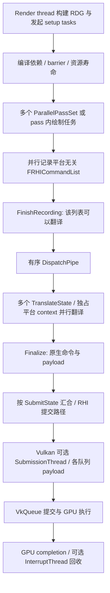

# Unreal 5.7.4 与 Metallic：并行录制和提交对照

日期：2026-09-26。结论：Metallic 可以直接借鉴 UE 的准备任务边界、按工作量分组、显式异步寿命和提交 payload，但当前没有足够理由照搬其平台无关 RHI 命令流与二次翻译层。原方案的“整帧录完再提交”适合作为首版；长期接口应允许按批次汇合，并与 native queue 接收和 GPU 完成分别计数。

## 1. 调研基线与证据范围

- Unreal：直接读取本机 `E:/UnrealEngine`，`Engine/Build/Build.version` 为 **5.7.4**，Git HEAD **`8284a0e654e`**；本轮读取时 tracked working tree 无修改。重点检查 RenderCore / RHI / VulkanRHI，以及传统 MeshDrawCommands 的任务分配。
- Metallic：`E:/metallic`，HEAD **`e4847f866`**，对照 [原改造方案](E:/metallic/Documentation/ParallelRecordingAndSubmission.md) 与当前 frame、registry、TaskSystem 契约。
- Epic 在线页面默认有些已标为 5.8；具体算法、默认值和 native Vulkan 路径以本地 5.7.4 源码为准。官方文档只辅助说明术语，不混称为统一的“最新实现”。
- 本轮没有构建或运行 UE / Metallic，没有测性能，也没有修改运行时代码。以下建议是源码推导，不是两引擎的运行性能比较。

## 2. UE 的实际流水线

这里有两次不同的 CPU 工作：pass lambda 记录平台无关 RHI 命令；translation 执行这些命令，调用 platform context，生成原生命令。RHI Thread 是流水线中的协调与串行执行位置，原生翻译也可以在其他 worker 上进行。概念说明见 [Epic Parallel Rendering Overview](https://dev.epicgames.com/documentation/unreal-engine/parallel-rendering-overview-for-unreal-engine)；该概述含历史说明，现代细节以下列源码为准。

Metallic 当前是 `pass → CommandBuffer → Vulkan vkCmd*`，直接进入原生录制。其 worker job 大致覆盖 UE 的 pass 命令生成与 platform translation 两段，不能直接比较“两边都有几个线程”。

## 3. RDG：不是简单地每个 pass 启动一个线程

### 3.1 准备、编译和录制分别有并行开关

[ERDGBuilderFlags](E:/UnrealEngine/Engine/Source/Runtime/RenderCore/Public/RenderGraphDefinitions.h:107) 分别定义 ParallelSetup、ParallelCompile、ParallelExecute。这并不意味着调用者可以从任意线程同时修改同一个 builder。

`AddSetupTask` 给独立准备任务定义前置关系；[ERDGSetupTaskWaitPoint](E:/UnrealEngine/Engine/Source/Runtime/RenderCore/Public/RenderGraphDefinitions.h:208) 区分：

- **Compile**：改变资源描述、buffer 大小或上传内容等编译输入的任务，编译前完成。
- **Execute**：不影响图编译的准备工作，可以更晚完成，在执行前汇合。

[FRDGBuilder::Execute](E:/UnrealEngine/Engine/Source/Runtime/RenderCore/Private/RenderGraphBuilder.cpp:1795) 还将部分资源处理、barrier 收集、view 创建等组织为有依赖的任务；它包含串行阶段和显式等待，不能概括成“所有图编译都并行”。

**对 Metallic 的修订：** 原方案的串行 prepare 是第一版的安全边界。长期应是“coordinator 串行确定共享状态与图结构 + 纯准备任务并行 + 必要位置汇合”。现有 streaming pre-pacing maintenance 不应未经快照与 publication 拆分就并发执行，但其中纯计算可以逐步产出局部结果，由 owner 应用。

### 3.2 连续 pass 分组，按 workload 决定粒度

[SetupParallelExecute](E:/UnrealEngine/Engine/Source/Runtime/RenderCore/Private/RenderGraphBuilder.cpp:2831) 在稳定 pass 顺序上收集候选，生成 `FParallelPassSet`：

- 跳过 culled pass；Inline pass 结束当前候选组，DispatchPass 单独处理。
- 参考 pass workload、task mode 与 dispatch hint 决定切点。
- 不能切断已合并的 RHI render pass 区域，会调整候选首尾。
- 每个组分配一个 FRHICommandList，由一个任务依次执行组内 pass；多个组可并行。
- [SetPassWorkload](E:/UnrealEngine/Engine/Source/Runtime/RenderCore/Public/RenderGraphBuilder.h:239) 允许提高重 pass 的权重。基线默认 workload 为 1，PassMin 为 1，PassMax 为 32；后者在分组逻辑中按累计 workload 使用。这是该源码默认值，不能当作 Metallic 的最优参数。

因此，GPU 依赖很长的 pass 链也可以分段并行录制；图的 GPU 拓扑不需要变成相同的 CPU 等待链。CPU 组内顺序是减少任务开销的策略，不是所有 GPU 依赖都要求 CPU 串行。

**对 Metallic 的修订：** 规划粒度明确为 `RecordBatch`，一个 batch 可含多个 pass/job；先用人工成本 hint，之后可以加入稳定的 CPU 历史成本估计。不能只做“节点数除以线程数”，也不能因少于 UE 默认 32 个 pass 就不启用并行。Metallic 图较小、单个 VisibilityBuffer 较重，更需要结合 pass 内阶段拆分。

### 3.3 pass 内并行是另一层能力

`AddDispatchPass` 让 pass 创建多个命令列表并管理其录制作业；对应 [FRDGBuilder 接口](E:/UnrealEngine/Engine/Source/Runtime/RenderCore/Public/RenderGraphBuilder.h:232)。传统 mesh draw 的 [FParallelMeshDrawCommandPass::Dispatch](E:/UnrealEngine/Engine/Source/Runtime/Renderer/Private/MeshDrawCommands.cpp:1765) 根据 worker 上限、draw 数和最小 draws/list 分配任务，并给每个列表设置所需状态。

这不是 Nanite 全路径的审计结论，也不表示按 draw 数拆分适用于 Metallic 的 GPU-driven / indirect raster。Metallic 更合适的初始候选是 producer、software raster、hardware raster、join 这些有明确输入和状态边界的阶段。

## 4. CPU 并行能力需要带生命周期语义

[ERDGPassTaskMode](E:/UnrealEngine/Engine/Source/Runtime/RenderCore/Public/RenderGraphPass.h:172) 有三种模式：

| UE 模式 | 源码语义 | Metallic 建议 |
| --- | --- | --- |
| Inline | 在 render thread 内联执行；lambda 使用 Immediate command list 时，模板将模式推导为 Inline | Serial：旧 pass、SDK 或共享发布逻辑 |
| Await | 可以作为任务执行，但在 FRDGBuilder::Execute 末尾等待 | ParallelJoined：首版 worker 并行录制，调用返回前汇合 |
| Async | 通过 FRDGAsyncTask 等显式标注，可以在 Execute 返回后继续录制 | AsyncOwned：后续可选，必须拥有捕获数据、资源和录制 token |

注意 **Async task 是 CPU 寿命契约；AsyncCompute 是 GPU pipeline 选择**。它们互相独立。UE 会按平台、builder 配置和任务分组合并情况降级，标为 Async 也不保证一定在 Execute 之外运行。

版本核对细节：该源码的 ERDGPassFlags 还声明了 NeverParallel，但在本轮 RenderCore 搜索中只找到枚举声明，未确认实际消费点；这里以已读到的 TaskMode 分支和 lambda 类型推导作为串行契约依据。

[FRDGAsyncTask 契约](E:/UnrealEngine/Engine/Source/Runtime/RenderCore/Public/RenderGraphDefinitions.h:61) 和 [builder 析构](E:/UnrealEngine/Engine/Source/Runtime/RenderCore/Private/RenderGraphBuilder.cpp:681) 表明，RDG 自己的 allocator、pass、resource 容器等可移动到延迟清理对象，等异步录制任务完成后释放。任意外部捕获对象仍需调用者保证寿命；这也不等于 GPU 已完成。

Metallic 的 `supportsAsyncQueue`、`supportsFrameOverlap` 都不能替代这个三态契约。首版启用 Serial / ParallelJoined；设计中预留 AsyncOwned，但在 frame recording identity 与 submission 状态拆开前不启用它。

## 5. RHI：有序交接、并行翻译、按提交范围汇合

[FRHICommandListExecutor::Submit](E:/UnrealEngine/Engine/Source/Runtime/RHI/Private/RHICommandList.cpp:1359) 明确组织为：

1. 每个命令列表有 DispatchEvent，FinishRecording 后允许下游开始处理。
2. DispatchPipe 串联 dispatch，保持输入命令列表的逻辑顺序，不按 worker 完成先后重排。
3. 一个 FTranslateState 可接收多个列表，共用自己的 RHI context；同一 context 的翻译串行，不同 context 可并行。
4. Finalize 收束 context；含 SubmitToGPU 的提交范围等待其 translation/finalize 依赖，然后交给平台 RHI。

[ShouldSplitTranslateJob](E:/UnrealEngine/Engine/Source/Runtime/RHI/Private/RHICommandList.cpp:836) 按命令数量、是否允许并行、parent/child 类型切分。基线 `MaxCommandsPerTranslate=256` 是 RHI 软件命令数，不是 draw 数、RDG pass 数或 VkCommandBuffer 数。

最容易误读的是 [QueueAsyncCommandListSubmit](E:/UnrealEngine/Engine/Source/Runtime/RHI/Private/RHICommandList.cpp:1598)：此版本向 executor 传入 `ERHISubmitFlags::None`，可开始下游 dispatch/translation，但不等于这次调用就发生 vkQueueSubmit。GPU 提交由之后的 SubmitToGPU 边界控制。UE 也会在一个提交范围内等待相关 finalize 任务，并非任意命令录完立即乱序提交。

**与原 Metallic 方案相比：** 独占 context、确定的逻辑次序、任务粗粒度和队列串行归属一致；UE 更细地拆开前端记录与后端翻译，允许二者流水重叠。Metallic 可以先直接生成原生命令，再用 Sealed RecordBatch 交接；无需为了拥有事件边界而新增一套 FRHICommand 风格的软件命令解释器。

## 6. Vulkan 后端：提交对象与 GPU 退休独立

### 6.1 独占的是 context/pool，不是永久 worker 身份

[FVulkanContextCommon](E:/UnrealEngine/Engine/Source/Runtime/VulkanRHI/Private/VulkanContext.cpp:18) 从 queue 获取 command buffer pool；[AcquireCommandBufferPool](E:/UnrealEngine/Engine/Source/Runtime/VulkanRHI/Private/VulkanQueue.cpp:688) 用短锁访问 pool 集合。Context 有自己的 graphics/compute pending state，Finalize 后交出 payload。这里可借鉴的是任务独占上下文、可复用池和清晰交接，并不要求每个逻辑任务绑定永久 OS thread。

Metallic 的 lane × frame slot 方案与此方向相同，但采用更保守的 frame 完成后统一复用，首版更容易保持现有取消逻辑。

### 6.2 真的有额外的 Vulkan submission / completion 线程，但有条件

[InitializeSubmissionPipe](E:/UnrealEngine/Engine/Source/Runtime/VulkanRHI/Private/VulkanSubmission.cpp:139) 在该版本中检查多线程、worker 数与 timeline semaphore 条件，然后分别依据 CVar 创建 RHISubmissionThread 和 RHIInterruptThread；不是每个录制 worker 各自提交。

[RHISubmitCommandLists](E:/UnrealEngine/Engine/Source/Runtime/VulkanRHI/Private/VulkanSubmission.cpp:562) 把 platform command lists 放进待提交队列；[ProcessSubmissionQueue](E:/UnrealEngine/Engine/Source/Runtime/VulkanRHI/Private/VulkanSubmission.cpp:336) 将 payload 分配到各实际 queue，推进可提交工作。没有独立提交线程的路径使用同步处理与 SubmissionCS。

**对 Metallic 的判断：** 这证明独立 submission service 是合理的成熟架构选项，但不证明增加线程本身能改善当前 workload。先实现相同的可移交 payload 和 queue owner，首版 owner 在 render 调用线程执行，之后才能以相同提交策略 A/B 测试线程位置。

### 6.3 native 合批保留同步与副作用边界

[SubmitQueuedPayloads](E:/UnrealEngine/Engine/Source/Runtime/VulkanRHI/Private/VulkanQueue.cpp:171) 检查非外部 wait semaphore 的 signal 是否已进入提交记录；这不是 CPU 等待 GPU signal 完成。只有队首依赖可推进，才收集 payload。

[SubmitPayloads](E:/UnrealEngine/Engine/Source/Runtime/VulkanRHI/Private/VulkanQueue.cpp:285) 的 minimal-submit 路径不会跨越当前 wait、前序 signal、pre-execute callback、reserved resource commit、timing 或不可移动 sync point 等边界任意合并。支持 timeline 的分支还可在一次 vkQueueSubmit 中提交多个 VkSubmitInfo。

Metallic 原方案“按依赖合批”应补充副作用切点：除了 semaphore 与 queue identity，还需检查 SubmissionTransaction 的可观察时机、SDK callback、外部消费者以及 profiling/capture 要求。可以保留多个提交描述而合并 host API 调用；不能通过合并改变 signal 的可见时机。

### 6.4 三种完成不能用同一个事件代替

| 边界 | 本地 UE 可见机制 | Metallic 必须保持的意义 |
| --- | --- | --- |
| CPU 录制结束 | FinishRecording / DispatchEvent | 录制结果不可再修改，下游可以接收 |
| native 提交已接受 | queue Submit 后触发 payload SubmissionEvents | 才能触发“提交成功”的 publication 事务 |
| GPU 执行完成 | queue timeline 或 fence，由 ProcessInterruptQueue 检查 | 才能退休参数、资源和 command buffer |

[ProcessInterruptQueue](E:/UnrealEngine/Engine/Source/Runtime/VulkanRHI/Private/VulkanQueue.cpp:506) 在 GPU 完成后调用 CompletePayload；[CompletePayload](E:/UnrealEngine/Engine/Source/Runtime/VulkanRHI/Private/VulkanSubmission.cpp:648) 再 reset command buffer、回收 descriptor pool 等。

这对 Metallic 的未来提交线程尤其重要：当前 Queue::submit 返回成功表示实际 queue 已接受工作。若改成只入软件队列便返回成功，现有 SubmissionTransaction 和 completion 就会失真，必须增加明确的 accepted receipt。

Metallic 还应保留自己已有的可恢复录制取消、accepted prefix 和逆序 publication rollback。所审计的 UE native submit 路径使用 VERIFYVULKANRESULT；不能从它推导出与 Metallic Result/transaction 相同的恢复语义，也不能因此删除 Metallic 的回归用例。

## 7. Primary / secondary：原方案需要扩充一个选项

UE 的具体 Vulkan 路径比“并行录制用 secondary”更丰富：

- [普通 context](E:/UnrealEngine/Engine/Source/Runtime/VulkanRHI/Private/VulkanContext.cpp:256) 使用 Primary。
- [并行 raster context](E:/UnrealEngine/Engine/Source/Runtime/VulkanRHI/Private/VulkanContext.cpp:277) 在支持 dynamic rendering 时使用内部 `Parallel` 类型；[分配代码](E:/UnrealEngine/Engine/Source/Runtime/VulkanRHI/Private/VulkanCommandBuffer.cpp:38) 将其映射成 Vulkan PRIMARY。
- 该路径通过 suspend/resume flags、首尾 context 和 payload 排序维持同一 rendering instance，见 [RHIGetParallelCommandContext](E:/UnrealEngine/Engine/Source/Runtime/VulkanRHI/Private/VulkanSubmission.cpp:286) 与 [RHIEndParallelRenderPass](E:/UnrealEngine/Engine/Source/Runtime/VulkanRHI/Private/VulkanContext.cpp:585)。
- 传统 render pass 路径使用 Secondary，再由 parent 执行 vkCmdExecuteCommands。

所以 Metallic 首版选择多个 primary 合理；后续单个 raster scope 的候选不应只有 secondary，还应比较 primary suspend/resume。后者也有 attachment 一致性、合法提交批次、首尾顺序及中间操作限制，不是添加一个 flag 就能安全跨段执行。两者都只在单 scope 的 CPU 录制成本足够高时投入。

## 8. 资源声明：借鉴 RDG 的完整性，不重新复制资源身份

RDG 从 pass 参数元数据枚举 texture/buffer use，编译访问、barrier 与寿命；对应 [SetupPassResources](E:/UnrealEngine/Engine/Source/Runtime/RenderCore/Private/RenderGraphBuilder.cpp:2374) 和 [CompilePassBarriers](E:/UnrealEngine/Engine/Source/Runtime/RenderCore/Private/RenderGraphBuilder.cpp:3750)。这与 Epic 的 [RDG 文档](https://dev.epicgames.com/documentation/en-us/unreal-engine/render-dependency-graph-in-unreal-engine?application_version=5.7) 一致。

UE 的 graph resource、pooled resource、RHI resource 分别承担图调度、分配复用和原生资源等职责，类型多不必然代表重复分配。Metallic 的简化目标仍是保持同一 allocation/lease 的身份；调度 metadata 可以附着在该身份上，不能因精简类型而失去读写与寿命信息。

建议让一个 prepared packet 同时携带 shader 数据和 CPU 可见 use 声明：use 引用已有 ResourceLease、BufferSlice 范围和 texture subresource，加访问方式、SyncScope 与队列约束。保留 packet 的 CPU ownership 与 GPU wire ABI 的区别。BDA 指针或嵌套 handle 数组无法自动说明 shader 的全部间接访问，必须显式注册 coarse scene/resource domain，不能仅扫描 POD 字节推断 hazard。

这让 typed 参数、registry、同步计划成为同一次准备的产物；不是另建 GPUScene/NRD/streaming 各自的 RDG 资源缓存。

## 9. 对照后的设计取舍

| 项目 | UE 5.7.4 | Metallic 原方案 | 结论 |
| --- | --- | --- | --- |
| 准备并行 | setup tasks、Compile/Execute 等待点 | 首版串行准备 | 增加纯准备任务接口，共享 mutation 仍由 owner 执行 |
| 录制任务粒度 | 连续 pass set + workload；重 pass 可再拆 | 粗 job，但接口示例偏单节点 | 明确 RecordBatch 和成本 hint |
| 命令表示 | RHI 软件命令 → context → native | worker 直接 native | 保留 Metallic 路线；需要多后端或独立翻译收益时再评估 IR |
| CPU 生命周期 | Inline / Await / Async | Serial / ParallelPrepared | 细化为 Serial / ParallelJoined / AsyncOwned，后者后续启用 |
| 原生录制状态 | 独占 context/pool | 独占 lane/pool | 一致；复用已有 TaskSystem，避免 worker 内阻塞等子图 |
| 提交范围 | 一个 SubmitState 的 finalize 汇合；可多批 | 首版整帧汇合 | 首版不变，数据模型现在就以 batch 为单位 |
| 提交线程 | RHI 调度 + 可选 Vulkan submission thread | coordinator 在 render 线程 | 先抽出服务边界，再按首次有效提交延迟决定线程位置 |
| 资源退休 | CPU allocator 与 GPU payload 分开 | frame 保留、所有队列完成后释放 | 保留保守回收，显式区分 recording / accepted / complete |
| GPU async compute | 独立于 CPU task mode，依赖决定 fork/join | 独立 GPU DAG | 一致；不复制 GPU 边成为 CPU 等待 |
| 单 raster scope | dynamic primary suspend/resume 或 secondary | secondary 为后续候选 | 补充前者，按 workload 和验证结果选择 |
| 失败恢复 | 不能从所读路径推导为 Metallic 的事务语义 | 明确 accepted prefix / rollback | 保留 Metallic 契约与失败测试 |

## 10. 调整后的实施顺序

**第一批：所有权与可测闭环。** 保持所有录制结束再实际提交，但交接类型直接设计成 `RecordedBatch`，分别记录逻辑序号、资源/参数所有权、事务和 profiling。实现 Serial / ParallelJoined，复用 command buffer，按工作量将简单 pass 组成 batch。准备任务预留 BeforePlan / BeforeRecord 两个汇合点；这两个名称是 Metallic 建议，不是已有 API。

**第二批：生产 CPU 成本。** 拆 VisibilityBuffer 阶段、prepared dispatch 和参数 arena；把不修改共享状态的准备工作发给任务系统。每个任务可运行的条件由真实 CPU 数据依赖决定；GPU hazard 仍由独立计划控制。补充资源 use 声明的完整性检查。

**第三批：提交流水。** 在明确 recording token、batch seal、accepted receipt 与 frame seal 后，允许已准备批次进入提交服务，避免无关尾部任务阻塞首批业务工作。启用独立提交线程前，以同一批次划分和同一队列策略比较线程内/线程外执行；不能同时改 batch、Reflex、frame slots 后把结果归因于线程。

**第四批：只补测量证明有价值的能力。** AsyncOwned 跨调用返回、单 scope primary suspend/resume / secondary、细粒度 GPU retirement、独立 completion 服务。无需预先复制 UE 全部线程层次。

新增验收重点：准备任务两个汇合点不能观察半成品；晚完成的 CPU job 不改变逻辑提交顺序；入提交软件队列不触发 accepted 回调；batch accepted 后其余 job 失败仍保留已提交资源；profiling、serial fallback 和 SDK opaque 域均可单独切换。性能仍以首次有效提交、CPU 关键路径、整帧尾部和内存峰值共同判断，不以线程数量或 task 数判断成功。
