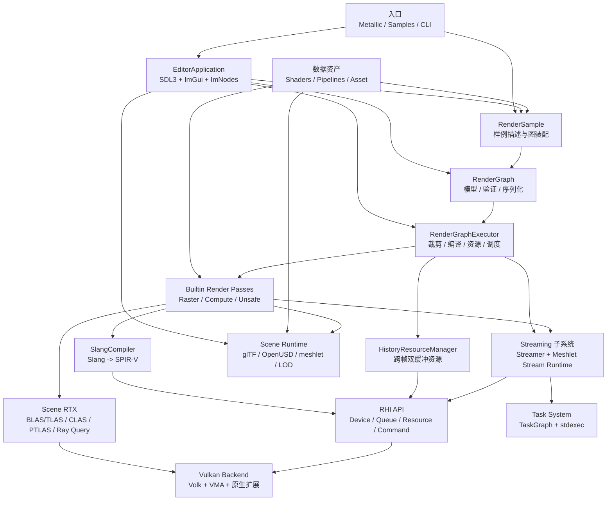

# Metallic

Metallic 是一个以 **C++23 + Slang + Vulkan** 为核心的实验性实时渲染框架。仓库同时包含一个可视化编辑器外壳、一套数据驱动的 RenderGraph、一个面向 Bindless / 动态渲染 / Mesh Shader / Ray Query 的 RHI，以及若干可独立运行的渲染样例（路径追踪、实时 OpenPBR 光照、RTXDI、NRD 去噪、GPU-driven 可见性缓冲等）。

项目的目标是：把「场景导入 → GPU 数据 → RenderGraph 装配 → Slang Shader → Vulkan 提交 → 调试/性能分析」整条链路放在同一个可读、可序列化、可测试的代码库里，并持续吸收 NVIDIA RTX 生态中的现代特性（Streamline DLSS、NRD、NRC、SHaRC、RTXCR、Nsight、Aftermath、Tracy）。

> 架构细节见 [`Documentation/ProjectArchitecture.md`](Documentation/ProjectArchitecture.md)；构建变体与依赖复用见 [`Documentation/Build.md`](Documentation/Build.md)。

## 特性一览

| 领域 | 内容 |
| --- | --- |
| 编辑器 | SDL3 + Dear ImGui（docking）+ ImNodes；Viewport、Scene Browser、Inspector、Assets、Console、Profiler、NVML Monitor、Statistics，以及独立 RenderGraph 编辑窗口 |
| RenderGraph | `.metallic_graph.json` 可序列化图资产、Pass 反射（`reflect()` / `execute()` / `compile()`）、活动子图裁剪、拓扑排序、自动 barrier、Bindless 描述符绑定 |
| RHI | move-only RAII `Device` / `Queue` / `Swapchain` / `CommandBuffer` / `Fence` / `Semaphore` / `Buffer` / `Texture` / Pipeline / `BindlessHeap` / `Streamer` |
| Vulkan 后端 | Volk 加载、VMA 内存管理、动态渲染、`VK_EXT_shader_object`、timeline semaphore、Pipeline Cache（`.pso` 版本化容器） |
| 场景 | TinyGLTF（glTF/GLB）与 OpenUSD（USD/USDA/USDC/USDZ）导入；材质、相机、灯光提取；meshlet / LOD / cluster 构建与缓存 |
| 光追 | 普通三角形 BLAS+TLAS、partitioned TLAS、cluster acceleration structure、Ray Query compute 路径 |
| GPU-driven | 两阶段 HZB 实例剔除、meshlet 剔除、Visibility Buffer、材质分箱、Mesh Shader 绘制、分页 StreamAsset 驻留与 CLAS 更新 |
| 降噪与超分 | NRD RELAX/SIGMA、Streamline DLSS-RR / DLSS-SR / DLSS-NR、Reflex、NRC、SHaRC |
| 物理光照 | 勒克斯/坎德拉单位、Cluster Light Grid、HDRI GGX mip 预过滤、球谐环境光、自动曝光 |
| 流送 | `MeshletStreamAsset` 离线构建 + `MeshletStreamRuntime` 异步分页、驻留预算、LRU 淘汰、page table patch |
| 任务系统 | `TaskGraph` / `TaskSystem`（基于 stdexec）：依赖图执行、取消、快照、事件观察者 |
| 诊断 | Nsight NVTX 标记、Nsight Graphics Capture、Aftermath GPU 崩溃转储、Tracy CPU/GPU 分析、GPU Debug Probe |

## 总体架构



编辑器视口不运行另一套渲染器：它把活动图输出转换到 `ShaderRead`，再通过 ImGui Vulkan 描述符显示。

## 目录结构

```text
Metallic/
├─ Source/
│  ├─ Main.cpp                 主程序入口：编辑器、RHI smoke test、StreamAsset 离线构建 CLI
│  ├─ Editor/                  编辑器生命周期、面板、节点编辑、视口、Profiler、NVML 监控
│  ├─ LookDev/                 LookDev 独立入口
│  ├─ Samples/                 各领域样例可执行入口（复用同一个 EditorApplication）
│  └─ Runtime/
│     ├─ Task/                 TaskSystem / TaskGraph
│     ├─ Scene/                glTF / OpenUSD 导入、meshlet/LOD、StreamAsset 格式
│     ├─ Debug/                DebugCore / Probe / Watch / Transport（Agent 调试控制面）
│     └─ Render/
│        ├─ RenderGraph/       图模型、Pass 接口、编译器、执行器、流送子系统
│        ├─ RenderPass/        内置 Pass 注册与实现（BuiltinPass/）
│        ├─ GAPI/              RHI 公共接口、Streamer、Vulkan 后端（GAPI/Vulkan/）
│        ├─ RayTracing/        加速结构构建与扩展
│        ├─ Denoising/         NRD 计划、RELAX、SIGMA、Reblur
│        └─ Profiling/         NVTX、Nsight Graphics Capture、Aftermath、Tracy
├─ Shaders/                    Libraries/ 公共库 + Features/ 功能 Shader
├─ Pipelines/                  .metallic_graph.json 图资产（Samples/ 下为样例图）
├─ Asset/                      样例 glTF/GLB、USD、纹理、HDR 环境、预生成 meshlet 数据
├─ Documentation/              架构、构建、各功能专题文档
├─ Tools/                      Terrain/OpenPBR 构建脚本、Aftermath 捕获脚本、MetallicCtl
├─ scripts/                    Tracy 启动、NRD vendor 脚本
├─ tests/                      task / scene / rhi / debug 测试与编辑器 smoke 脚本
├─ cmake/                      依赖与 SDK 集成模块、依赖缓存
└─ External/                   第三方依赖（submodule），不属于 Metallic 自身模块
```

## 环境要求

- **Windows x64 + MSVC**（当前主要验证平台）与支持 **Vulkan 1.3** 的 GPU；`VK_EXT_shader_object` 是基础运行时要求，不支持时相关路径返回 `Unsupported` 而非静默降级。
- **CMake ≥ 3.20**（使用 `CMakePresets.json` 需 ≥ 3.27）。
- **Ninja**（使用预设时）与 x64 Visual Studio Developer PowerShell。
- **Slang**：放在 `External/slang`，或配置时传 `-DSLANG_ROOT=<path>`。
- Git 与 submodule：`git submodule update --init --recursive`。

## 快速开始

### 1. 初始化依赖

```powershell
git clone --recurse-submodules <repo-url>
cd Metallic
# 已克隆但未拉取子模块时：
git submodule update --init --recursive
```

`External/NRC`、`External/RTXCR-*` 等可选 SDK 按需初始化，例如：

```powershell
git submodule update --init --recursive -- External/NRC
```

### 2. 配置与构建

日常开发（最快：关闭 OpenUSD/NRD/NTC 与测试，启用 DLSS 与 NRC）：

```powershell
cmake --preset metallic-dev
cmake --build --preset metallic-dev --parallel 8
```

需要 OpenUSD / NRD / NTC 与完整测试时，改用 `metallic-full`（首次需先构建依赖包，见 [`Documentation/Build.md`](Documentation/Build.md)）：

```powershell
cmake --preset metallic-deps-debug
cmake --build --preset metallic-deps-debug
cmake --preset metallic-full
cmake --build --preset metallic-full --parallel 8
```

不使用预设的等价方式（测试默认开启）：

```powershell
cmake -S . -B build -DMETALLIC_BUILD_TESTS=ON
cmake --build build --target Metallic --config Debug
```

### 3. 运行

```powershell
# 单配置生成器（Ninja）
build-dev\Metallic.exe

# 多配置生成器（Visual Studio）
build\Source\Debug\Metallic.exe

# 快速冒烟检查：渲染一帧后退出
build\Source\Debug\Metallic.exe --smoke-test
```

编辑器默认加载 `pathtracing-sample` 样例；`--scene <path>` 可覆盖样例场景，`.metallic_graph.json` 与场景文件都支持拖放加载。

## 构建预设

| 预设 | 构建目录 | 说明 |
| --- | --- | --- |
| `metallic-dev` | `build-dev` | 日常开发：glTF + DLSS + NRC，关闭 OpenUSD/NRD/NTC 与测试 |
| `metallic-release` | `build-release` | 同 `metallic-dev` 的 `Release` 配置 |
| `metallic-relwithdebinfo` | `build-relwithdebinfo` | 优化 + 原生调试符号，默认启用 Nsight Graphics Capture |
| `metallic-full` | `build-full` | 使用已安装依赖包的完整配置（OpenUSD/NRD/NRC/NTC + 全部测试） |
| `metallic-ci` | `build-ci` | 关闭 Streamline/NRC，启用 scene/task/debug 测试 |
| `metallic-deps-debug` | `build-dependencies/debug` | 单独构建可复用的依赖包（SDL3、spdlog、oneTBB、OpenUSD） |

常用 CMake 选项：

| 选项 | 默认 | 说明 |
| --- | --- | --- |
| `METALLIC_BUILD_TESTS` | `ON` | 构建 task/scene/rhi/debug 测试目标 |
| `METALLIC_ENABLE_OPENUSD` | `ON` | USD 场景导入（需要 oneTBB） |
| `METALLIC_ENABLE_NRD` | `ON` | NRD 去噪（vendored shader，无需 SDK 构建） |
| `METALLIC_ENABLE_TRACY` | `ON` | Tracy CPU/GPU 分析 |
| `METALLIC_ENABLE_STREAMLINE` | 按预设 | Streamline / DLSS 集成 |
| `METALLIC_ENABLE_NRC` / `METALLIC_ENABLE_NTC` | 按预设 | NRC 辐射缓存 / 神经纹理压缩 |
| `METALLIC_DEPENDENCY_MODE` | `SOURCE` | `SOURCE` 全量源码构建，`PREBUILT` 复用依赖包 |
| `METALLIC_CLUSTER_LOD_TOPOLOGY_NYX` | `OFF` | 实验性 Nyx 风格 ClusterLOD 顶层 BVH |
| `SLANG_ROOT` | `External/slang` | Slang SDK 路径 |
| `RTXCR_ROOT` / `RTXCR_ASSETS_ROOT` | 自动探测 | RTXCR 材质库与授权资产检出 |

依赖复用、sccache、RelWithDebInfo/Nsight 细节见 [`Documentation/Build.md`](Documentation/Build.md)。

## 内置样例

内置样例由 `RenderSample` 描述（场景、图、环境、预览输出），在编辑器的样例列表中选择，或通过 `Source/Samples/` 下的独立可执行文件直接启动。每个图资产的最终颜色都应接到 `FinalBlitPass.source`。

| 样例 ID | 名称 | 类别 |
| --- | --- | --- |
| `pathtracing-sample` | PathTracingSample（编辑器默认） | Path Tracing |
| `pathtracing-meet-mat` | Path Tracing / meet_mat | Path Tracing |
| `pathtracing-sharc-meet-mat` | Path Tracing / meet_mat / SHaRC | Path Tracing |
| `pathtracing-nrc-meet-mat` | Path Tracing / meet_mat / NRC | Path Tracing |
| `pathtracing-sample-dlss-rr` | PathTracingSample / DLSS-RR | Path Tracing |
| `pathtracing-sample-dlss-sr` | PathTracingSample / DLSS-SR | Path Tracing |
| `pathtracing-sample-dlss-nr` | PathTracingSample / DLSS-NR（实验） | Path Tracing |
| `realtime-lighting` | Real-time / Physical Lighting | Lighting |
| `light-grid-debug` | LightGrid / Coverage Heatmap | Lighting |
| `rtxdi-sample` | RTXDI / ReSTIR DI | Lighting |
| `openpbr-lookdev` | LookDev / OpenPBR Default | LookDev |
| `lookdev-shading-compare` | LookDev / Shading Comparison | LookDev |
| `lookdev-vbuffer` | LookDev / VBuffer vs Path Tracing | LookDev |
| `lookdev-abeautiful-game` | LookDev / ABeautifulGame / Material Binning | LookDev |
| `material-visualization-abeautiful-game` | Material Visualization / ABeautifulGame | Material |
| `rtxcr-material-sample` | RTXCR Claire Ponytail | Material |
| `gpu-driven-sample` | GPUDrivenSample（默认实时 Sponza） | GPU Driven |
| `gpu-driven-visibility-buffer` | GPUDrivenSample / Visibility Buffer | GPU Driven |
| `gpu-driven-usd` | GPUDrivenSample / USD | GPU Driven |
| `gpu-driven-streamasset` | GPUDrivenSample / StreamAsset | GPU Driven |
| `gpu-driven-rtas-visualization` | GPUDrivenSample / RTAS Visualization | GPU Driven |
| `gpu-driven-terrain-p0` | GPUDrivenSample / Terrain P0 | GPU Driven |
| `gpu-driven-terrain-p1-unified` | GPUDrivenSample / Terrain P1 Unified | GPU Driven |

生成的独立可执行文件：`Metallic`（编辑器）、`MetallicMaterialVisualizationSample`、`MetallicPathTracingSample`、`MetallicRtxdiSample`、`MetallicGPUDrivenSample`、`MetallicRtxcrSample`、`LookDev`、`metallicctl`。

## 内置 Render Pass

内置 Pass 在 `Source/Runtime/Render/RenderPass/BuiltinRenderPasses.cpp` 注册，Pass 类型名会写入 Pipeline JSON，属于资产兼容性标识。

| 类别 | Pass |
| --- | --- |
| 基础 | `ClearColorPass`、`CopyColorPass`、`TriangleRasterPass`、`ImageSamplePass`、`FinalBlitPass` |
| 场景光栅 | `BunnyWireframePass`、`SceneMaterialShaderObjectPass` |
| 后处理 | `AutoExposurePass`、`SliderDebugPass`、`ScreenSpaceShadowPass` |
| Ray Query | `SceneMaterialVisualizationPass`、`SceneRayQueryVisualizationPass` |
| 路径追踪 | `ScenePathTracePass`（含可选 DLSS-RR guides） |
| RTXDI | `SceneRtxdiPass`、`RtxdiConfidencePass`、`RtxdiCompositePass` |
| 降噪 / 超分 | `NrdDenoisePass`、`StreamlineDlssRrPass`、`DlssNrPass` |
| GPU-driven | `VisibilityBufferPass`、`GPUDrivenStreamAssetPass` |
| 调试 / 测试 | `LightGridDebugPass`、`RenderGraphBufferWritePass`、`RenderGraphBufferCopyPass` |

可选能力（Mesh Shader、Ray Query、CLAS/PTLAS、NRD、Streamline、RTXCR）缺失时，相关 Pass 应返回 `Unsupported`，不影响基础运行时的构建。

## 资产与 Shader 组织

```text
Asset/*.gltf|*.glb|*.hdr|*.usd   <- 样例节点 properties 中的路径
Pipelines/*.metallic_graph.json  <- Pass 节点、边、输出与参数
Shaders/Features/**/*.slang      <- Pass compile() 选择的功能模块，复用 Shaders/Libraries/
tests/rhi/shaders/*.slang        <- 测试专用探针
```

- Shader 搜索根只有 `Shaders/`；`SlangShaderDesc::moduleName` 使用相对该根目录的完整模块路径（省略 `.slang`），`#include` 使用相对当前文件的显式路径。详见 [`Shaders/README.md`](Shaders/README.md)。
- `Libraries/` 只放可复用类型与算法，不依赖 `Features/`。
- GLSL 源使用 `PascalCase` 文件名（如 `ScenePathTrace.slang`）。

## 命令行选项

`Metallic.exe` 支持（其他样例可执行文件共享编辑器选项中的大部分）：

```text
--scene <path>                            覆盖样例场景（glTF 或 USD）
--smoke-test                              渲染一帧后退出
--debug-control                           启用本地 Agent 调试控制面
--wait-for-graphics-debugger              Vulkan 初始化前等待调试器
--nsight-capture                          启用 Profiler Graphics Capture 导出
--nsight-shader-debug                     输出无优化 shader 调试信息
--rhi-smoke-test                          运行 RHI smoke test
--rhi-triangle-preview-test               运行 RHI 三角形预览测试
--rhi-bindless-descriptor-heap-smoke-test 运行 Bindless 描述符堆 smoke test
--rhi-no-validation                       关闭 smoke test 的 RHI 验证层
--build-meshstream <source.gltf>          离线构建 meshlet StreamAsset 后退出
--output <file.meshstream.bin>            --build-meshstream 的输出路径
--meshstream-compression <none|byte-rle>  payload 压缩模式
--meshstream-max-geometries <count>       达到该几何数后暂停（0 = 不限制）
--meshstream-checkpoint-interval <count>  部分检查点间隔（0 = 仅暂停）
```

场景 → StreamAsset 的离线转换示例：

```powershell
build\Source\Debug\Metallic.exe --build-meshstream Asset/Sponza/glTF/Sponza.gltf --meshstream-compression byte-rle
```

## 测试与验证

测试为自定义 CTest 可执行文件（task/scene/debug 使用 GoogleTest，rhi 使用注册表适配到 GoogleTest）。RHI 测试支持 `--list` / `--filter <text>`，设备能力缺失时以 skip 处理（退出码 `77`）。

```powershell
cmake --preset metallic-ci
cmake --build --preset metallic-ci --parallel 8
ctest --preset metallic-ci

# 等价的显式命令
ctest --test-dir build -C Debug --output-on-failure
ctest --test-dir build -C Debug -L scene --output-on-failure
ctest --test-dir build -C Debug -L rhi   --output-on-failure
ctest --test-dir build -C Debug -L task  --output-on-failure

# 单个目标
cmake --build build --target MetallicSceneTests --config Debug
```

推荐提交前的验证顺序：

```powershell
git submodule update --init --recursive
cmake -S . -B build -DMETALLIC_BUILD_TESTS=ON
cmake --build build --config Debug
ctest --test-dir build -C Debug --output-on-failure
build\Source\Debug\Metallic.exe --smoke-test
```

测试生成的图像写入 `rhi-test-output/`、`scene-test-output/` 等输出目录，不应提交到源码树。

## 性能分析与调试

- **Tracy**：`METALLIC_ENABLE_TRACY=ON`（默认）时编辑器把 RenderGraph GPU 时序导出到 Tracy；`./scripts/StartTracy.ps1 -WithMetallic` 可同时连接查看器。详见 [`Documentation/TracyGpuProfiling.md`](Documentation/TracyGpuProfiling.md)。
- **Nsight NVTX**：`Metallic.Editor` 与 `Metallic.Render` 两个 domain 覆盖帧循环、图执行、单个 Pass、提交、等待与上传。
- **Nsight Graphics Capture**：`--nsight-capture` 导出带优化符号的 View 捕获，适合 Shader Browser / Shader Profiler；断点与单步需要 `--nsight-shader-debug`（无优化，性能不代表实际）。
- **Aftermath**：GPU 崩溃转储由 `Source/Runtime/Render/Profiling/NsightAftermath.cpp` 与 `Tools/CaptureLookDevAftermath.ps1` 支撑。

## 扩展指南

**新增 Render Pass**

1. 在 `Source/Runtime/Render/RenderPass/BuiltinPass/` 新建 Pass，选择 `RasterPass` / `ComputePass` / `UnsafePass`；
2. 在 `reflect()` 中完整声明输入输出、访问方式、格式、尺寸与 Bindless 需求；
3. 在 `compile()` 中检查 `DeviceCapabilities`、编译 Slang、创建资源；
4. 在 `execute()` 中只通过 `RenderGraphExecutionContext` 使用图资源、历史资源与 Streamer；
5. 在 `BuiltinPasses.h` 暴露工厂并在 `BuiltinRenderPasses.cpp` 注册稳定类型名；
6. 加入 `MetallicRuntimeRender` 的源文件列表；
7. 补充序列化/编译/执行或图像输出测试。

**新增样例**

1. 在 `Pipelines/Samples/` 创建并验证图资产，最终颜色接到 `FinalBlitPass.source`，`outputs` 留空；
2. 在 `RenderSample.cpp` 实现描述类并注册到 `builtInRenderSamples()`；
3. 需要独立入口时在 `Source/Samples/` 增加薄封装并配置 CMake；
4. 至少覆盖图加载、目标节点存在性与 smoke test。

**修改共享 RHI 接口**：`Rhi.h` 的改动需同时检查 Vulkan PImpl、RenderGraph 状态映射、Scene RTX、Streamer、编辑器 native bridge 与 `tests/rhi/`。RHI 对象保持 move-only 与 owner 控制生命周期。

## 代码风格

- 4 空格缩进，不使用 Tab；函数定义使用 Allman 大括号，控制语句同行的开括号，命名空间结束处写 `} // namespace metallic::render`。
- 类型 `PascalCase`，函数与局部变量 `lowerCamelCase`，常量 `kPascalCase`，私有成员带尾随下划线。
- C++/头文件/Shader 文件名为 `PascalCase`（如 `TaskGraph.cpp`、`ScenePathTrace.slang`）；既有历史文件名不做额外重命名。
- 提交信息使用简短祈使句（如 `Add runtime scene browser and tests`），一次提交聚焦一个子系统。

## 已知约束

- **后端边界未完全闭合**：编辑器呈现桥接、Scene RTX 与 NVIDIA 集成仍与 Vulkan 耦合，新增后端需一并拆分这些接口。
- **RenderGraph 多队列调度有限**：支持多队列提交，但尚无跨队列资源边与自动 queue ownership transfer。
- **资源按编译期输出独立分配**：尚无 transient aliasing 或通用资源池。
- **历史资源显式管理**：跨帧数据不属于普通图边，Pass 必须通过 `HistoryResourceManager` 约定名字与有效性。
- **Shader Object 为必需能力**：显式关闭或硬件不支持会被拒绝/返回 `Unsupported`。
- **Ray Query 法线空间必须稳定**：在 `traceClosest()` 中不得按当前 ray 翻转 authored/world-space `normal` 或 `geometryNormal`；如需同半球法线，只对最终 shading normal 做 face-forward。

## 文档索引

| 文档 | 内容 |
| --- | --- |
| [`Documentation/ProjectArchitecture.md`](Documentation/ProjectArchitecture.md) | 完整现状架构、目标划分、Pass 清单、扩展与验证 |
| [`Documentation/Build.md`](Documentation/Build.md) | 预设、依赖复用包、sccache、Release/RelWithDebInfo |
| [`Documentation/RealtimePipeline.md`](Documentation/RealtimePipeline.md) | 实时管线 |
| [`Documentation/PhysicalLighting.md`](Documentation/PhysicalLighting.md) | 物理光照单位与光源约定 |
| [`Documentation/AutoExposure.md`](Documentation/AutoExposure.md) | 自动曝光 |
| [`Documentation/VisibilityBufferDeferred.md`](Documentation/VisibilityBufferDeferred.md) / [`VisibilityBufferSample.md`](Documentation/VisibilityBufferSample.md) | Visibility Buffer 与延迟着色 |
| [`Documentation/DlssNr.md`](Documentation/DlssNr.md) / [`DlssRayReconstruction.md`](Documentation/DlssRayReconstruction.md) | DLSS-NR 与 DLSS-RR |
| [`Documentation/NeuralTextureCompression.md`](Documentation/NeuralTextureCompression.md) | NTC |
| [`Documentation/OpenPbrLookDev.md`](Documentation/OpenPbrLookDev.md) | OpenPBR LookDev |
| [`Documentation/DebugControlPlane.md`](Documentation/DebugControlPlane.md) | Agent 调试控制面与 Probe/Watch |
| [`Documentation/ScreenSpaceShadows.md`](Documentation/ScreenSpaceShadows.md) | 屏幕空间阴影 |
| [`Documentation/TracyGpuProfiling.md`](Documentation/TracyGpuProfiling.md) | Tracy CPU/GPU 分析 |
| [`RTXDI.md`](RTXDI.md) | 原生 ReSTIR DI / RTXDI 风格实现说明 |
| [`Shaders/README.md`](Shaders/README.md) | Shader 目录组织与模块加载规则 |

## 许可证

Metallic 本体以 [MIT License](LICENSE) 发布。`External/` 下的第三方依赖与 `Shaders/Licenses/`、`Asset/` 中各资产的许可证归各自权利方所有；例如样例模型、HDRI 与 RTXCR 授权资产需遵守其随附许可（如 `Asset/SuperSponza/credits_license.txt`），商用或再分发前请逐一确认。
